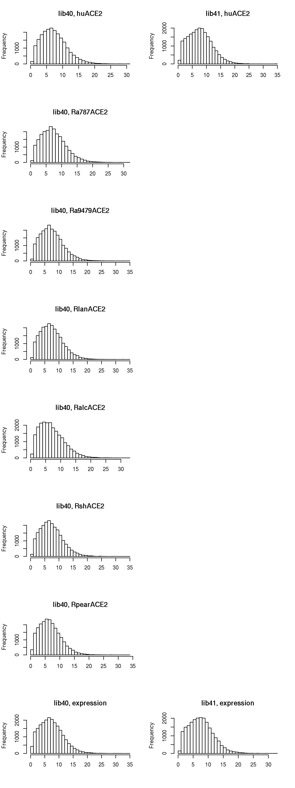
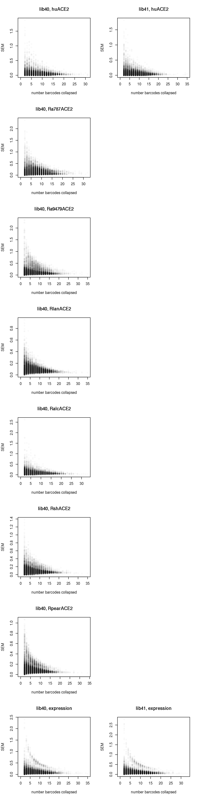
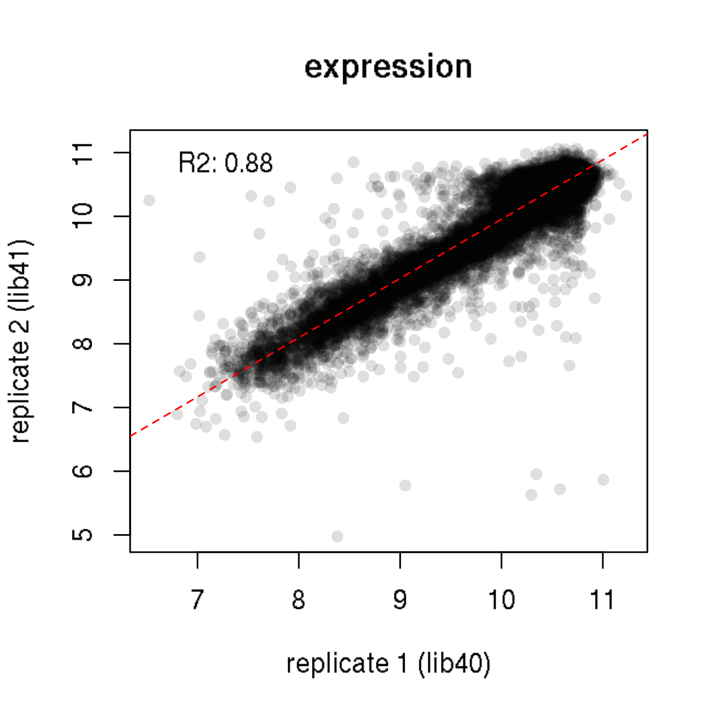
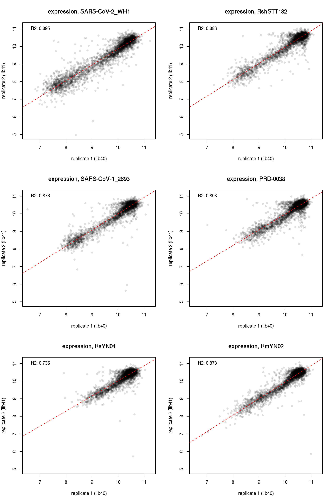
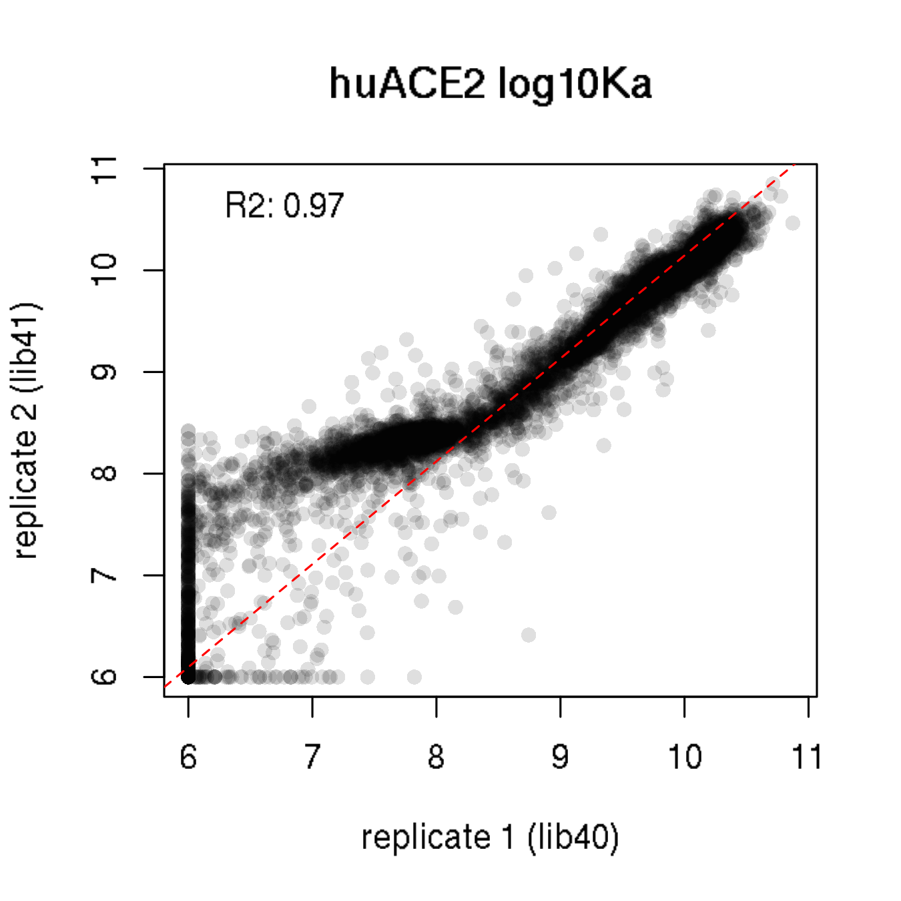
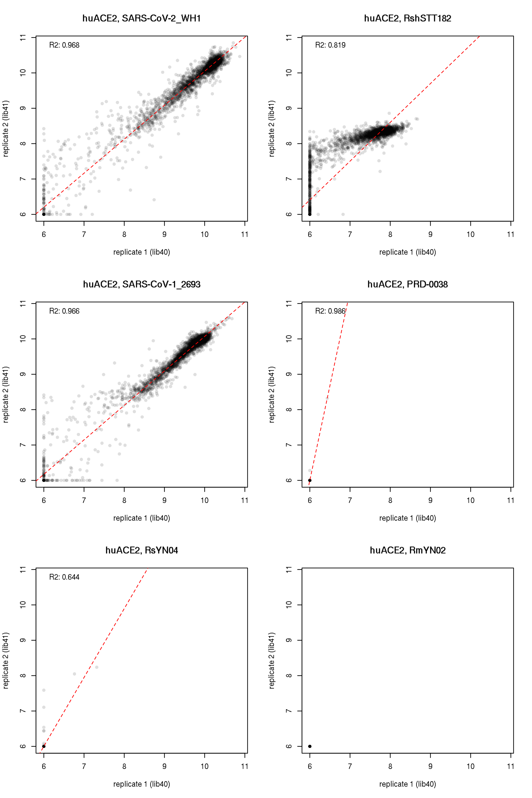
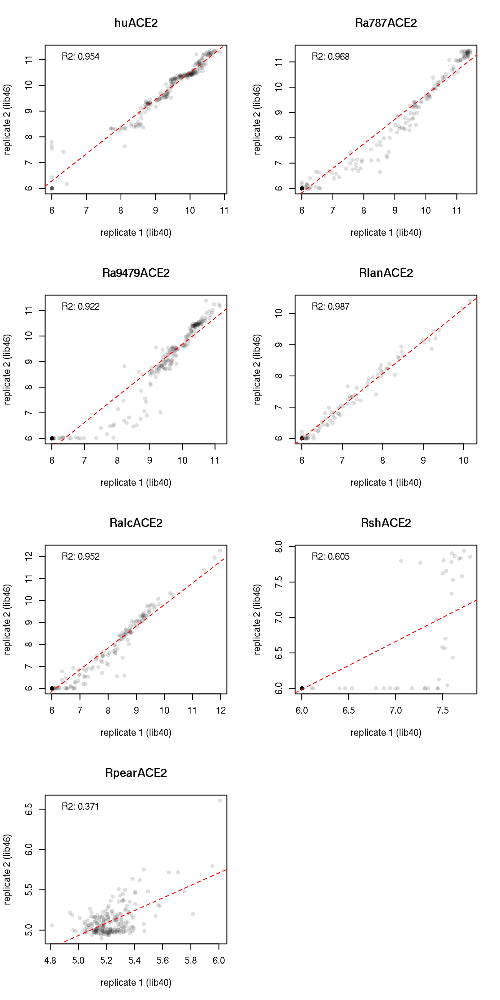
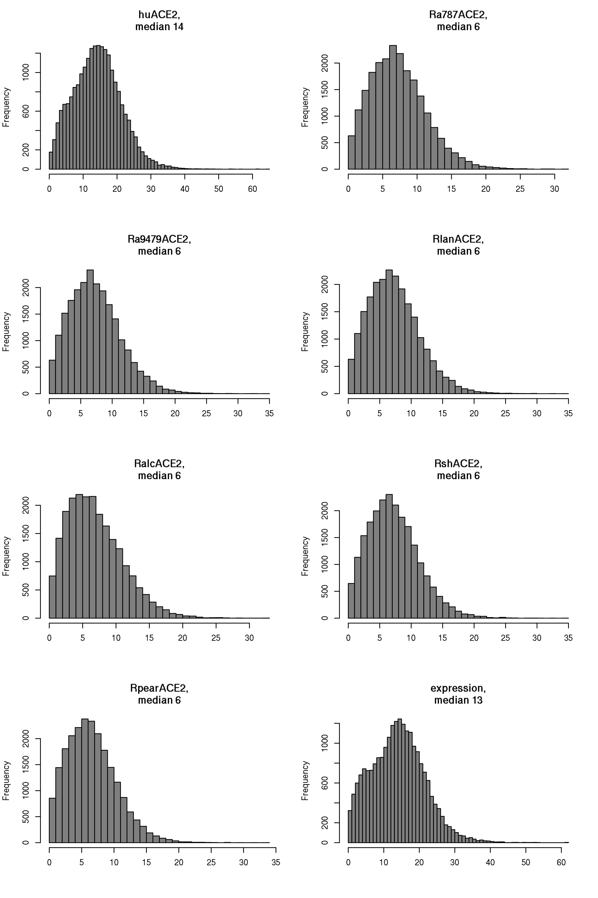

Collapse barcodes to final per-RBD/mutant phenotype scores
================
Tyler Starr
01/04/2023

-   [Setup](#setup)
-   [Calculate per-variant mean scores within
    replicates](#calculate-per-variant-mean-scores-within-replicates)
-   [Collapse per-mutant scores across
    libraries](#collapse-per-mutant-scores-across-libraries)
-   [Heatmaps!](#heatmaps)

This notebook reads in the per-barcode ACE2 binding phenos and collapses
barcodes to final mean binding for each variant, and generates some
coverage and QC analyses. It also makes some heatmaps and other
visualizations of these data.

``` r
require("knitr")
knitr::opts_chunk$set(echo = T)
knitr::opts_chunk$set(dev.args = list(png = list(type = "cairo")))

#list of packages to install/load
packages = c("yaml","data.table","tidyverse","gridExtra")
#install any packages not already installed
installed_packages <- packages %in% rownames(installed.packages())
if(any(installed_packages == F)){
  install.packages(packages[!installed_packages])
}
#load packages
invisible(lapply(packages, library, character.only=T))

#read in config file
config <- read_yaml("config.yaml")

#make output directory
if(!file.exists(config$final_variant_scores_dir)){
  dir.create(file.path(config$final_variant_scores_dir))
}

#read in file giving spike/RBD indexing concordance between backgrounds
RBD_sites <- read.csv(file=config$RBD_annotation_file,stringsAsFactors=F)
```

Session info for reproducing environment:

``` r
sessionInfo()
```

    ## R version 3.6.2 (2019-12-12)
    ## Platform: x86_64-pc-linux-gnu (64-bit)
    ## Running under: Ubuntu 18.04.6 LTS
    ## 
    ## Matrix products: default
    ## BLAS/LAPACK: /app/software/OpenBLAS/0.3.7-GCC-8.3.0/lib/libopenblas_haswellp-r0.3.7.so
    ## 
    ## locale:
    ##  [1] LC_CTYPE=en_US.UTF-8       LC_NUMERIC=C              
    ##  [3] LC_TIME=en_US.UTF-8        LC_COLLATE=en_US.UTF-8    
    ##  [5] LC_MONETARY=en_US.UTF-8    LC_MESSAGES=en_US.UTF-8   
    ##  [7] LC_PAPER=en_US.UTF-8       LC_NAME=C                 
    ##  [9] LC_ADDRESS=C               LC_TELEPHONE=C            
    ## [11] LC_MEASUREMENT=en_US.UTF-8 LC_IDENTIFICATION=C       
    ## 
    ## attached base packages:
    ## [1] stats     graphics  grDevices utils     datasets  methods   base     
    ## 
    ## other attached packages:
    ##  [1] gridExtra_2.3     forcats_0.4.0     stringr_1.4.0     dplyr_0.8.3      
    ##  [5] purrr_0.3.3       readr_1.3.1       tidyr_1.0.0       tibble_3.0.2     
    ##  [9] ggplot2_3.3.0     tidyverse_1.3.0   data.table_1.12.8 yaml_2.2.0       
    ## [13] knitr_1.26       
    ## 
    ## loaded via a namespace (and not attached):
    ##  [1] Rcpp_1.0.3       cellranger_1.1.0 pillar_1.4.5     compiler_3.6.2  
    ##  [5] dbplyr_1.4.2     tools_3.6.2      digest_0.6.23    lubridate_1.7.4 
    ##  [9] jsonlite_1.6     evaluate_0.14    lifecycle_0.2.0  gtable_0.3.0    
    ## [13] pkgconfig_2.0.3  rlang_0.4.7      reprex_0.3.0     cli_2.0.0       
    ## [17] rstudioapi_0.10  DBI_1.1.0        haven_2.2.0      xfun_0.11       
    ## [21] withr_2.1.2      xml2_1.3.3       httr_1.4.1       fs_1.3.1        
    ## [25] hms_0.5.2        generics_0.0.2   vctrs_0.3.1      grid_3.6.2      
    ## [29] tidyselect_1.1.0 glue_1.3.1       R6_2.4.1         fansi_0.4.0     
    ## [33] readxl_1.3.1     rmarkdown_2.0    modelr_0.1.5     magrittr_1.5    
    ## [37] backports_1.1.5  scales_1.1.0     ellipsis_0.3.0   htmltools_0.4.0 
    ## [41] rvest_0.3.5      assertthat_0.2.1 colorspace_1.4-1 stringi_1.4.3   
    ## [45] munsell_0.5.0    broom_0.7.0      crayon_1.3.4

## Setup

Read in tables of per-barcode sera AUC values, as well as the prior
SARSr DMS data with expression effects of mutations.

``` r
dt_huACE2 <- data.table(read.csv(config$Titeseq_Kds_file_huACE2),stringsAsFactors=F)[library %in% c("lib40","lib41"),]
dt_Ra787ACE2 <- data.table(read.csv(config$Titeseq_Kds_file_Ra787ACE2),stringsAsFactors=F)[library %in% c("lib40","lib41"),]
dt_Ra9479ACE2 <- data.table(read.csv(config$Titeseq_Kds_file_Ra9479ACE2),stringsAsFactors=F)[library %in% c("lib40","lib41"),]
dt_RlanACE2 <- data.table(read.csv(config$Titeseq_Kds_file_RlanACE2),stringsAsFactors=F)[library %in% c("lib40","lib41"),]
dt_RalcACE2 <- data.table(read.csv(config$Titeseq_Kds_file_RalcACE2),stringsAsFactors=F)[library %in% c("lib40","lib41"),]
dt_RshACE2 <- data.table(read.csv(config$Titeseq_Kds_file_RshACE2),stringsAsFactors=F)[library %in% c("lib40","lib41"),]
dt_RpearACE2 <- data.table(read.csv(config$Titeseq_Kds_file_RpearACE2),stringsAsFactors=F)[library %in% c("lib40","lib41"),]
dt_expr <- data.table(read.csv(config$expression_sortseq_file),stringsAsFactors=F)

#merge
dt <- merge(merge(merge(merge(merge(merge(merge(dt_huACE2,dt_Ra787ACE2,all=T),dt_Ra9479ACE2,all=T),dt_RlanACE2,all=T),dt_RalcACE2,all=T),dt_RshACE2,all=T),dt_RpearACE2,all=T),dt_expr,all=T)
rm(dt_huACE2);rm(dt_Ra787ACE2);rm(dt_Ra9479ACE2);rm(dt_RlanACE2);rm(dt_RalcACE2);rm(dt_RshACE2);rm(dt_RpearACE2);rm(dt_expr)

#change any names
dt[target=="Wuhan_Hu_1",target:="SARS-CoV-2_WH1"]
```

## Calculate per-variant mean scores within replicates

Calculate the mean binding and expression score collapsed by genotype.
Also output the number of barcodes across which a variant score was
determined in each library.

``` r
dt[is.na(log10Ka_huACE2),TiteSeq_huACE2_avgcount:=NA]
dt[is.na(log10Ka_Ra787ACE2),TiteSeq_Ra787ACE2_avgcount:=NA]
dt[is.na(log10Ka_Ra9479ACE2),TiteSeq_Ra9479ACE2_avgcount:=NA]
dt[is.na(log10Ka_RlanACE2),TiteSeq_RlanACE2_avgcount:=NA]
dt[is.na(log10Ka_RalcACE2),TiteSeq_RalcACE2_avgcount:=NA]
dt[is.na(log10Ka_RshACE2),TiteSeq_RshACE2_avgcount:=NA]
dt[is.na(MFI_RpearACE2),RpearACE2_count:=NA]
dt[is.na(expression),expr_count:=NA]

#huACE2
dt[,mean_huACE2:=mean(log10Ka_huACE2,na.rm=T),by=c("library","target","variant_class","aa_substitutions")]
dt[,sd_huACE2:=sd(log10Ka_huACE2,na.rm=T),by=c("library","target","variant_class","aa_substitutions")]
dt[,n_bc_huACE2:=sum(!is.na(log10Ka_huACE2)),by=c("library","target","variant_class","aa_substitutions")]
dt[,avg_count_huACE2:=mean(TiteSeq_huACE2_avgcount,na.rm=T),by=c("library","target","variant_class","aa_substitutions")]

#Ra787ACE2
dt[,mean_Ra787ACE2:=mean(log10Ka_Ra787ACE2,na.rm=T),by=c("library","target","variant_class","aa_substitutions")]
dt[,sd_Ra787ACE2:=sd(log10Ka_Ra787ACE2,na.rm=T),by=c("library","target","variant_class","aa_substitutions")]
dt[,n_bc_Ra787ACE2:=sum(!is.na(log10Ka_Ra787ACE2)),by=c("library","target","variant_class","aa_substitutions")]
dt[,avg_count_Ra787ACE2:=mean(TiteSeq_Ra787ACE2_avgcount,na.rm=T),by=c("library","target","variant_class","aa_substitutions")]

#Ra9479ACE2
dt[,mean_Ra9479ACE2:=mean(log10Ka_Ra9479ACE2,na.rm=T),by=c("library","target","variant_class","aa_substitutions")]
dt[,sd_Ra9479ACE2:=sd(log10Ka_Ra9479ACE2,na.rm=T),by=c("library","target","variant_class","aa_substitutions")]
dt[,n_bc_Ra9479ACE2:=sum(!is.na(log10Ka_Ra9479ACE2)),by=c("library","target","variant_class","aa_substitutions")]
dt[,avg_count_Ra9479ACE2:=mean(TiteSeq_Ra9479ACE2_avgcount,na.rm=T),by=c("library","target","variant_class","aa_substitutions")]

#RlanACE2
dt[,mean_RlanACE2:=mean(log10Ka_RlanACE2,na.rm=T),by=c("library","target","variant_class","aa_substitutions")]
dt[,sd_RlanACE2:=sd(log10Ka_RlanACE2,na.rm=T),by=c("library","target","variant_class","aa_substitutions")]
dt[,n_bc_RlanACE2:=sum(!is.na(log10Ka_RlanACE2)),by=c("library","target","variant_class","aa_substitutions")]
dt[,avg_count_RlanACE2:=mean(TiteSeq_RlanACE2_avgcount,na.rm=T),by=c("library","target","variant_class","aa_substitutions")]

#RalcACE2
dt[,mean_RalcACE2:=mean(log10Ka_RalcACE2,na.rm=T),by=c("library","target","variant_class","aa_substitutions")]
dt[,sd_RalcACE2:=sd(log10Ka_RalcACE2,na.rm=T),by=c("library","target","variant_class","aa_substitutions")]
dt[,n_bc_RalcACE2:=sum(!is.na(log10Ka_RalcACE2)),by=c("library","target","variant_class","aa_substitutions")]
dt[,avg_count_RalcACE2:=mean(TiteSeq_RalcACE2_avgcount,na.rm=T),by=c("library","target","variant_class","aa_substitutions")]

#RshACE2
dt[,mean_RshACE2:=mean(log10Ka_RshACE2,na.rm=T),by=c("library","target","variant_class","aa_substitutions")]
dt[,sd_RshACE2:=sd(log10Ka_RshACE2,na.rm=T),by=c("library","target","variant_class","aa_substitutions")]
dt[,n_bc_RshACE2:=sum(!is.na(log10Ka_RshACE2)),by=c("library","target","variant_class","aa_substitutions")]
dt[,avg_count_RshACE2:=mean(TiteSeq_RshACE2_avgcount,na.rm=T),by=c("library","target","variant_class","aa_substitutions")]

#RpearACE2
dt[,mean_RpearACE2:=mean(MFI_RpearACE2,na.rm=T),by=c("library","target","variant_class","aa_substitutions")]
dt[,sd_RpearACE2:=sd(MFI_RpearACE2,na.rm=T),by=c("library","target","variant_class","aa_substitutions")]
dt[,n_bc_RpearACE2:=sum(!is.na(MFI_RpearACE2)),by=c("library","target","variant_class","aa_substitutions")]
dt[,avg_count_RpearACE2:=mean(RpearACE2_count,na.rm=T),by=c("library","target","variant_class","aa_substitutions")]

#expression
dt[,mean_expression:=mean(expression,na.rm=T),by=c("library","target","variant_class","aa_substitutions")]
dt[,sd_expression:=sd(expression,na.rm=T),by=c("library","target","variant_class","aa_substitutions")]
dt[,n_bc_expression:=sum(!is.na(expression)),by=c("library","target","variant_class","aa_substitutions")]
dt[,avg_count_expression:=mean(expr_count,na.rm=T),by=c("library","target","variant_class","aa_substitutions")]

dt <- unique(dt[,.(library,target,variant_class,aa_substitutions,n_aa_substitutions,
                   mean_huACE2,sd_huACE2,n_bc_huACE2,avg_count_huACE2,
                   mean_Ra787ACE2,sd_Ra787ACE2,n_bc_Ra787ACE2,avg_count_Ra787ACE2,
                   mean_Ra9479ACE2,sd_Ra9479ACE2,n_bc_Ra9479ACE2,avg_count_Ra9479ACE2,
                   mean_RlanACE2,sd_RlanACE2,n_bc_RlanACE2,avg_count_RlanACE2,
                   mean_RalcACE2,sd_RalcACE2,n_bc_RalcACE2,avg_count_RalcACE2,
                   mean_RshACE2,sd_RshACE2,n_bc_RshACE2,avg_count_RshACE2,
                   mean_RpearACE2,sd_RpearACE2,n_bc_RpearACE2,avg_count_RpearACE2,
                   mean_expression,sd_expression,n_bc_expression,avg_count_expression)])
```

Our highest concentration point was 1uM, but we let the curve fitting go
out to 1e-5 Kd. Spot checking curves suggests the variation between 1e-5
and 1e-6 Kds is just noise, so we want to collapse things to our
detection limit of 1e-6

``` r
limit <- 6

dt[mean_huACE2 < limit,mean_huACE2:=limit]
dt[mean_Ra787ACE2 < limit,mean_Ra787ACE2:=limit]
dt[mean_Ra9479ACE2 < limit,mean_Ra9479ACE2:=limit]
dt[mean_RlanACE2 < limit,mean_RlanACE2:=limit]
dt[mean_RalcACE2 < limit,mean_RalcACE2:=limit]
dt[mean_RshACE2 < limit,mean_RshACE2:=limit]
```

Some QC plots. First, look at distribution of number barcodes for single
mutant detemrinations in each library. These are ‘left-justified’
histograms, so the leftmost bar represents the number of genotypes for
which no barcodes were collapsed to final measurement in a pool.

``` r
par(mfrow=c(8,2))
#huACE2
hist(dt[library=="lib40" & variant_class=="1 nonsynonymous",n_bc_huACE2],main="lib40, huACE2",right=F,breaks=max(dt[library=="lib40" & variant_class=="1 nonsynonymous",n_bc_huACE2],na.rm=T),xlab="")
hist(dt[library=="lib41" & variant_class=="1 nonsynonymous",n_bc_huACE2],main="lib41, huACE2",right=F,breaks=max(dt[library=="lib41" & variant_class=="1 nonsynonymous",n_bc_huACE2],na.rm=T),xlab="")
#Ra787ACE2
hist(dt[library=="lib40" & variant_class=="1 nonsynonymous",n_bc_Ra787ACE2],main="lib40, Ra787ACE2",right=F,breaks=max(dt[library=="lib40" & variant_class=="1 nonsynonymous",n_bc_Ra787ACE2],na.rm=T),xlab="")
plot.new()
#Ra9479ACE2
hist(dt[library=="lib40" & variant_class=="1 nonsynonymous",n_bc_Ra9479ACE2],main="lib40, Ra9479ACE2",right=F,breaks=max(dt[library=="lib40" & variant_class=="1 nonsynonymous",n_bc_Ra9479ACE2],na.rm=T),xlab="")
plot.new()
#RlanACE2
hist(dt[library=="lib40" & variant_class=="1 nonsynonymous",n_bc_RlanACE2],main="lib40, RlanACE2",right=F,breaks=max(dt[library=="lib40" & variant_class=="1 nonsynonymous",n_bc_RlanACE2],na.rm=T),xlab="")
plot.new()
#RalcACE2
hist(dt[library=="lib40" & variant_class=="1 nonsynonymous",n_bc_RalcACE2],main="lib40, RalcACE2",right=F,breaks=max(dt[library=="lib40" & variant_class=="1 nonsynonymous",n_bc_RalcACE2],na.rm=T),xlab="")
plot.new()
#RshACE2
hist(dt[library=="lib40" & variant_class=="1 nonsynonymous",n_bc_RshACE2],main="lib40, RshACE2",right=F,breaks=max(dt[library=="lib40" & variant_class=="1 nonsynonymous",n_bc_RshACE2],na.rm=T),xlab="")
plot.new()
#RpearACE2
hist(dt[library=="lib40" & variant_class=="1 nonsynonymous",n_bc_RpearACE2],main="lib40, RpearACE2",right=F,breaks=max(dt[library=="lib40" & variant_class=="1 nonsynonymous",n_bc_RpearACE2],na.rm=T),xlab="")
plot.new()
#expression
hist(dt[library=="lib40" & variant_class=="1 nonsynonymous",n_bc_expression],main="lib40, expression",right=F,breaks=max(dt[library=="lib40" & variant_class=="1 nonsynonymous",n_bc_expression],na.rm=T),xlab="")
hist(dt[library=="lib41" & variant_class=="1 nonsynonymous",n_bc_expression],main="lib41, expression",right=F,breaks=max(dt[library=="lib41" & variant_class=="1 nonsynonymous",n_bc_expression],na.rm=T),xlab="")
```



What about how SEM tracks with number of barcodes collapsed? This could
help for choosing a minimum number of barcodes to use or an SEM cutoff.
List fraction above SEM 0.5 on each plot.

``` r
par(mfrow=c(8,2))
#huACE2
plot(dt[library=="lib40" & variant_class=="1 nonsynonymous",n_bc_huACE2],
     dt[library=="lib40" & variant_class=="1 nonsynonymous",sd_huACE2/sqrt(n_bc_huACE2)],
     pch=16,col="#00000005",main="lib40, huACE2",ylab="SEM",xlab="number barcodes collapsed")
plot(dt[library=="lib41" & variant_class=="1 nonsynonymous",n_bc_huACE2],
     dt[library=="lib41" & variant_class=="1 nonsynonymous",sd_huACE2/sqrt(n_bc_huACE2)],
     pch=16,col="#00000005",main="lib41, huACE2",ylab="SEM",xlab="number barcodes collapsed")
#Ra787ACE2
plot(dt[library=="lib40" & variant_class=="1 nonsynonymous",n_bc_Ra787ACE2],
     dt[library=="lib40" & variant_class=="1 nonsynonymous",sd_Ra787ACE2/sqrt(n_bc_Ra787ACE2)],
     pch=16,col="#00000005",main="lib40, Ra787ACE2",ylab="SEM",xlab="number barcodes collapsed")
plot.new()
#Ra9479ACE2
plot(dt[library=="lib40" & variant_class=="1 nonsynonymous",n_bc_Ra9479ACE2],
     dt[library=="lib40" & variant_class=="1 nonsynonymous",sd_Ra9479ACE2/sqrt(n_bc_Ra9479ACE2)],
     pch=16,col="#00000005",main="lib40, Ra9479ACE2",ylab="SEM",xlab="number barcodes collapsed")
plot.new()
#RlanACE2
plot(dt[library=="lib40" & variant_class=="1 nonsynonymous",n_bc_RlanACE2],
     dt[library=="lib40" & variant_class=="1 nonsynonymous",sd_RlanACE2/sqrt(n_bc_RlanACE2)],
     pch=16,col="#00000005",main="lib40, RlanACE2",ylab="SEM",xlab="number barcodes collapsed")
plot.new()
#RalcACE2
plot(dt[library=="lib40" & variant_class=="1 nonsynonymous",n_bc_RalcACE2],
     dt[library=="lib40" & variant_class=="1 nonsynonymous",sd_RalcACE2/sqrt(n_bc_RalcACE2)],
     pch=16,col="#00000005",main="lib40, RalcACE2",ylab="SEM",xlab="number barcodes collapsed")
plot.new()
#RshACE2
plot(dt[library=="lib40" & variant_class=="1 nonsynonymous",n_bc_RshACE2],
     dt[library=="lib40" & variant_class=="1 nonsynonymous",sd_RshACE2/sqrt(n_bc_RshACE2)],
     pch=16,col="#00000005",main="lib40, RshACE2",ylab="SEM",xlab="number barcodes collapsed")
plot.new()
#RpearACE2
plot(dt[library=="lib40" & variant_class=="1 nonsynonymous",n_bc_RpearACE2],
     dt[library=="lib40" & variant_class=="1 nonsynonymous",sd_RpearACE2/sqrt(n_bc_RpearACE2)],
     pch=16,col="#00000005",main="lib40, RpearACE2",ylab="SEM",xlab="number barcodes collapsed")
plot.new()
#expression
plot(dt[library=="lib40" & variant_class=="1 nonsynonymous",n_bc_expression],
     dt[library=="lib40" & variant_class=="1 nonsynonymous",sd_expression/sqrt(n_bc_expression)],
     pch=16,col="#00000005",main="lib40, expression",ylab="SEM",xlab="number barcodes collapsed")
plot(dt[library=="lib41" & variant_class=="1 nonsynonymous",n_bc_expression],
     dt[library=="lib41" & variant_class=="1 nonsynonymous",sd_expression/sqrt(n_bc_expression)],
     pch=16,col="#00000005",main="lib41, expression",ylab="SEM",xlab="number barcodes collapsed")
```



``` r
invisible(dev.print(pdf, paste(config$final_variant_scores_dir,"/lib40-41_sem_v_n-bc.pdf",sep=""),useDingbats=F))
```

Format into a ‘mutation lookup table’, where we focus just on the single
mutants (and wildtype), breakup the string of mutations, and fill in the
table to also include any missing mutants. We also provide indexing of
sites according to SARS2 numbering and my alignment and according to
“self” numbering

``` r
dt_mutant <- dt[variant_class %in% "1 nonsynonymous",]

#split mutation string
#define function to apply
split_mut <- function(x){
  split <- strsplit(x,split="")[[1]]
  return(list(split[1],as.numeric(paste(split[2:(length(split)-1)],collapse="")),split[length(split)]))
}
dt_mutant[,c("wildtype","position","mutant"):=split_mut(as.character(aa_substitutions)),by=aa_substitutions]

dt_mutant <- dt_mutant[,.(library,target,wildtype,position,mutant,
                          mean_huACE2,sd_huACE2,n_bc_huACE2,avg_count_huACE2,
                          mean_Ra787ACE2,sd_Ra787ACE2,n_bc_Ra787ACE2,avg_count_Ra787ACE2,
                          mean_Ra9479ACE2,sd_Ra9479ACE2,n_bc_Ra9479ACE2,avg_count_Ra9479ACE2,
                          mean_RlanACE2,sd_RlanACE2,n_bc_RlanACE2,avg_count_RlanACE2,
                          mean_RalcACE2,sd_RalcACE2,n_bc_RalcACE2,avg_count_RalcACE2,
                          mean_RshACE2,sd_RshACE2,n_bc_RshACE2,avg_count_RshACE2,
                          mean_RpearACE2,sd_RpearACE2,n_bc_RpearACE2,avg_count_RpearACE2,
                          mean_expression,sd_expression,n_bc_expression,avg_count_expression)]

aas <- c("A","C","D","E","F","G","H","I","K","L","M","N","P","Q","R","S","T","V","W","Y")
#fill out missing values in table with a hideous loop, so the table is complete for all mutaitons (including those that are missing). If you are somebody who is reading this code, I apologize.
for(lib in as.character(unique(dt_mutant$library))){
  for(bg in as.character(unique(dt_mutant$target))){
    for(pos in 1:max(dt_mutant$position)){
      for(aa in aas){
        if(!(aa %in% as.character(dt_mutant[library==lib & target==bg & position==pos,mutant]))){
          dt_mutant <- rbind(dt_mutant,list(lib, bg, dt_mutant[target==bg & position==pos,wildtype][1],pos,aa),fill=T)
        }
      }
    }
  }
}
setkey(dt_mutant,library,target,position,mutant)

#fill in wildtype values -- should vectorize in data table but being so stupid so just going to write for loop
for(lib in as.character(unique(dt_mutant$library))){
  for(bg in as.character(unique(dt_mutant$target))){
    dt_mutant[library==lib & target==bg & wildtype==mutant, 
              c("mean_huACE2","sd_huACE2","n_bc_huACE2","avg_count_huACE2",
                "mean_Ra787ACE2","sd_Ra787ACE2","n_bc_Ra787ACE2","avg_count_Ra787ACE2",
                "mean_Ra9479ACE2","sd_Ra9479ACE2","n_bc_Ra9479ACE2","avg_count_Ra9479ACE2",
                "mean_RlanACE2","sd_RlanACE2","n_bc_RlanACE2","avg_count_RlanACE2",
                "mean_RalcACE2","sd_RalcACE2","n_bc_RalcACE2","avg_count_RalcACE2",
                "mean_RshACE2","sd_RshACE2","n_bc_RshACE2","avg_count_RshACE2",
                "mean_RpearACE2","sd_RpearACE2","n_bc_RpearACE2","avg_count_RpearACE2",
                "mean_expression","sd_expression","n_bc_expression","avg_count_expression") := 
                dt[library==lib & target==bg & variant_class=="wildtype",
                   .(mean_huACE2,sd_huACE2,n_bc_huACE2,avg_count_huACE2,
                     mean_Ra787ACE2,sd_Ra787ACE2,n_bc_Ra787ACE2,avg_count_Ra787ACE2,
                     mean_Ra9479ACE2,sd_Ra9479ACE2,n_bc_Ra9479ACE2,avg_count_Ra9479ACE2,
                     mean_RlanACE2,sd_RlanACE2,n_bc_RlanACE2,avg_count_RlanACE2,
                     mean_RalcACE2,sd_RalcACE2,n_bc_RalcACE2,avg_count_RalcACE2,
                     mean_RshACE2,sd_RshACE2,n_bc_RshACE2,avg_count_RshACE2,
                     mean_RpearACE2,sd_RpearACE2,n_bc_RpearACE2,avg_count_RpearACE2,
                     mean_expression,sd_expression,n_bc_expression,avg_count_expression)]]
  }
}

#add delta bind measures relative to respective wildtypes
for(lib in as.character(unique(dt_mutant$library))){
  for(bg in as.character(unique(dt_mutant$target))){
    #huACE2
    ref_huACE2 <- dt[library==lib & target==bg & variant_class=="wildtype",mean_huACE2]
    dt_mutant[library==lib & target==bg,delta_huACE2 := mean_huACE2 - ref_huACE2]
    #Ra787ACE2
    ref_Ra787ACE2 <- dt[library==lib & target==bg & variant_class=="wildtype",mean_Ra787ACE2]
    dt_mutant[library==lib & target==bg,delta_Ra787ACE2 := mean_Ra787ACE2 - ref_Ra787ACE2]
    #Ra9479ACE2
    ref_Ra9479ACE2 <- dt[library==lib & target==bg & variant_class=="wildtype",mean_Ra9479ACE2]
    dt_mutant[library==lib & target==bg,delta_Ra9479ACE2 := mean_Ra9479ACE2 - ref_Ra9479ACE2]
    #RlanACE2
    ref_RlanACE2 <- dt[library==lib & target==bg & variant_class=="wildtype",mean_RlanACE2]
    dt_mutant[library==lib & target==bg,delta_RlanACE2 := mean_RlanACE2 - ref_RlanACE2]
    #RalcACE2
    ref_RalcACE2 <- dt[library==lib & target==bg & variant_class=="wildtype",mean_RalcACE2]
    dt_mutant[library==lib & target==bg,delta_RalcACE2 := mean_RalcACE2 - ref_RalcACE2]
    #RshACE2
    ref_RshACE2 <- dt[library==lib & target==bg & variant_class=="wildtype",mean_RshACE2]
    dt_mutant[library==lib & target==bg,delta_RshACE2 := mean_RshACE2 - ref_RshACE2]
    #RpearACE2
    ref_RpearACE2 <- dt[library==lib & target==bg & variant_class=="wildtype",mean_RpearACE2]
    dt_mutant[library==lib & target==bg,delta_RpearACE2 := mean_RpearACE2 - ref_RpearACE2]
    #expression
    ref_expression <- dt[library==lib & target==bg & variant_class=="wildtype",mean_expression]
    dt_mutant[library==lib & target==bg,delta_expression := mean_expression - ref_expression]
  }
}

#reindex sites for each background according to alignment. I will keep two columns: one gives each mutation in the "SARS2" spike indexing, one that gives that spike's indexing

#remove positions past the last index (no wildtype position). Could also fix this above when we fill out this table
dt_mutant <- dt_mutant[!is.na(wildtype)]

#set empty columns to fill with indexed sites
dt_mutant$site <- as.character(NA)
dt_mutant$site_SARS2 <- as.character(NA)

#do by bg with if/else looping
for(i in 1:nrow(dt_mutant)){
  if(dt_mutant[i,target]=="SARS-CoV-2_WH1"){
    dt_mutant[i,site := as.character(RBD_sites[RBD_sites$site_SARS2_RBD==dt_mutant[i,position] & !is.na(RBD_sites$site_SARS2_RBD),"site_SARS2_spike"])]
    dt_mutant[i,site_SARS2 := as.character(RBD_sites[RBD_sites$site_SARS2_RBD==dt_mutant[i,position] & !is.na(RBD_sites$site_SARS2_RBD),"site_SARS2_spike"])]
  }else if(dt_mutant[i,target]=="RshSTT182"){
    dt_mutant[i,site := as.character(RBD_sites[RBD_sites$site_RshSTT182_RBD==dt_mutant[i,position] & !is.na(RBD_sites$site_RshSTT182_RBD),"site_RshSTT182_spike"])]
    dt_mutant[i,site_SARS2 := as.character(RBD_sites[RBD_sites$site_RshSTT182_RBD==dt_mutant[i,position] & !is.na(RBD_sites$site_RshSTT182_RBD),"site_SARS2_spike"])]
  }else if(dt_mutant[i,target]=="PRD-0038"){
    dt_mutant[i,site:=as.character(RBD_sites[RBD_sites$site_PRD0038_RBD==dt_mutant[i,position] & !is.na(RBD_sites$site_PRD0038_RBD),"site_PRD0038_spike"])]
    dt_mutant[i,site_SARS2 := as.character(RBD_sites[RBD_sites$site_PRD0038_RBD==dt_mutant[i,position] & !is.na(RBD_sites$site_PRD0038_RBD),"site_SARS2_spike"])]
  }else if(dt_mutant[i,target]=="SARS-CoV-1_2693"){
    dt_mutant[i,site := as.character(RBD_sites[RBD_sites$site_SARS1_RBD==dt_mutant[i,position] & !is.na(RBD_sites$site_SARS1_RBD),"site_SARS1_spike"])]
    dt_mutant[i,site_SARS2 := as.character(RBD_sites[RBD_sites$site_SARS1_RBD==dt_mutant[i,position] & !is.na(RBD_sites$site_SARS1_RBD),"site_SARS2_spike"])]
  }else if(dt_mutant[i,target]=="RsYN04"){
    dt_mutant[i,site := as.character(RBD_sites[RBD_sites$site_RsYN04_RBD==dt_mutant[i,position] & !is.na(RBD_sites$site_RsYN04_RBD),"site_RsYN04_spike"])]
    dt_mutant[i,site_SARS2 := as.character(RBD_sites[RBD_sites$site_RsYN04_RBD==dt_mutant[i,position] & !is.na(RBD_sites$site_RsYN04_RBD),"site_SARS2_spike"])]
  }else if(dt_mutant[i,target]=="RmYN02"){
    dt_mutant[i,site := as.character(RBD_sites[RBD_sites$site_RmYN02_RBD==dt_mutant[i,position] & !is.na(RBD_sites$site_RmYN02_RBD),"site_RmYN02_spike"])]
    dt_mutant[i,site_SARS2 := as.character(RBD_sites[RBD_sites$site_RmYN02_RBD==dt_mutant[i,position] & !is.na(RBD_sites$site_RmYN02_RBD),"site_SARS2_spike"])]
  }
}

#add single mutation string indicators
dt_mutant[,mutation:=paste(wildtype,site,mutant,sep=""),by=c("wildtype","site","mutant")]
dt_mutant[,mutation_SARS2:=paste(wildtype,site_SARS2,mutant,sep=""),by=c("wildtype","site_SARS2","mutant")]

dt_mutant <- unique(dt_mutant[,.(library,target,wildtype,site,site_SARS2,mutant,mutation,mutation_SARS2,
                               mean_huACE2,delta_huACE2,sd_huACE2,n_bc_huACE2,avg_count_huACE2,
                               mean_Ra787ACE2,delta_Ra787ACE2,sd_Ra787ACE2,n_bc_Ra787ACE2,avg_count_Ra787ACE2,
                               mean_Ra9479ACE2,delta_Ra9479ACE2,sd_Ra9479ACE2,n_bc_Ra9479ACE2,avg_count_Ra9479ACE2,
                               mean_RlanACE2,delta_RlanACE2,sd_RlanACE2,n_bc_RlanACE2,avg_count_RlanACE2,
                               mean_RalcACE2,delta_RalcACE2,sd_RalcACE2,n_bc_RalcACE2,avg_count_RalcACE2,
                               mean_RshACE2,delta_RshACE2,sd_RshACE2,n_bc_RshACE2,avg_count_RshACE2,
                               mean_RpearACE2,delta_RpearACE2,sd_RpearACE2,n_bc_RpearACE2,avg_count_RpearACE2,
                               mean_expression,delta_expression,sd_expression,n_bc_expression,avg_count_expression)])
```

We have duplicate measurements! For huACE2 and expression, we duplicated
both lib40 and lib41. For the other ACE2s, we have a limited replicate
with the shared mutations that are present in lib46. The lib40/lib41
correlations first are below, for the entire pool and for particular
variants:

``` r
x <- dt_mutant[library=="lib40" & wildtype!=mutant,mean_expression]; y <- dt_mutant[library=="lib41" & wildtype!=mutant,mean_expression]; plot(x,y,pch=16,col="#00000020",xlab="replicate 1 (lib40)",ylab="replicate 2 (lib41)",main="expression");model <- lm(y~x);abline(model,lty=2,col="red");legend("topleft",legend=paste("R2: ",round(summary(model)$r.squared,3),sep=""),bty="n")
```



``` r
invisible(dev.print(pdf, paste(config$final_variant_scores_dir,"/lib40-41_replicate_correlations-pooled_expr.pdf",sep=""),useDingbats=F))
```

``` r
par(mfrow=c(3,2))
x <- dt_mutant[target=="SARS-CoV-2_WH1" & library=="lib40" & wildtype!=mutant,mean_expression]; y <- dt_mutant[target=="SARS-CoV-2_WH1" & library=="lib41" & wildtype!=mutant,mean_expression]; plot(x,y,pch=16,col="#00000020",xlab="replicate 1 (lib40)",ylab="replicate 2 (lib41)",main="expression, SARS-CoV-2_WH1",xlim=range(dt_mutant[library=="lib40",mean_expression],na.rm=T),ylim=range(dt_mutant[library=="lib41",mean_expression],na.rm=T));model <- lm(y~x);abline(model,lty=2,col="red");legend("topleft",legend=paste("R2: ",round(summary(model)$r.squared,3),sep=""),bty="n")

x <- dt_mutant[target=="RshSTT182" & library=="lib40" & wildtype!=mutant,mean_expression]; y <- dt_mutant[target=="RshSTT182" & library=="lib41" & wildtype!=mutant,mean_expression]; plot(x,y,pch=16,col="#00000020",xlab="replicate 1 (lib40)",ylab="replicate 2 (lib41)",main="expression, RshSTT182",xlim=range(dt_mutant[library=="lib40",mean_expression],na.rm=T),ylim=range(dt_mutant[library=="lib41",mean_expression],na.rm=T));model <- lm(y~x);abline(model,lty=2,col="red");legend("topleft",legend=paste("R2: ",round(summary(model)$r.squared,3),sep=""),bty="n")

x <- dt_mutant[target=="SARS-CoV-1_2693" & library=="lib40" & wildtype!=mutant,mean_expression]; y <- dt_mutant[target=="SARS-CoV-1_2693" & library=="lib41" & wildtype!=mutant,mean_expression]; plot(x,y,pch=16,col="#00000020",xlab="replicate 1 (lib40)",ylab="replicate 2 (lib41)",main="expression, SARS-CoV-1_2693",xlim=range(dt_mutant[library=="lib40",mean_expression],na.rm=T),ylim=range(dt_mutant[library=="lib41",mean_expression],na.rm=T));model <- lm(y~x);abline(model,lty=2,col="red");legend("topleft",legend=paste("R2: ",round(summary(model)$r.squared,3),sep=""),bty="n")

x <- dt_mutant[target=="PRD-0038" & library=="lib40" & wildtype!=mutant,mean_expression]; y <- dt_mutant[target=="PRD-0038" & library=="lib41" & wildtype!=mutant,mean_expression]; plot(x,y,pch=16,col="#00000020",xlab="replicate 1 (lib40)",ylab="replicate 2 (lib41)",main="expression, PRD-0038",xlim=range(dt_mutant[library=="lib40",mean_expression],na.rm=T),ylim=range(dt_mutant[library=="lib41",mean_expression],na.rm=T));model <- lm(y~x);abline(model,lty=2,col="red");legend("topleft",legend=paste("R2: ",round(summary(model)$r.squared,3),sep=""),bty="n")

x <- dt_mutant[target=="RsYN04" & library=="lib40" & wildtype!=mutant,mean_expression]; y <- dt_mutant[target=="RsYN04" & library=="lib41" & wildtype!=mutant,mean_expression]; plot(x,y,pch=16,col="#00000020",xlab="replicate 1 (lib40)",ylab="replicate 2 (lib41)",main="expression, RsYN04",xlim=range(dt_mutant[library=="lib40",mean_expression],na.rm=T),ylim=range(dt_mutant[library=="lib41",mean_expression],na.rm=T));model <- lm(y~x);abline(model,lty=2,col="red");legend("topleft",legend=paste("R2: ",round(summary(model)$r.squared,3),sep=""),bty="n")

x <- dt_mutant[target=="RmYN02" & library=="lib40" & wildtype!=mutant,mean_expression]; y <- dt_mutant[target=="RmYN02" & library=="lib41" & wildtype!=mutant,mean_expression]; plot(x,y,pch=16,col="#00000020",xlab="replicate 1 (lib40)",ylab="replicate 2 (lib41)",main="expression, RmYN02",xlim=range(dt_mutant[library=="lib40",mean_expression],na.rm=T),ylim=range(dt_mutant[library=="lib41",mean_expression],na.rm=T));model <- lm(y~x);abline(model,lty=2,col="red");legend("topleft",legend=paste("R2: ",round(summary(model)$r.squared,3),sep=""),bty="n")
```



``` r
invisible(dev.print(pdf, paste(config$final_variant_scores_dir,"/lib40-41_replicate_correlations-by-bg_expr.pdf",sep=""),useDingbats=F))
```

huACE2:

``` r
x <- dt_mutant[library=="lib40" & wildtype!=mutant,mean_huACE2]; y <- dt_mutant[library=="lib41" & wildtype!=mutant,mean_huACE2]; plot(x,y,pch=16,col="#00000020",xlab="replicate 1 (lib40)",ylab="replicate 2 (lib41)",main="huACE2 log10Ka");model <- lm(y~x);abline(model,lty=2,col="red");legend("topleft",legend=paste("R2: ",round(summary(model)$r.squared,3),sep=""),bty="n")
```



``` r
invisible(dev.print(pdf, paste(config$final_variant_scores_dir,"/lib40-41_replicate_correlations-pooled_huACE2.pdf",sep=""),useDingbats=F))
```

``` r
par(mfrow=c(3,2))
x <- dt_mutant[target=="SARS-CoV-2_WH1" & library=="lib40" & wildtype!=mutant,mean_huACE2]; y <- dt_mutant[target=="SARS-CoV-2_WH1" & library=="lib41" & wildtype!=mutant,mean_huACE2]; plot(x,y,pch=16,col="#00000020",xlab="replicate 1 (lib40)",ylab="replicate 2 (lib41)",main="huACE2, SARS-CoV-2_WH1",xlim=range(dt_mutant[library=="lib40",mean_huACE2],na.rm=T),ylim=range(dt_mutant[library=="lib41",mean_huACE2],na.rm=T));model <- lm(y~x);abline(model,lty=2,col="red");legend("topleft",legend=paste("R2: ",round(summary(model)$r.squared,3),sep=""),bty="n")

x <- dt_mutant[target=="RshSTT182" & library=="lib40" & wildtype!=mutant,mean_huACE2]; y <- dt_mutant[target=="RshSTT182" & library=="lib41" & wildtype!=mutant,mean_huACE2]; plot(x,y,pch=16,col="#00000020",xlab="replicate 1 (lib40)",ylab="replicate 2 (lib41)",main="huACE2, RshSTT182",xlim=range(dt_mutant[library=="lib40",mean_huACE2],na.rm=T),ylim=range(dt_mutant[library=="lib41",mean_huACE2],na.rm=T));model <- lm(y~x);abline(model,lty=2,col="red");legend("topleft",legend=paste("R2: ",round(summary(model)$r.squared,3),sep=""),bty="n")

x <- dt_mutant[target=="SARS-CoV-1_2693" & library=="lib40" & wildtype!=mutant,mean_huACE2]; y <- dt_mutant[target=="SARS-CoV-1_2693" & library=="lib41" & wildtype!=mutant,mean_huACE2]; plot(x,y,pch=16,col="#00000020",xlab="replicate 1 (lib40)",ylab="replicate 2 (lib41)",main="huACE2, SARS-CoV-1_2693",xlim=range(dt_mutant[library=="lib40",mean_huACE2],na.rm=T),ylim=range(dt_mutant[library=="lib41",mean_huACE2],na.rm=T));model <- lm(y~x);abline(model,lty=2,col="red");legend("topleft",legend=paste("R2: ",round(summary(model)$r.squared,3),sep=""),bty="n")

x <- dt_mutant[target=="PRD-0038" & library=="lib40" & wildtype!=mutant,mean_huACE2]; y <- dt_mutant[target=="PRD-0038" & library=="lib41" & wildtype!=mutant,mean_huACE2]; plot(x,y,pch=16,col="#00000020",xlab="replicate 1 (lib40)",ylab="replicate 2 (lib41)",main="huACE2, PRD-0038",xlim=range(dt_mutant[library=="lib40",mean_huACE2],na.rm=T),ylim=range(dt_mutant[library=="lib41",mean_huACE2],na.rm=T));model <- lm(y~x);abline(model,lty=2,col="red");legend("topleft",legend=paste("R2: ",round(summary(model)$r.squared,3),sep=""),bty="n")

x <- dt_mutant[target=="RsYN04" & library=="lib40" & wildtype!=mutant,mean_huACE2]; y <- dt_mutant[target=="RsYN04" & library=="lib41" & wildtype!=mutant,mean_huACE2]; plot(x,y,pch=16,col="#00000020",xlab="replicate 1 (lib40)",ylab="replicate 2 (lib41)",main="huACE2, RsYN04",xlim=range(dt_mutant[library=="lib40",mean_huACE2],na.rm=T),ylim=range(dt_mutant[library=="lib41",mean_huACE2],na.rm=T));model <- lm(y~x);abline(model,lty=2,col="red");legend("topleft",legend=paste("R2: ",round(summary(model)$r.squared,3),sep=""),bty="n")

x <- dt_mutant[target=="RmYN02" & library=="lib40" & wildtype!=mutant,mean_huACE2]; y <- dt_mutant[target=="RmYN02" & library=="lib41" & wildtype!=mutant,mean_huACE2]; plot(x,y,pch=16,col="#00000020",xlab="replicate 1 (lib40)",ylab="replicate 2 (lib41)",main="huACE2, RmYN02",xlim=range(dt_mutant[library=="lib40",mean_huACE2],na.rm=T),ylim=range(dt_mutant[library=="lib41",mean_huACE2],na.rm=T))#;model <- lm(y~x);abline(model,lty=2,col="red");legend("topleft",legend=paste("R2: ",round(summary(model)$r.squared,3),sep=""),bty="n")
```



``` r
invisible(dev.print(pdf, paste(config$final_variant_scores_dir,"/lib40-41_replicate_correlations-by-bg_huACE2.pdf",sep=""),useDingbats=F))
```

Now, for lib40/46 correlations. Need to merge in the collapsed bc lib46
measurements for the correspoding SARS1 and SARS2 mutagenesis

``` r
dt_lib46 <- data.table(read.csv(file=config$final_variant_scores_lib46_muts_file,stringsAsFactors = F))[target %in% c("SARS-CoV-2_WH1","SARS-CoV-1_2693"),
                                                                                                        .(target,wildtype,position,mutant,
                                                                                                          expression,huACE2,Ra787ACE2,Ra9479ACE2,RlanACE2,RalcACE2,RshACE2,RpearACE2,
                                                                                                          expression_delta,huACE2_delta,Ra787ACE2_delta,Ra9479ACE2_delta,RlanACE2_delta,RalcACE2_delta,RshACE2_delta,RpearACE2_delta)]
#rename columns to prepare for merging
setnames(dt_lib46,
         c("expression","huACE2","Ra787ACE2","Ra9479ACE2","RlanACE2","RalcACE2","RshACE2","RpearACE2",
           "expression_delta","huACE2_delta","Ra787ACE2_delta","Ra9479ACE2_delta","RlanACE2_delta","RalcACE2_delta","RshACE2_delta","RpearACE2_delta"),
         c("mean_expression","mean_huACE2","mean_Ra787ACE2","mean_Ra9479ACE2","mean_RlanACE2","mean_RalcACE2","mean_RshACE2","mean_RpearACE2",
           "delta_expression","delta_huACE2","delta_Ra787ACE2","delta_Ra9479ACE2","delta_RlanACE2","delta_RalcACE2","delta_RshACE2","delta_RpearACE2"))

dt_mutant_reduced <- copy(dt_lib46)
for(i in 1:nrow(dt_mutant_reduced)){
  dt_mutant_reduced[i,c("mean_expression","mean_huACE2","mean_Ra787ACE2","mean_Ra9479ACE2","mean_RlanACE2","mean_RalcACE2","mean_RshACE2","mean_RpearACE2",
                        "delta_expression","delta_huACE2","delta_Ra787ACE2","delta_Ra9479ACE2","delta_RlanACE2","delta_RalcACE2","delta_RshACE2","delta_RpearACE2") := 
                      dt_mutant[library=="lib40" & target==dt_mutant_reduced[i,target] & site_SARS2==as.character(dt_mutant_reduced[i,position]) & mutant==dt_mutant_reduced[i,mutant],
                                .(mean_expression,mean_huACE2,mean_Ra787ACE2,mean_Ra9479ACE2,mean_RlanACE2,mean_RalcACE2,mean_RshACE2,mean_RpearACE2,
                                  delta_expression,delta_huACE2,delta_Ra787ACE2,delta_Ra9479ACE2,delta_RlanACE2,delta_RalcACE2,delta_RshACE2,delta_RpearACE2)]]
}
```

Correlations for each ACE2 (including huACE2 lib40 vs lib46 even though
we have 40/41 above) pooled across all backgrounds

``` r
par(mfrow=c(4,2))
#huACE2
x <- dt_mutant_reduced[wildtype!=mutant,mean_huACE2]; y <- dt_lib46[wildtype!=mutant,mean_huACE2]; plot(x,y,pch=16,col="#00000020",xlab="replicate 1 (lib40)",ylab="replicate 2 (lib46)",main="huACE2");model <- lm(y~x);abline(model,lty=2,col="red");legend("topleft",legend=paste("R2: ",round(summary(model)$r.squared,3),sep=""),bty="n")
#Ra787ACE2
x <- dt_mutant_reduced[wildtype!=mutant,mean_Ra787ACE2]; y <- dt_lib46[wildtype!=mutant,mean_Ra787ACE2]; plot(x,y,pch=16,col="#00000020",xlab="replicate 1 (lib40)",ylab="replicate 2 (lib46)",main="Ra787ACE2");model <- lm(y~x);abline(model,lty=2,col="red");legend("topleft",legend=paste("R2: ",round(summary(model)$r.squared,3),sep=""),bty="n")
#Ra9479ACE2
x <- dt_mutant_reduced[wildtype!=mutant,mean_Ra9479ACE2]; y <- dt_lib46[wildtype!=mutant,mean_Ra9479ACE2]; plot(x,y,pch=16,col="#00000020",xlab="replicate 1 (lib40)",ylab="replicate 2 (lib46)",main="Ra9479ACE2");model <- lm(y~x);abline(model,lty=2,col="red");legend("topleft",legend=paste("R2: ",round(summary(model)$r.squared,3),sep=""),bty="n")
#RlanACE2
x <- dt_mutant_reduced[wildtype!=mutant,mean_RlanACE2]; y <- dt_lib46[wildtype!=mutant,mean_RlanACE2]; plot(x,y,pch=16,col="#00000020",xlab="replicate 1 (lib40)",ylab="replicate 2 (lib46)",main="RlanACE2");model <- lm(y~x);abline(model,lty=2,col="red");legend("topleft",legend=paste("R2: ",round(summary(model)$r.squared,3),sep=""),bty="n")
#RalcACE2
x <- dt_mutant_reduced[wildtype!=mutant,mean_RalcACE2]; y <- dt_lib46[wildtype!=mutant,mean_RalcACE2]; plot(x,y,pch=16,col="#00000020",xlab="replicate 1 (lib40)",ylab="replicate 2 (lib46)",main="RalcACE2");model <- lm(y~x);abline(model,lty=2,col="red");legend("topleft",legend=paste("R2: ",round(summary(model)$r.squared,3),sep=""),bty="n")
#RshACE2
x <- dt_mutant_reduced[wildtype!=mutant,mean_RshACE2]; y <- dt_lib46[wildtype!=mutant,mean_RshACE2]; plot(x,y,pch=16,col="#00000020",xlab="replicate 1 (lib40)",ylab="replicate 2 (lib46)",main="RshACE2");model <- lm(y~x);abline(model,lty=2,col="red");legend("topleft",legend=paste("R2: ",round(summary(model)$r.squared,3),sep=""),bty="n")
#RpearACE2
x <- dt_mutant_reduced[wildtype!=mutant,mean_RpearACE2]; y <- dt_lib46[wildtype!=mutant,mean_RpearACE2]; plot(x,y,pch=16,col="#00000020",xlab="replicate 1 (lib40)",ylab="replicate 2 (lib46)",main="RpearACE2");model <- lm(y~x);abline(model,lty=2,col="red");legend("topleft",legend=paste("R2: ",round(summary(model)$r.squared,3),sep=""),bty="n")

invisible(dev.print(pdf, paste(config$final_variant_scores_dir,"/lib40-46_replicate_correlations-pooled_all-ACE2.pdf",sep=""),useDingbats=F))
```



## Collapse per-mutant scores across libraries

For huACE2 and expression we have both lib40 and lib41 measurements, so
let’s collapse the two.

``` r
dt <- copy(dt_mutant)

#huACE2
dt[,huACE2:=mean(mean_huACE2,na.rm=T),by=c("target","site_SARS2","mutant")]
dt[,huACE2_delta:=mean(delta_huACE2,na.rm=T),by=c("target","site_SARS2","mutant")]
dt[,n_bc_huACE2:=sum(n_bc_huACE2,na.rm=T),by=c("target","site_SARS2","mutant")]

#Ra787ACE2
dt[,Ra787ACE2:=mean(mean_Ra787ACE2,na.rm=T),by=c("target","site_SARS2","mutant")]
dt[,Ra787ACE2_delta:=mean(delta_Ra787ACE2,na.rm=T),by=c("target","site_SARS2","mutant")]
dt[,n_bc_Ra787ACE2:=sum(n_bc_Ra787ACE2,na.rm=T),by=c("target","site_SARS2","mutant")]

#Ra9479ACE2
dt[,Ra9479ACE2:=mean(mean_Ra9479ACE2,na.rm=T),by=c("target","site_SARS2","mutant")]
dt[,Ra9479ACE2_delta:=mean(delta_Ra9479ACE2,na.rm=T),by=c("target","site_SARS2","mutant")]
dt[,n_bc_Ra9479ACE2:=sum(n_bc_Ra9479ACE2,na.rm=T),by=c("target","site_SARS2","mutant")]

#RlanACE2
dt[,RlanACE2:=mean(mean_RlanACE2,na.rm=T),by=c("target","site_SARS2","mutant")]
dt[,RlanACE2_delta:=mean(delta_RlanACE2,na.rm=T),by=c("target","site_SARS2","mutant")]
dt[,n_bc_RlanACE2:=sum(n_bc_RlanACE2,na.rm=T),by=c("target","site_SARS2","mutant")]

#RalcACE2
dt[,RalcACE2:=mean(mean_RalcACE2,na.rm=T),by=c("target","site_SARS2","mutant")]
dt[,RalcACE2_delta:=mean(delta_RalcACE2,na.rm=T),by=c("target","site_SARS2","mutant")]
dt[,n_bc_RalcACE2:=sum(n_bc_RalcACE2,na.rm=T),by=c("target","site_SARS2","mutant")]

#RshACE2
dt[,RshACE2:=mean(mean_RshACE2,na.rm=T),by=c("target","site_SARS2","mutant")]
dt[,RshACE2_delta:=mean(delta_RshACE2,na.rm=T),by=c("target","site_SARS2","mutant")]
dt[,n_bc_RshACE2:=sum(n_bc_RshACE2,na.rm=T),by=c("target","site_SARS2","mutant")]

#RpearACE2
dt[,RpearACE2:=mean(mean_RpearACE2,na.rm=T),by=c("target","site_SARS2","mutant")]
dt[,RpearACE2_delta:=mean(delta_RpearACE2,na.rm=T),by=c("target","site_SARS2","mutant")]
dt[,n_bc_RpearACE2:=sum(n_bc_RpearACE2,na.rm=T),by=c("target","site_SARS2","mutant")]

#expression
dt[,expression:=mean(mean_expression,na.rm=T),by=c("target","site_SARS2","mutant")]
dt[,expression_delta:=mean(delta_expression,na.rm=T),by=c("target","site_SARS2","mutant")]
dt[,n_bc_expression:=sum(n_bc_expression,na.rm=T),by=c("target","site_SARS2","mutant")]


dt <- unique(dt[,.(target,wildtype,site,site_SARS2,mutant,mutation,mutation_SARS2,
                   huACE2,huACE2_delta,n_bc_huACE2,
                   Ra787ACE2,Ra787ACE2_delta,n_bc_Ra787ACE2,
                   Ra9479ACE2,Ra9479ACE2_delta,n_bc_Ra9479ACE2,
                   RlanACE2,RlanACE2_delta,n_bc_RlanACE2,
                   RalcACE2,RalcACE2_delta,n_bc_RalcACE2,
                   RshACE2,RshACE2_delta,n_bc_RshACE2,
                   RpearACE2,RpearACE2_delta,n_bc_RpearACE2,
                   expression,expression_delta,n_bc_expression)])
```

Censor any measurements that are from a single bc and/or below a certain
SEM? don’t do this for now, let’s visualize first

``` r
# min_bc <- 2
# min_lib <- 2
#  
# dt_mutant[n_bc_bind < min_bc, c("bind","delta_bind","n_bc_bind","n_libs_bind") := list(NA,NA,NA,NA)]
# dt_mutant[n_bc_expr < min_bc, c("expr","delta_expr","n_bc_expr","n_libs_expr") := list(NA,NA,NA,NA)]
```

Coverage stats on n_barcodes for different measurements in the final
pooled measurements.

``` r
par(mfrow=c(4,2))
#huACE2
hist(dt[wildtype!=mutant, n_bc_huACE2],col="gray50",main=paste("huACE2,\nmedian ",median(dt[wildtype!=mutant, n_bc_huACE2],na.rm=F),sep=""),right=F,breaks=max(dt[wildtype!=mutant, n_bc_huACE2],na.rm=T),xlab="")
#Ra787ACE2
hist(dt[wildtype!=mutant, n_bc_Ra787ACE2],col="gray50",main=paste("Ra787ACE2,\nmedian ",median(dt[wildtype!=mutant, n_bc_Ra787ACE2],na.rm=F),sep=""),right=F,breaks=max(dt[wildtype!=mutant, n_bc_Ra787ACE2],na.rm=T),xlab="")
#Ra9479ACE2
hist(dt[wildtype!=mutant, n_bc_Ra9479ACE2],col="gray50",main=paste("Ra9479ACE2,\nmedian ",median(dt[wildtype!=mutant, n_bc_Ra9479ACE2],na.rm=F),sep=""),right=F,breaks=max(dt[wildtype!=mutant, n_bc_Ra9479ACE2],na.rm=T),xlab="")
#RlanACE2
hist(dt[wildtype!=mutant, n_bc_RlanACE2],col="gray50",main=paste("RlanACE2,\nmedian ",median(dt[wildtype!=mutant, n_bc_RlanACE2],na.rm=F),sep=""),right=F,breaks=max(dt[wildtype!=mutant, n_bc_RlanACE2],na.rm=T),xlab="")
#RalcACE2
hist(dt[wildtype!=mutant, n_bc_RalcACE2],col="gray50",main=paste("RalcACE2,\nmedian ",median(dt[wildtype!=mutant, n_bc_RalcACE2],na.rm=F),sep=""),right=F,breaks=max(dt[wildtype!=mutant, n_bc_RalcACE2],na.rm=T),xlab="")
#RshACE2
hist(dt[wildtype!=mutant, n_bc_RshACE2],col="gray50",main=paste("RshACE2,\nmedian ",median(dt[wildtype!=mutant, n_bc_RshACE2],na.rm=F),sep=""),right=F,breaks=max(dt[wildtype!=mutant, n_bc_RshACE2],na.rm=T),xlab="")
#RpearACE2
hist(dt[wildtype!=mutant, n_bc_RpearACE2],col="gray50",main=paste("RpearACE2,\nmedian ",median(dt[wildtype!=mutant, n_bc_RpearACE2],na.rm=F),sep=""),right=F,breaks=max(dt[wildtype!=mutant, n_bc_RpearACE2],na.rm=T),xlab="")
#expression
hist(dt[wildtype!=mutant, n_bc_expression],col="gray50",main=paste("expression,\nmedian ",median(dt[wildtype!=mutant, n_bc_expression],na.rm=F),sep=""),right=F,breaks=max(dt[wildtype!=mutant, n_bc_expression],na.rm=T),xlab="")
```



``` r
invisible(dev.print(pdf, paste(config$final_variant_scores_dir,"/lib40-41_histogram_n_bc_per_geno_pooled-libs.pdf",sep="")))
```

## Heatmaps!

Order factor variables for plotting.

``` r
#order targets for plotting
dt[target=="SARS-CoV-1_2693",target:="SARS-CoV-1_Urbani"]
dt$target <- factor(dt$target,levels=c("SARS-CoV-2_WH1","RshSTT182","SARS-CoV-1_Urbani","RsYN04","PRD-0038","RmYN02"))
#order mutant as a factor for grouping by rough biochemical grouping
dt$mutant <- factor(dt$mutant, levels=c("C","P","G","V","M","L","I","A","F","W","Y","T","S","N","Q","E","D","H","K","R"))
#order the sites character vector (becuase of 372a number for the PRD0038 insertion)
dt$site_SARS2 <-factor(dt$site_SARS2,levels=sort(unique(dt$site_SARS2)))
dt$site <-factor(dt$site,levels=sort(unique(dt$site)))

#add character vector indicating wildtype to use as plotting symbols for wt
dt[,wildtype_indicator := ""]
dt[as.character(mutant)==as.character(wildtype),wildtype_indicator := "x"]

#make temp long-form data frame for raw affinities
temp1 <- data.table::melt(dt[, .(target,site,site_SARS2,mutant,wildtype_indicator,
                                huACE2,
                                Ra787ACE2,
                                Ra9479ACE2,
                                RlanACE2,
                                RalcACE2,
                                RshACE2,
                                RpearACE2,
                                expression)],
                         id.vars=c("target","site","site_SARS2","mutant","wildtype_indicator"),
                         measure.vars=c("huACE2",
                                        "Ra787ACE2",
                                        "Ra9479ACE2",
                                        "RlanACE2",
                                        "RalcACE2",
                                        "RshACE2",
                                        "RpearACE2",
                                        "expression"),
                         variable.name="measurement",value.name="value")

#make temp long-form data frame for delta affinities
temp2 <- data.table::melt(dt[, .(target,site,site_SARS2,mutant,wildtype_indicator,
                                huACE2_delta,
                                Ra787ACE2_delta,
                                Ra9479ACE2_delta,
                                RlanACE2_delta,
                                RalcACE2_delta,
                                RshACE2_delta,
                                RpearACE2_delta,
                                expression_delta)],
                         id.vars=c("target","site","site_SARS2","mutant","wildtype_indicator"),
                         measure.vars=c("huACE2_delta",
                                        "Ra787ACE2_delta",
                                        "Ra9479ACE2_delta",
                                        "RlanACE2_delta",
                                        "RalcACE2_delta",
                                        "RshACE2_delta",
                                        "RpearACE2_delta",
                                        "expression_delta"),
                         variable.name="measurement",value.name="value")

#for method to duplicate aa labels on right side of plot https://github.com/tidyverse/ggplot2/issues/3171
guide_axis_label_trans <- function(label_trans = identity, ...) {
  axis_guide <- guide_axis(...)
  axis_guide$label_trans <- rlang::as_function(label_trans)
  class(axis_guide) <- c("guide_axis_trans", class(axis_guide))
  axis_guide
}

guide_train.guide_axis_trans <- function(x, ...) {
  trained <- NextMethod()
  trained$key$.label <- x$label_trans(trained$key$.label)
  trained
}
```

Make heatmaps faceted by target, showing raw affinity and delta-affinity
of muts relative to respective wt

First, huACE2

``` r
p1 <- ggplot(temp1[measurement=="huACE2",],aes(site_SARS2,mutant))+geom_tile(aes(fill=value),color="black",lwd=0.1)+
  scale_fill_gradientn(colours=c("#FFFFFF","#003366","#003366"),limits=c(6,13),values=c(0,8/8.5,8.5/8.5),na.value="gray70")+ 
  #scale_x_continuous(expand=c(0,0),breaks=c(331,seq(335,530,by=5)))+
  labs(x="",y="")+theme_classic(base_size=9)+
  coord_equal()+theme(axis.text.x=element_text(angle=90,hjust=1,vjust=0.6,face="bold",size=10),axis.text.y=element_text(face="bold",size=10))+
  facet_wrap(~target,nrow=6)+
  guides(y.sec=guide_axis_label_trans())+
  geom_text(aes(label=wildtype_indicator),size=2,color="gray10")+
  theme(strip.text.x = element_text(size = 18))

p1
```


``` r
invisible(dev.print(pdf, paste(config$final_variant_scores_dir,"/lib40-41_heatmap_all-targets_huACE2_log10Ka.pdf",sep="")))
```

And delta, huACE2

``` r
p1 <- ggplot(temp2[measurement=="huACE2_delta",],aes(site_SARS2,mutant))+geom_tile(aes(fill=value),color="black",lwd=0.1)+
  scale_fill_gradientn(colours=c("#A94E35","#A94E35","#F48365","#FFFFFF","#7378B9","#383C6C","#383C6C"),limits=c(-6,5),values=c(0,4/11,5/11,6/11,7/11,8/11,11/11),na.value="gray70")+ #effective scale -2 <- 0 -> 2
  #scale_x_continuous(expand=c(0,0),breaks=c(331,seq(335,530,by=5)))+
  labs(x="",y="")+theme_classic(base_size=9)+
  coord_equal()+theme(axis.text.x=element_text(angle=90,hjust=1,vjust=0.6,face="bold",size=10),axis.text.y=element_text(face="bold",size=10))+
  facet_wrap(~target,nrow=6)+
  guides(y.sec=guide_axis_label_trans())+
  geom_text(aes(label=wildtype_indicator),size=2,color="gray10")+
  theme(strip.text.x = element_text(size = 18))

p1
```


``` r
invisible(dev.print(pdf, paste(config$final_variant_scores_dir,"/lib40-41_heatmap_all-targets_huACE2_delta-log10Ka.pdf",sep="")))
```

Next, Ra787ACE2

``` r
p1 <- ggplot(temp1[measurement=="Ra787ACE2",],aes(site_SARS2,mutant))+geom_tile(aes(fill=value),color="black",lwd=0.1)+
  scale_fill_gradientn(colours=c("#FFFFFF","#003366","#003366"),limits=c(6,13),values=c(0,8/8.5,8.5/8.5),na.value="gray70")+ 
  #scale_x_continuous(expand=c(0,0),breaks=c(331,seq(335,530,by=5)))+
  labs(x="",y="")+theme_classic(base_size=9)+
  coord_equal()+theme(axis.text.x=element_text(angle=90,hjust=1,vjust=0.6,face="bold",size=10),axis.text.y=element_text(face="bold",size=10))+
  facet_wrap(~target,nrow=6)+
  guides(y.sec=guide_axis_label_trans())+
  geom_text(aes(label=wildtype_indicator),size=2,color="gray10")+
  theme(strip.text.x = element_text(size = 18))

p1
```


``` r
invisible(dev.print(pdf, paste(config$final_variant_scores_dir,"/lib40-41_heatmap_all-targets_Ra787ACE2_log10Ka.pdf",sep="")))
```

And delta, Ra787ACE2

``` r
p1 <- ggplot(temp2[measurement=="Ra787ACE2_delta",],aes(site_SARS2,mutant))+geom_tile(aes(fill=value),color="black",lwd=0.1)+
  scale_fill_gradientn(colours=c("#A94E35","#A94E35","#F48365","#FFFFFF","#7378B9","#383C6C","#383C6C"),limits=c(-6,5),values=c(0,4/11,5/11,6/11,7/11,8/11,11/11),na.value="gray70")+ #effective scale -2 <- 0 -> 2
  #scale_x_continuous(expand=c(0,0),breaks=c(331,seq(335,530,by=5)))+
  labs(x="",y="")+theme_classic(base_size=9)+
  coord_equal()+theme(axis.text.x=element_text(angle=90,hjust=1,vjust=0.6,face="bold",size=10),axis.text.y=element_text(face="bold",size=10))+
  facet_wrap(~target,nrow=6)+
  guides(y.sec=guide_axis_label_trans())+
  geom_text(aes(label=wildtype_indicator),size=2,color="gray10")+
  theme(strip.text.x = element_text(size = 18))

p1
```


``` r
invisible(dev.print(pdf, paste(config$final_variant_scores_dir,"/lib40-41_heatmap_all-targets_Ra787ACE2_delta-log10Ka.pdf",sep="")))
```

Next, Ra9479ACE2

``` r
p1 <- ggplot(temp1[measurement=="Ra9479ACE2",],aes(site_SARS2,mutant))+geom_tile(aes(fill=value),color="black",lwd=0.1)+
  scale_fill_gradientn(colours=c("#FFFFFF","#003366","#003366"),limits=c(6,13),values=c(0,8/8.5,8.5/8.5),na.value="gray70")+ 
  #scale_x_continuous(expand=c(0,0),breaks=c(331,seq(335,530,by=5)))+
  labs(x="",y="")+theme_classic(base_size=9)+
  coord_equal()+theme(axis.text.x=element_text(angle=90,hjust=1,vjust=0.6,face="bold",size=10),axis.text.y=element_text(face="bold",size=10))+
  facet_wrap(~target,nrow=6)+
  guides(y.sec=guide_axis_label_trans())+
  geom_text(aes(label=wildtype_indicator),size=2,color="gray10")+
  theme(strip.text.x = element_text(size = 18))

p1
```


``` r
invisible(dev.print(pdf, paste(config$final_variant_scores_dir,"/lib40-41_heatmap_all-targets_Ra9479ACE2_log10Ka.pdf",sep="")))
```

And delta, Ra9479ACE2

``` r
p1 <- ggplot(temp2[measurement=="Ra9479ACE2_delta",],aes(site_SARS2,mutant))+geom_tile(aes(fill=value),color="black",lwd=0.1)+
  scale_fill_gradientn(colours=c("#A94E35","#A94E35","#F48365","#FFFFFF","#7378B9","#383C6C","#383C6C"),limits=c(-6,5),values=c(0,4/11,5/11,6/11,7/11,8/11,11/11),na.value="gray70")+ #effective scale -2 <- 0 -> 2
  #scale_x_continuous(expand=c(0,0),breaks=c(331,seq(335,530,by=5)))+
  labs(x="",y="")+theme_classic(base_size=9)+
  coord_equal()+theme(axis.text.x=element_text(angle=90,hjust=1,vjust=0.6,face="bold",size=10),axis.text.y=element_text(face="bold",size=10))+
  facet_wrap(~target,nrow=6)+
  guides(y.sec=guide_axis_label_trans())+
  geom_text(aes(label=wildtype_indicator),size=2,color="gray10")+
  theme(strip.text.x = element_text(size = 18))

p1
```


``` r
invisible(dev.print(pdf, paste(config$final_variant_scores_dir,"/lib40-41_heatmap_all-targets_Ra9479ACE2_delta-log10Ka.pdf",sep="")))
```

Next, RlanACE2

``` r
p1 <- ggplot(temp1[measurement=="RlanACE2",],aes(site_SARS2,mutant))+geom_tile(aes(fill=value),color="black",lwd=0.1)+
  scale_fill_gradientn(colours=c("#FFFFFF","#003366","#003366"),limits=c(6,13),values=c(0,8/8.5,8.5/8.5),na.value="gray70")+ 
  #scale_x_continuous(expand=c(0,0),breaks=c(331,seq(335,530,by=5)))+
  labs(x="",y="")+theme_classic(base_size=9)+
  coord_equal()+theme(axis.text.x=element_text(angle=90,hjust=1,vjust=0.6,face="bold",size=10),axis.text.y=element_text(face="bold",size=10))+
  facet_wrap(~target,nrow=6)+
  guides(y.sec=guide_axis_label_trans())+
  geom_text(aes(label=wildtype_indicator),size=2,color="gray10")+
  theme(strip.text.x = element_text(size = 18))

p1
```


``` r
invisible(dev.print(pdf, paste(config$final_variant_scores_dir,"/lib40-41_heatmap_all-targets_RlanACE2_log10Ka.pdf",sep="")))
```

And delta, RlanACE2

``` r
p1 <- ggplot(temp2[measurement=="RlanACE2_delta",],aes(site_SARS2,mutant))+geom_tile(aes(fill=value),color="black",lwd=0.1)+
  scale_fill_gradientn(colours=c("#A94E35","#A94E35","#F48365","#FFFFFF","#7378B9","#383C6C","#383C6C"),limits=c(-6,5),values=c(0,4/11,5/11,6/11,7/11,8/11,11/11),na.value="gray70")+ #effective scale -2 <- 0 -> 2
  #scale_x_continuous(expand=c(0,0),breaks=c(331,seq(335,530,by=5)))+
  labs(x="",y="")+theme_classic(base_size=9)+
  coord_equal()+theme(axis.text.x=element_text(angle=90,hjust=1,vjust=0.6,face="bold",size=10),axis.text.y=element_text(face="bold",size=10))+
  facet_wrap(~target,nrow=6)+
  guides(y.sec=guide_axis_label_trans())+
  geom_text(aes(label=wildtype_indicator),size=2,color="gray10")+
  theme(strip.text.x = element_text(size = 18))

p1
```


``` r
invisible(dev.print(pdf, paste(config$final_variant_scores_dir,"/lib40-41_heatmap_all-targets_RlanACE2_delta-log10Ka.pdf",sep="")))
```

Next, RalcACE2

``` r
p1 <- ggplot(temp1[measurement=="RalcACE2",],aes(site_SARS2,mutant))+geom_tile(aes(fill=value),color="black",lwd=0.1)+
  scale_fill_gradientn(colours=c("#FFFFFF","#003366","#003366"),limits=c(6,13),values=c(0,8/8.5,8.5/8.5),na.value="gray70")+ 
  #scale_x_continuous(expand=c(0,0),breaks=c(331,seq(335,530,by=5)))+
  labs(x="",y="")+theme_classic(base_size=9)+
  coord_equal()+theme(axis.text.x=element_text(angle=90,hjust=1,vjust=0.6,face="bold",size=10),axis.text.y=element_text(face="bold",size=10))+
  facet_wrap(~target,nrow=6)+
  guides(y.sec=guide_axis_label_trans())+
  geom_text(aes(label=wildtype_indicator),size=2,color="gray10")+
  theme(strip.text.x = element_text(size = 18))

p1
```


``` r
invisible(dev.print(pdf, paste(config$final_variant_scores_dir,"/lib40-41_heatmap_all-targets_RalcACE2_log10Ka.pdf",sep="")))
```

And delta, RalcACE2

``` r
p1 <- ggplot(temp2[measurement=="RalcACE2_delta",],aes(site_SARS2,mutant))+geom_tile(aes(fill=value),color="black",lwd=0.1)+
  scale_fill_gradientn(colours=c("#A94E35","#A94E35","#F48365","#FFFFFF","#7378B9","#383C6C","#383C6C"),limits=c(-6,5),values=c(0,4/11,5/11,6/11,7/11,8/11,11/11),na.value="gray70")+ #effective scale -2 <- 0 -> 2
  #scale_x_continuous(expand=c(0,0),breaks=c(331,seq(335,530,by=5)))+
  labs(x="",y="")+theme_classic(base_size=9)+
  coord_equal()+theme(axis.text.x=element_text(angle=90,hjust=1,vjust=0.6,face="bold",size=10),axis.text.y=element_text(face="bold",size=10))+
  facet_wrap(~target,nrow=6)+
  guides(y.sec=guide_axis_label_trans())+
  geom_text(aes(label=wildtype_indicator),size=2,color="gray10")+
  theme(strip.text.x = element_text(size = 18))

p1
```


``` r
invisible(dev.print(pdf, paste(config$final_variant_scores_dir,"/lib40-41_heatmap_all-targets_RalcACE2_delta-log10Ka.pdf",sep="")))
```

Next, RshACE2

``` r
p1 <- ggplot(temp1[measurement=="RshACE2",],aes(site_SARS2,mutant))+geom_tile(aes(fill=value),color="black",lwd=0.1)+
  scale_fill_gradientn(colours=c("#FFFFFF","#003366","#003366"),limits=c(6,13),values=c(0,8/8.5,8.5/8.5),na.value="gray70")+ 
  #scale_x_continuous(expand=c(0,0),breaks=c(331,seq(335,530,by=5)))+
  labs(x="",y="")+theme_classic(base_size=9)+
  coord_equal()+theme(axis.text.x=element_text(angle=90,hjust=1,vjust=0.6,face="bold",size=10),axis.text.y=element_text(face="bold",size=10))+
  facet_wrap(~target,nrow=6)+
  guides(y.sec=guide_axis_label_trans())+
  geom_text(aes(label=wildtype_indicator),size=2,color="gray10")+
  theme(strip.text.x = element_text(size = 18))

p1
```


``` r
invisible(dev.print(pdf, paste(config$final_variant_scores_dir,"/lib40-41_heatmap_all-targets_RshACE2_log10Ka.pdf",sep="")))
```

And delta, RshACE2

``` r
p1 <- ggplot(temp2[measurement=="RshACE2_delta",],aes(site_SARS2,mutant))+geom_tile(aes(fill=value),color="black",lwd=0.1)+
  scale_fill_gradientn(colours=c("#A94E35","#A94E35","#F48365","#FFFFFF","#7378B9","#383C6C","#383C6C"),limits=c(-6,5),values=c(0,4/11,5/11,6/11,7/11,8/11,11/11),na.value="gray70")+ #effective scale -2 <- 0 -> 2
  #scale_x_continuous(expand=c(0,0),breaks=c(331,seq(335,530,by=5)))+
  labs(x="",y="")+theme_classic(base_size=9)+
  coord_equal()+theme(axis.text.x=element_text(angle=90,hjust=1,vjust=0.6,face="bold",size=10),axis.text.y=element_text(face="bold",size=10))+
  facet_wrap(~target,nrow=6)+
  guides(y.sec=guide_axis_label_trans())+
  geom_text(aes(label=wildtype_indicator),size=2,color="gray10")+
  theme(strip.text.x = element_text(size = 18))

p1
```


``` r
invisible(dev.print(pdf, paste(config$final_variant_scores_dir,"/lib40-41_heatmap_all-targets_RshACE2_delta-log10Ka.pdf",sep="")))
```

Next, RpearACE2

``` r
p1 <- ggplot(temp1[measurement=="RpearACE2",],aes(site_SARS2,mutant))+geom_tile(aes(fill=value),color="black",lwd=0.1)+
  scale_fill_gradientn(colours=c("#FFFFFF","#FFFFFF","#003366"),limits=c(4.5,8),values=c(0,2/4.5,4.5/4.5),na.value="gray70")+ #three notches to 'censor' closer to the 5 boundary condition
  #scale_x_continuous(expand=c(0,0),breaks=c(331,seq(335,530,by=5)))+
  labs(x="",y="")+theme_classic(base_size=9)+
  coord_equal()+theme(axis.text.x=element_text(angle=90,hjust=1,vjust=0.6,face="bold",size=10),axis.text.y=element_text(face="bold",size=10))+
  facet_wrap(~target,nrow=6)+
  guides(y.sec=guide_axis_label_trans())+
  geom_text(aes(label=wildtype_indicator),size=2,color="gray10")+
  theme(strip.text.x = element_text(size = 18))

p1
```


``` r
invisible(dev.print(pdf, paste(config$final_variant_scores_dir,"/lib40-41_heatmap_all-targets_RpearACE2_MFI.pdf",sep="")))
```

And delta, RpearACE2

``` r
p1 <- ggplot(temp2[measurement=="RpearACE2_delta",],aes(site_SARS2,mutant))+geom_tile(aes(fill=value),color="black",lwd=0.1)+
  scale_fill_gradientn(colours=c("#A94E35","#A94E35","#F48365","#FFFFFF","#FFFFFF","#7378B9","#383C6C"),limits=c(-2,2.5),values=c(0,0.1/4.5,0.2/4.5,2/4.5,3.5/4.5,4/4.5,4.5/4.5),na.value="gray70")+ #effective scale -2 <- 0 -> 2
  #scale_x_continuous(expand=c(0,0),breaks=c(331,seq(335,530,by=5)))+
  labs(x="",y="")+theme_classic(base_size=9)+
  coord_equal()+theme(axis.text.x=element_text(angle=90,hjust=1,vjust=0.6,face="bold",size=10),axis.text.y=element_text(face="bold",size=10))+
  facet_wrap(~target,nrow=6)+
  guides(y.sec=guide_axis_label_trans())+
  geom_text(aes(label=wildtype_indicator),size=2,color="gray10")+
  theme(strip.text.x = element_text(size = 18))

p1
```


``` r
invisible(dev.print(pdf, paste(config$final_variant_scores_dir,"/lib40-41_heatmap_all-targets_RpearACE2_delta-MFI.pdf",sep="")))
```

Next, expression

``` r
p1 <- ggplot(temp1[measurement=="expression",],aes(site_SARS2,mutant))+geom_tile(aes(fill=value),color="black",lwd=0.1)+
  scale_fill_gradientn(colours=c("#FFFFFF","#FFFFFF","#003366","#003366"),limits=c(4.5,13),values=c(0,1/8.5,8/8.5,8.5/8.5),na.value="gray70")+ #three notches to 'censor' closer to the 5 boundary condition
  #scale_x_continuous(expand=c(0,0),breaks=c(331,seq(335,530,by=5)))+
  labs(x="",y="")+theme_classic(base_size=9)+
  coord_equal()+theme(axis.text.x=element_text(angle=90,hjust=1,vjust=0.6,face="bold",size=10),axis.text.y=element_text(face="bold",size=10))+
  facet_wrap(~target,nrow=6)+
  guides(y.sec=guide_axis_label_trans())+
  geom_text(aes(label=wildtype_indicator),size=2,color="gray10")+
  theme(strip.text.x = element_text(size = 18))

p1
```


``` r
invisible(dev.print(pdf, paste(config$final_variant_scores_dir,"/lib40-41_heatmap_all-targets_expression_MFI.pdf",sep="")))
```

And delta, expression

``` r
p1 <- ggplot(temp2[measurement=="expression_delta",],aes(site_SARS2,mutant))+geom_tile(aes(fill=value),color="black",lwd=0.1)+
  scale_fill_gradientn(colours=c("#A94E35","#A94E35","#F48365","#FFFFFF","#7378B9","#383C6C"),limits=c(-6,1),values=c(0,4/7,5/7,6/7,6.5/7,7/7),na.value="gray70")+ #effective scale -2 <- 0 -> 1
  #scale_x_continuous(expand=c(0,0),breaks=c(331,seq(335,530,by=5)))+
  labs(x="",y="")+theme_classic(base_size=9)+
  coord_equal()+theme(axis.text.x=element_text(angle=90,hjust=1,vjust=0.6,face="bold",size=10),axis.text.y=element_text(face="bold",size=10))+
  facet_wrap(~target,nrow=6)+
  guides(y.sec=guide_axis_label_trans())+
  geom_text(aes(label=wildtype_indicator),size=2,color="gray10")+
  theme(strip.text.x = element_text(size = 18))

p1
```


``` r
invisible(dev.print(pdf, paste(config$final_variant_scores_dir,"/lib40-41_heatmap_all-targets_expression_delta-MFI.pdf",sep="")))
```

Save output files.

``` r
dt[,.(target,wildtype,site,site_SARS2,mutant,mutation,mutation_SARS2,
            huACE2,huACE2_delta,n_bc_huACE2,
            Ra787ACE2,Ra787ACE2_delta,n_bc_Ra787ACE2,
            Ra9479ACE2,Ra9479ACE2_delta,n_bc_Ra9479ACE2,
            RlanACE2,RlanACE2_delta,n_bc_RlanACE2,
            RalcACE2,RalcACE2_delta,n_bc_RalcACE2,
            RshACE2,RshACE2_delta,n_bc_RshACE2,
            RpearACE2,RpearACE2_delta,n_bc_RpearACE2,
            expression,expression_delta,n_bc_expression)] %>%
  mutate_if(is.numeric, round, digits=5) %>%
  write.csv(file=config$final_variant_scores_lib40_41_file, row.names=F,quote=F)
```
