Collapse barcodes to final per-RBD/mutant phenotype scores for the
pan-sarbecoviruses pool
================
Tyler Starr
01/03/2023

-   [Setup](#setup)
-   [Calculate per-variant mean
    scores](#calculate-per-variant-mean-scores)
-   [Heatmaps!](#heatmaps)

This notebook reads in the per-barcode ACE2 binding values and
previously measured expression and ACE2 binding for pan-sarbecovirus
homologs pool. It synthesizes these two sets of results and calculates
the final ‘mean’ phenotypes for each variant, and generates some
coverage and QC analyses.

``` r
require("knitr")
knitr::opts_chunk$set(echo = T)
knitr::opts_chunk$set(dev.args = list(png = list(type = "cairo")))

#list of packages to install/load
packages = c("yaml","data.table","tidyverse","gridExtra","egg")
#install any packages not already installed
installed_packages <- packages %in% rownames(installed.packages())
if(any(installed_packages == F)){
  install.packages(packages[!installed_packages])
}
#load packages
invisible(lapply(packages, library, character.only=T))

#read in config file
config <- read_yaml("config.yaml")

#make output directory
if(!file.exists(config$final_variant_scores_dir)){
  dir.create(file.path(config$final_variant_scores_dir))
}
```

Session info for reproducing environment:

``` r
sessionInfo()
```

    ## R version 3.6.2 (2019-12-12)
    ## Platform: x86_64-pc-linux-gnu (64-bit)
    ## Running under: Ubuntu 18.04.6 LTS
    ## 
    ## Matrix products: default
    ## BLAS/LAPACK: /app/software/OpenBLAS/0.3.7-GCC-8.3.0/lib/libopenblas_haswellp-r0.3.7.so
    ## 
    ## locale:
    ##  [1] LC_CTYPE=en_US.UTF-8       LC_NUMERIC=C              
    ##  [3] LC_TIME=en_US.UTF-8        LC_COLLATE=en_US.UTF-8    
    ##  [5] LC_MONETARY=en_US.UTF-8    LC_MESSAGES=en_US.UTF-8   
    ##  [7] LC_PAPER=en_US.UTF-8       LC_NAME=C                 
    ##  [9] LC_ADDRESS=C               LC_TELEPHONE=C            
    ## [11] LC_MEASUREMENT=en_US.UTF-8 LC_IDENTIFICATION=C       
    ## 
    ## attached base packages:
    ## [1] stats     graphics  grDevices utils     datasets  methods   base     
    ## 
    ## other attached packages:
    ##  [1] egg_0.4.5         gridExtra_2.3     forcats_0.4.0     stringr_1.4.0    
    ##  [5] dplyr_0.8.3       purrr_0.3.3       readr_1.3.1       tidyr_1.0.0      
    ##  [9] tibble_3.0.2      ggplot2_3.3.0     tidyverse_1.3.0   data.table_1.12.8
    ## [13] yaml_2.2.0        knitr_1.26       
    ## 
    ## loaded via a namespace (and not attached):
    ##  [1] tidyselect_1.1.0 xfun_0.11        haven_2.2.0      colorspace_1.4-1
    ##  [5] vctrs_0.3.1      generics_0.0.2   htmltools_0.4.0  rlang_0.4.7     
    ##  [9] pillar_1.4.5     glue_1.3.1       withr_2.1.2      DBI_1.1.0       
    ## [13] dbplyr_1.4.2     modelr_0.1.5     readxl_1.3.1     lifecycle_0.2.0 
    ## [17] munsell_0.5.0    gtable_0.3.0     cellranger_1.1.0 rvest_0.3.5     
    ## [21] evaluate_0.14    fansi_0.4.0      broom_0.7.0      Rcpp_1.0.3      
    ## [25] scales_1.1.0     backports_1.1.5  jsonlite_1.6     fs_1.3.1        
    ## [29] hms_0.5.2        digest_0.6.23    stringi_1.4.3    grid_3.6.2      
    ## [33] cli_2.0.0        tools_3.6.2      magrittr_1.5     crayon_1.3.4    
    ## [37] pkgconfig_2.0.3  ellipsis_0.3.0   xml2_1.3.3       reprex_0.3.0    
    ## [41] lubridate_1.7.4  assertthat_0.2.1 rmarkdown_2.0    httr_1.4.1      
    ## [45] rstudioapi_0.10  R6_2.4.1         compiler_3.6.2

## Setup

Read in tables of per-barcode ACE2 binding as determined in this study
and in our prior manuscript.

``` r
dt_RlanACE2 <- data.table(read.csv(config$Titeseq_Kds_file_RlanACE2),stringsAsFactors=F)[library=="lib46",]
dt_RalcACE2 <- data.table(read.csv(config$Titeseq_Kds_file_RalcACE2),stringsAsFactors=F)[library=="lib46",]
dt_RshACE2 <- data.table(read.csv(config$Titeseq_Kds_file_RshACE2),stringsAsFactors=F)[library=="lib46",]
dt_RpearACE2 <- data.table(read.csv(config$Titeseq_Kds_file_RpearACE2),stringsAsFactors=F)[library=="lib46",]

#merge into single dt
dt <- merge(merge(merge(dt_RlanACE2,dt_RalcACE2),dt_RshACE2),dt_RpearACE2)
rm(dt_RlanACE2);rm(dt_RalcACE2);rm(dt_RshACE2);rm(dt_RpearACE2)

#check all targets are in the targets_ordered config list
unique(dt$target) %in% config$targets_ordered
```

    ##  [1] TRUE TRUE TRUE TRUE TRUE TRUE TRUE TRUE TRUE TRUE TRUE TRUE TRUE TRUE TRUE
    ## [16] TRUE TRUE TRUE TRUE TRUE TRUE TRUE TRUE TRUE TRUE TRUE TRUE TRUE TRUE TRUE
    ## [31] TRUE TRUE TRUE TRUE TRUE TRUE TRUE TRUE TRUE TRUE TRUE TRUE TRUE TRUE TRUE
    ## [46] TRUE TRUE TRUE TRUE TRUE TRUE TRUE TRUE TRUE TRUE TRUE TRUE TRUE TRUE TRUE
    ## [61] TRUE TRUE TRUE TRUE TRUE TRUE TRUE TRUE TRUE TRUE TRUE TRUE TRUE TRUE TRUE
    ## [76] TRUE TRUE TRUE TRUE TRUE TRUE TRUE TRUE TRUE TRUE TRUE TRUE TRUE

``` r
#assign target as a factor in my desired overall plotting order
dt[,target := factor(dt$target,levels=config$targets_ordered)]

#prior measurements from published manuscript. These can be our template tables for integrating the new values into, too.
dt_mut <- data.table(read.csv(config$SARSr_lib46_mut_bind_expr),stringsAsFactors=F)[,.(target,wildtype,position,mutant,huACE2,cvACE2,pgACE2,mACE2,RaACE2.787,RaACE2.9479,RsACE2.3364,RsACE2.1434,RpACE2,expression)]
dt_wt <- data.table(read.csv(config$SARSr_lib47_mut_bind_expr),stringsAsFactors=F)

#update column names to how I'm calling the ACE2s
setnames(dt_mut,c("RaACE2.787","RaACE2.9479","RsACE2.3364","RsACE2.1434","RpACE2"),c("Ra787ACE2","Ra9479ACE2","Rs3364ACE2","Rs1434ACE2","RpearoldACE2"))
setnames(dt_wt,c("RaACE2.787","RaACE2.9479","RsACE2.3364","RsACE2.1434","RpACE2"),c("Ra787ACE2","Ra9479ACE2","Rs3364ACE2","Rs1434ACE2","RpearoldACE2"))

#update any target names
dt_mut[target=="SARS-CoV-2",target:="SARS-CoV-2_WH1"]
dt_mut[target=="SARS-CoV-1_Urbani_HP03L",target:="SARS-CoV-1_2693"]

dt_wt[target=="SARS-CoV-2",target:="SARS-CoV-2_WH1"]
dt_wt[target=="SARS-CoV-1_Urbani_HP03L",target:="SARS-CoV-1_2693"]
```

## Calculate per-variant mean scores

Unfiltered, look at distribution of ACE2 binding scores for wildtypes

``` r
p1 <- ggplot(dt[!is.na(log10Ka_RlanACE2) & variant_class=="wildtype",],aes(x=target,y=log10Ka_RlanACE2))+
  geom_violin(scale="width")+stat_summary(fun=median,geom="point",size=1)+
  ggtitle("RlanACE2 binding")+xlab("homolog")+theme(axis.text.x=element_text(angle=-90,hjust=0))

p2 <- ggplot(dt[!is.na(log10Ka_RalcACE2) & variant_class=="wildtype",],aes(x=target,y=log10Ka_RalcACE2))+
  geom_violin(scale="width")+stat_summary(fun=median,geom="point",size=1)+
  ggtitle("RalcACE2 binding")+xlab("homolog")+theme(axis.text.x=element_text(angle=-90,hjust=0))

p3 <- ggplot(dt[!is.na(log10Ka_RshACE2) & variant_class=="wildtype",],aes(x=target,y=log10Ka_RshACE2))+
  geom_violin(scale="width")+stat_summary(fun=median,geom="point",size=1)+
  ggtitle("RshACE2 binding")+xlab("homolog")+theme(axis.text.x=element_text(angle=-90,hjust=0))

p4 <- ggplot(dt[!is.na(MFI_RpearACE2) & variant_class=="wildtype",],aes(x=target,y=MFI_RpearACE2))+
  geom_violin(scale="width")+stat_summary(fun=median,geom="point",size=1)+
  ggtitle("RpearACE2 binding")+xlab("homolog")+theme(axis.text.x=element_text(angle=-90,hjust=0))

grid.arrange(p1,p2,p3,p4,ncol=1)
```

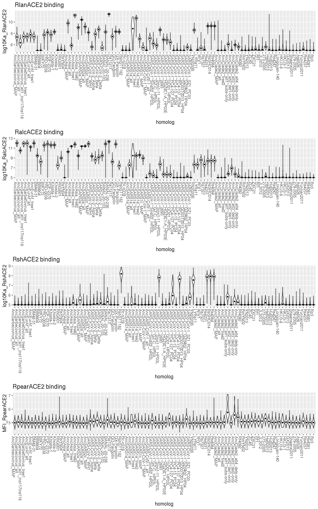

Let’s add a variable that flags the top and bottom 2.5% of binding
scores for each variant, and see how violin plots look when censoring
these top and bottom 2.5% of barcodes

``` r
dt[,RlanACE2_censor_lower:=quantile(log10Ka_RlanACE2,0.025,na.rm=T,type=7),by=c("library","target","variant_class","aa_substitutions")]
dt[,RlanACE2_censor_upper:=quantile(log10Ka_RlanACE2,0.975,na.rm=T,type=7),by=c("library","target","variant_class","aa_substitutions")]

dt[,RalcACE2_censor_lower:=quantile(log10Ka_RalcACE2,0.025,na.rm=T,type=7),by=c("library","target","variant_class","aa_substitutions")]
dt[,RalcACE2_censor_upper:=quantile(log10Ka_RalcACE2,0.975,na.rm=T,type=7),by=c("library","target","variant_class","aa_substitutions")]

dt[,RshACE2_censor_lower:=quantile(log10Ka_RshACE2,0.025,na.rm=T,type=7),by=c("library","target","variant_class","aa_substitutions")]
dt[,RshACE2_censor_upper:=quantile(log10Ka_RshACE2,0.975,na.rm=T,type=7),by=c("library","target","variant_class","aa_substitutions")]

dt[,RpearACE2_censor_lower:=quantile(MFI_RpearACE2,0.025,na.rm=T,type=7),by=c("library","target","variant_class","aa_substitutions")]
dt[,RpearACE2_censor_upper:=quantile(MFI_RpearACE2,0.975,na.rm=T,type=7),by=c("library","target","variant_class","aa_substitutions")]

p1 <- ggplot(dt[!is.na(log10Ka_RlanACE2) & log10Ka_RlanACE2 >= RlanACE2_censor_lower & log10Ka_RlanACE2 <= RlanACE2_censor_upper & variant_class=="wildtype",],aes(x=target,y=log10Ka_RlanACE2))+
  geom_violin(scale="width")+stat_summary(fun=median,geom="point",size=1)+
  ggtitle("RlanACE2 binding")+xlab("homolog")+theme(axis.text.x=element_text(angle=-90,hjust=0))

p2 <- ggplot(dt[!is.na(log10Ka_RalcACE2) & log10Ka_RalcACE2 >= RalcACE2_censor_lower & log10Ka_RalcACE2 <= RalcACE2_censor_upper & variant_class=="wildtype",],aes(x=target,y=log10Ka_RalcACE2))+
  geom_violin(scale="width")+stat_summary(fun=median,geom="point",size=1)+
  ggtitle("RalcACE2 binding")+xlab("homolog")+theme(axis.text.x=element_text(angle=-90,hjust=0))

p3 <- ggplot(dt[!is.na(log10Ka_RshACE2) & log10Ka_RshACE2 >= RshACE2_censor_lower & log10Ka_RshACE2 <= RshACE2_censor_upper & variant_class=="wildtype",],aes(x=target,y=log10Ka_RshACE2))+
  geom_violin(scale="width")+stat_summary(fun=median,geom="point",size=1)+
  ggtitle("RshACE2 binding")+xlab("homolog")+theme(axis.text.x=element_text(angle=-90,hjust=0))

p4 <- ggplot(dt[!is.na(MFI_RpearACE2) & MFI_RpearACE2 >= RpearACE2_censor_lower & MFI_RpearACE2 <= RpearACE2_censor_upper & variant_class=="wildtype",],aes(x=target,y=MFI_RpearACE2))+
  geom_violin(scale="width")+stat_summary(fun=median,geom="point",size=1)+
  ggtitle("RpearACE2 binding")+xlab("homolog")+theme(axis.text.x=element_text(angle=-90,hjust=0))


grid.arrange(p1,p2,p3,p4,ncol=1)
```

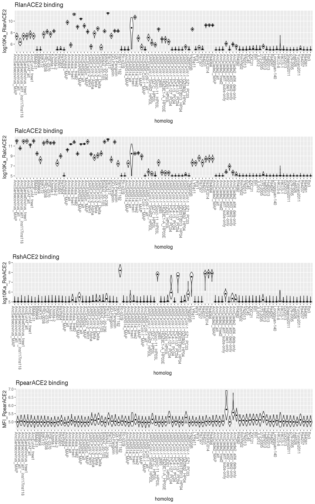

``` r
invisible(dev.print(pdf, paste(config$final_variant_scores_dir,"/lib46_vioplots_bind-cens.pdf",sep="")))
```

Calculate the mean per variant, the standard deviation, and the number
of (post-filter) barcodes on which a variant score was determined

``` r
#apply the censors to NA out the phenotypes outside the range
dt[log10Ka_RlanACE2 < RlanACE2_censor_lower | log10Ka_RlanACE2 > RlanACE2_censor_upper, log10Ka_RlanACE2:=NA]
dt[log10Ka_RalcACE2 < RalcACE2_censor_lower | log10Ka_RalcACE2 > RalcACE2_censor_upper, log10Ka_RalcACE2:=NA]
dt[log10Ka_RshACE2 < RshACE2_censor_lower | log10Ka_RshACE2 > RshACE2_censor_upper, log10Ka_RshACE2:=NA]
dt[MFI_RpearACE2 < RpearACE2_censor_lower | MFI_RpearACE2 > RpearACE2_censor_upper, MFI_RpearACE2:=NA]

dt[,mean_log10Ka_RlanACE2:=mean(log10Ka_RlanACE2,na.rm=T),by=c("library","target","variant_class","aa_substitutions")]
dt[,sd_log10Ka_RlanACE2:=sd(log10Ka_RlanACE2,na.rm=T),by=c("library","target","variant_class","aa_substitutions")]
dt[,n_bc_log10Ka_RlanACE2:=sum(!is.na(log10Ka_RlanACE2)),by=c("library","target","variant_class","aa_substitutions")]

dt[,mean_log10Ka_RalcACE2:=mean(log10Ka_RalcACE2,na.rm=T),by=c("library","target","variant_class","aa_substitutions")]
dt[,sd_log10Ka_RalcACE2:=sd(log10Ka_RalcACE2,na.rm=T),by=c("library","target","variant_class","aa_substitutions")]
dt[,n_bc_log10Ka_RalcACE2:=sum(!is.na(log10Ka_RalcACE2)),by=c("library","target","variant_class","aa_substitutions")]

dt[,mean_log10Ka_RshACE2:=mean(log10Ka_RshACE2,na.rm=T),by=c("library","target","variant_class","aa_substitutions")]
dt[,sd_log10Ka_RshACE2:=sd(log10Ka_RshACE2,na.rm=T),by=c("library","target","variant_class","aa_substitutions")]
dt[,n_bc_log10Ka_RshACE2:=sum(!is.na(log10Ka_RshACE2)),by=c("library","target","variant_class","aa_substitutions")]

dt[,mean_MFI_RpearACE2:=mean(MFI_RpearACE2,na.rm=T),by=c("library","target","variant_class","aa_substitutions")]
dt[,sd_MFI_RpearACE2:=sd(MFI_RpearACE2,na.rm=T),by=c("library","target","variant_class","aa_substitutions")]
dt[,n_bc_MFI_RpearACE2:=sum(!is.na(MFI_RpearACE2)),by=c("library","target","variant_class","aa_substitutions")]
```

Collapse down to tables reporting just the summary statistics for each
genotype.

``` r
dt_wt_new <- dt[variant_class=="wildtype",
                .(target,
                  mean_log10Ka_RlanACE2, sd_log10Ka_RlanACE2, n_bc_log10Ka_RlanACE2,
                  mean_log10Ka_RalcACE2, sd_log10Ka_RalcACE2, n_bc_log10Ka_RalcACE2,
                  mean_log10Ka_RshACE2, sd_log10Ka_RshACE2, n_bc_log10Ka_RshACE2,
                  mean_MFI_RpearACE2, sd_MFI_RpearACE2, n_bc_MFI_RpearACE2)]

dt_wt_new <- unique(dt_wt_new); setkey(dt_wt_new, target)

dt_mut_new <- dt[variant_class=="1 nonsynonymous",
                 .(library,target,aa_substitutions,
                   mean_log10Ka_RlanACE2, sd_log10Ka_RlanACE2, n_bc_log10Ka_RlanACE2,
                   mean_log10Ka_RalcACE2, sd_log10Ka_RalcACE2, n_bc_log10Ka_RalcACE2,
                   mean_log10Ka_RshACE2, sd_log10Ka_RshACE2, n_bc_log10Ka_RshACE2,
                   mean_MFI_RpearACE2, sd_MFI_RpearACE2, n_bc_MFI_RpearACE2)]

dt_mut_new <- unique(dt_mut_new)

#split mutation string
#define function to apply
split_mut <- function(x){
  split <- strsplit(x,split="")[[1]]
  return(list(split[1],as.numeric(paste(split[2:(length(split)-1)],collapse="")),split[length(split)]))
}
dt_mut_new[,c("wildtype","position","mutant"):=split_mut(as.character(aa_substitutions)),by=aa_substitutions]

dt_mut_new <- dt_mut_new[,.(target, wildtype, position, mutant,
                            mean_log10Ka_RlanACE2, sd_log10Ka_RlanACE2, n_bc_log10Ka_RlanACE2,
                            mean_log10Ka_RalcACE2, sd_log10Ka_RalcACE2, n_bc_log10Ka_RalcACE2,
                            mean_log10Ka_RshACE2, sd_log10Ka_RshACE2, n_bc_log10Ka_RshACE2,
                            mean_MFI_RpearACE2, sd_MFI_RpearACE2, n_bc_MFI_RpearACE2)]

aas <- c("A","C","D","E","F","G","H","I","K","L","M","N","P","Q","R","S","T","V","W","Y")
#fill out missing values in table with a hideous loop. If you are somebody who is reading this code, I apologize.
for(bg in unique(dt_mut_new$target)){
  for(pos in unique(dt_mut_new$position)){
    for(aa in aas){
      if(!(aa %in% as.character(dt_mut_new[target==bg & position==pos,mutant]))){
        dt_mut_new <- rbind(dt_mut_new,list(bg, dt_mut_new[target==bg & position==pos,wildtype][1],pos,aa),fill=T)
      }
    }
  }
}

setkey(dt_mut_new,target,position,mutant)
```

Let’s look how SEM is distributed. Can see that SEM is generally very,
very low. Also that it doesn’t really have a relationship with the bind
metric, which is good.

``` r
par(mfrow=c(2,2))
#RlanACE2
x <- dt_mut_new[,mean_log10Ka_RlanACE2]; y <- dt_mut_new[,sd_log10Ka_RlanACE2/sqrt(n_bc_log10Ka_RlanACE2)]; plot(x,y,pch=16,col="#00000090",xlab="variant binding",ylab="SEM",main="RlanACE2 log10Ka")

#RalcACE2
x <- dt_mut_new[,mean_log10Ka_RalcACE2]; y <- dt_mut_new[,sd_log10Ka_RalcACE2/sqrt(n_bc_log10Ka_RalcACE2)]; plot(x,y,pch=16,col="#00000090",xlab="variant binding",ylab="SEM",main="RalcACE2 log10Ka")

#RshACE2
x <- dt_mut_new[,mean_log10Ka_RshACE2]; y <- dt_mut_new[,sd_log10Ka_RshACE2/sqrt(n_bc_log10Ka_RshACE2)]; plot(x,y,pch=16,col="#00000090",xlab="variant binding",ylab="SEM",main="RshACE2 log10Ka")

#RpearACE2
x <- dt_mut_new[,mean_MFI_RpearACE2]; y <- dt_mut_new[,sd_MFI_RpearACE2/sqrt(n_bc_MFI_RpearACE2)]; plot(x,y,pch=16,col="#00000090",xlab="variant binding",ylab="SEM",main="RpearACE2 MFI")
```

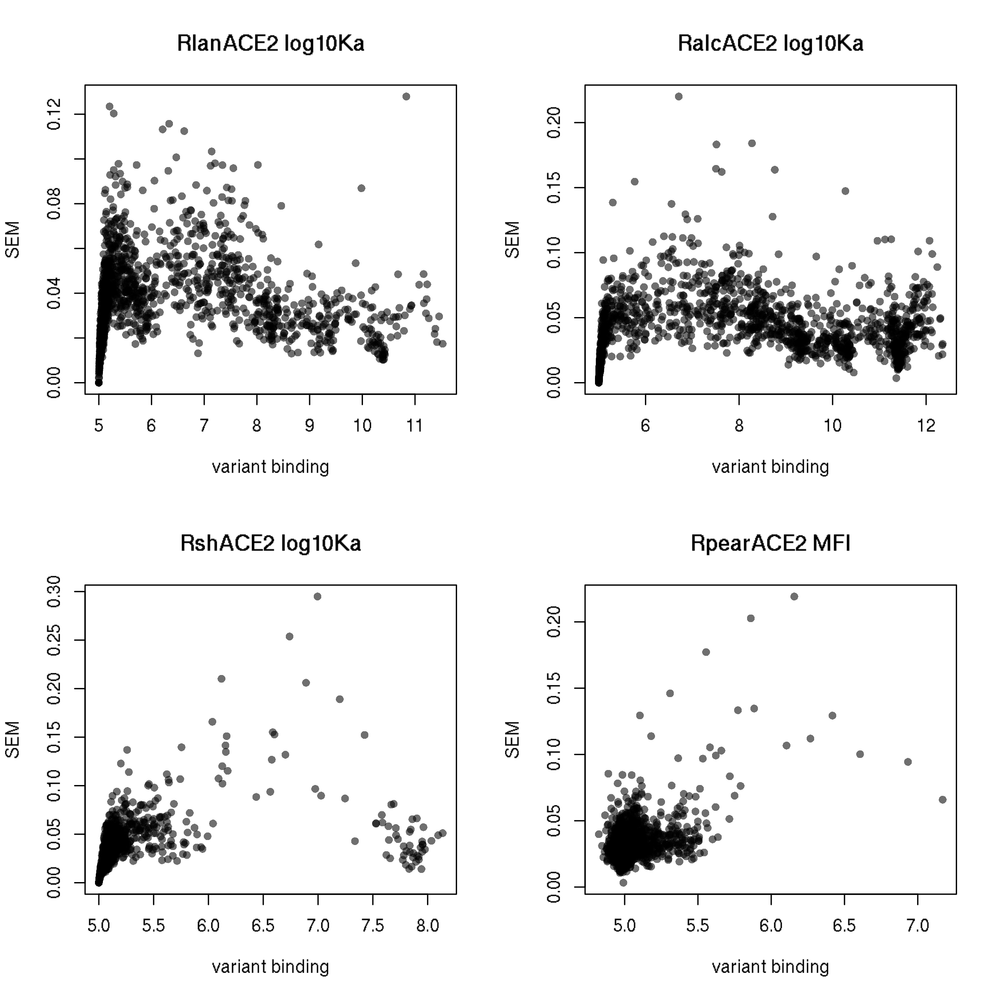

``` r
invisible(dev.print(pdf, paste(config$final_variant_scores_dir,"/lib46_SEM-v-bind.pdf",sep=""),useDingbats=F))
```

Let’s also look at how standard error of a within-replicate mean varies
with the number of barcodes

``` r
par(mfrow=c(2,2))
#RlanACE2
x <- dt_mut_new[,n_bc_log10Ka_RlanACE2]; y <- dt_mut_new[,sd_log10Ka_RlanACE2/sqrt(n_bc_log10Ka_RlanACE2)]; plot(x,y,pch=16,col="#00000090",xlab="number barcodes",ylab="SEM",main="RlanACE2")

#RalcACE2
x <- dt_mut_new[,n_bc_log10Ka_RalcACE2]; y <- dt_mut_new[,sd_log10Ka_RalcACE2/sqrt(n_bc_log10Ka_RalcACE2)]; plot(x,y,pch=16,col="#00000090",xlab="number barcodes",ylab="SEM",main="RalcACE2")

#RshACE2
x <- dt_mut_new[,n_bc_log10Ka_RshACE2]; y <- dt_mut_new[,sd_log10Ka_RshACE2/sqrt(n_bc_log10Ka_RshACE2)]; plot(x,y,pch=16,col="#00000090",xlab="number barcodes",ylab="SEM",main="RshACE2")

#RpearACE2
x <- dt_mut_new[,n_bc_MFI_RpearACE2]; y <- dt_mut_new[,sd_MFI_RpearACE2/sqrt(n_bc_MFI_RpearACE2)]; plot(x,y,pch=16,col="#00000090",xlab="number barcodes",ylab="SEM",main="RpearACE2")
```

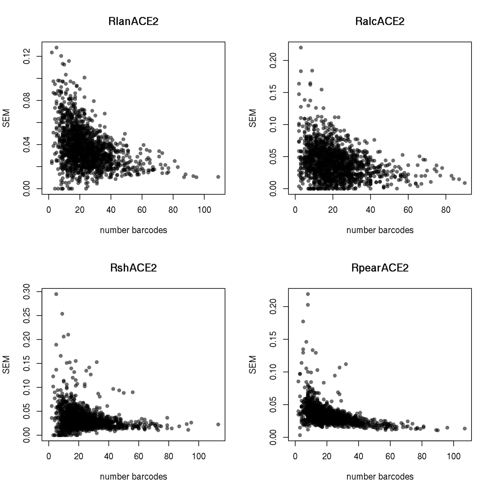

``` r
invisible(dev.print(pdf, paste(config$final_variant_scores_dir,"/lib46_SEM-v-n-bc.pdf",sep=""),useDingbats=F))
```

Combine with the previously published measurements of ACE2 and
expression

``` r
dt_wt <- merge(dt_wt,dt_wt_new,by="target",all=T); rm(dt_wt_new)
setkey(dt_wt,target)

dt_mut <- merge(dt_mut,dt_mut_new,by=c("target","wildtype","position","mutant"),all=T); rm(dt_mut_new)
setkey(dt_mut,target,position,mutant)
```

Filter out the two backgrounds that were completely non-expressing. Most
barcodes were purged before the affinity measurements for these
backgrounds, so the affinities are determined from few barcodes and are
just generally unreliable because these are poorly folded/expressing
variants. (E.g. could see very high standard deviations)

``` r
dt_wt[target %in% c("HKU3-8","AncSARS1a_alt"), c("mean_log10Ka_RlanACE2","sd_log10Ka_RlanACE2","n_bc_log10Ka_RlanACE2",
                                                 "mean_log10Ka_RalcACE2","sd_log10Ka_RalcACE2","n_bc_log10Ka_RalcACE2",
                                                 "mean_log10Ka_RshACE2","sd_log10Ka_RshACE2","n_bc_log10Ka_RshACE2",
                                                 "mean_MFI_RpearACE2","sd_MFI_RpearACE2","n_bc_MFI_RpearACE2"):=NA]
```

Filter out mutant genotypes if they weren’t sampled with at least 3
barcodes

``` r
dt_mut[n_bc_log10Ka_RlanACE2 < 3,c("mean_log10Ka_RlanACE2","sd_log10Ka_RlanACE2","n_bc_log10Ka_RlanACE2"):=NA]
dt_mut[n_bc_log10Ka_RalcACE2 < 3,c("mean_log10Ka_RalcACE2","sd_log10Ka_RalcACE2","n_bc_log10Ka_RalcACE2"):=NA]
dt_mut[n_bc_log10Ka_RshACE2 < 3,c("mean_log10Ka_RshACE2","sd_log10Ka_RshACE2","n_bc_log10Ka_RshACE2"):=NA]
dt_mut[n_bc_MFI_RpearACE2 < 3,c("mean_MFI_RpearACE2","sd_MFI_RpearACE2","n_bc_MFI_RpearACE2"):=NA]
```

Our highest concentration point was 1uM, but we let the curve fitting go
out to 1e-5 Kd. Spot checking curves suggests the variation between 1e-5
and 1e-6 Kds is just noise, so we want to collapse things to our
detection limit of 1e-6

``` r
limit <- 6

dt_mut[huACE2 < limit,huACE2:=limit]
dt_mut[cvACE2 < limit,cvACE2:=limit]
dt_mut[pgACE2 < limit,pgACE2:=limit]
dt_mut[mACE2 < limit,mACE2:=limit]
dt_mut[Ra787ACE2 < limit,Ra787ACE2:=limit]
dt_mut[Ra9479ACE2 < limit,Ra9479ACE2:=limit]
dt_mut[Rs3364ACE2 < limit,Rs3364ACE2:=limit]
dt_mut[Rs1434ACE2 < limit,Rs1434ACE2:=limit]
dt_mut[mean_log10Ka_RlanACE2 < limit,mean_log10Ka_RlanACE2:=limit]
dt_mut[mean_log10Ka_RalcACE2 < limit,mean_log10Ka_RalcACE2:=limit]
dt_mut[mean_log10Ka_RshACE2 < limit,mean_log10Ka_RshACE2:=limit]

dt_wt[huACE2 < limit,huACE2:=limit]
dt_wt[cvACE2 < limit,cvACE2:=limit]
dt_wt[pgACE2 < limit,pgACE2:=limit]
dt_wt[mACE2 < limit,mACE2:=limit]
dt_wt[Ra787ACE2 < limit,Ra787ACE2:=limit]
dt_wt[Ra9479ACE2 < limit,Ra9479ACE2:=limit]
dt_wt[Rs3364ACE2 < limit,Rs3364ACE2:=limit]
dt_wt[Rs1434ACE2 < limit,Rs1434ACE2:=limit]
dt_wt[mean_log10Ka_RlanACE2 < limit,mean_log10Ka_RlanACE2:=limit]
dt_wt[mean_log10Ka_RalcACE2 < limit,mean_log10Ka_RalcACE2:=limit]
dt_wt[mean_log10Ka_RshACE2 < limit,mean_log10Ka_RshACE2:=limit]
```

Coverage stats on n_barcodes for different measurements in the final
pooled measurements.

``` r
par(mfrow=c(2,2))

hist(dt_mut$n_bc_log10Ka_RlanACE2,col="gray50",main=paste("RlanACE2,\nmedian ",median(dt_mut$n_bc_log10Ka_RlanACE2,na.rm=T),sep=""),xlab="number barcodes",ylab="number genotypes",breaks=20)

hist(dt_mut$n_bc_log10Ka_RalcACE2,col="gray50",main=paste("RalcACE2,\nmedian ",median(dt_mut$n_bc_log10Ka_RalcACE2,na.rm=T),sep=""),xlab="number barcodes",ylab="number genotypes",breaks=20)

hist(dt_mut$n_bc_log10Ka_RshACE2,col="gray50",main=paste("RshACE2,\nmedian ",median(dt_mut$n_bc_log10Ka_RshACE2,na.rm=T),sep=""),xlab="number barcodes",ylab="number genotypes",breaks=20)

hist(dt_mut$n_bc_MFI_RpearACE2,col="gray50",main=paste("RpearACE2,\nmedian ",median(dt_mut$n_bc_MFI_RpearACE2,na.rm=T),sep=""),xlab="number barcodes",ylab="number genotypes",breaks=20)
```

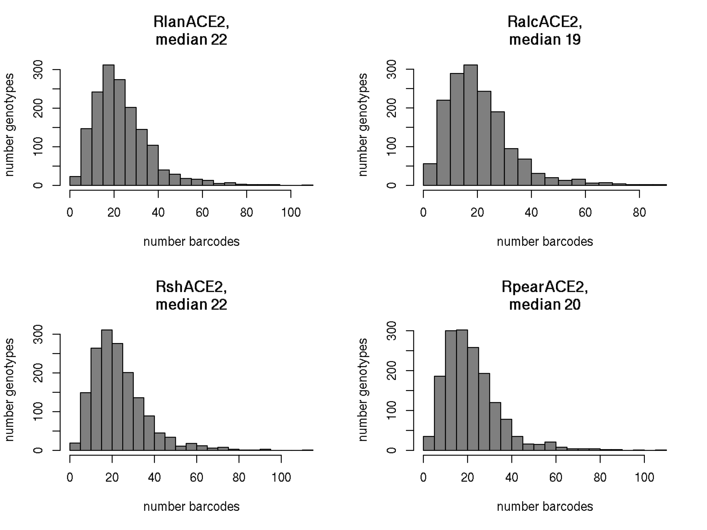

``` r
invisible(dev.print(pdf, paste(config$final_variant_scores_dir,"/lib46_hist_n_barcodes.pdf",sep="")))
```

``` r
#remove n info from table
dt_wt <- dt_wt[,.(target,expression,huACE2,cvACE2,pgACE2,mACE2,Ra787ACE2,Ra9479ACE2,Rs3364ACE2,Rs1434ACE2,RpearoldACE2,
                  mean_log10Ka_RlanACE2,mean_log10Ka_RalcACE2,mean_log10Ka_RshACE2,mean_MFI_RpearACE2)]
dt_mut <- dt_mut[,.(target,wildtype,position,mutant,expression,huACE2,cvACE2,pgACE2,mACE2,Ra787ACE2,Ra9479ACE2,Rs3364ACE2,Rs1434ACE2,RpearoldACE2,
                    mean_log10Ka_RlanACE2,mean_log10Ka_RalcACE2,mean_log10Ka_RshACE2,mean_MFI_RpearACE2)]


setnames(dt_wt,c("mean_log10Ka_RlanACE2","mean_log10Ka_RalcACE2","mean_log10Ka_RshACE2","mean_MFI_RpearACE2"),c("RlanACE2","RalcACE2","RshACE2","RpearACE2"))
setnames(dt_mut,c("mean_log10Ka_RlanACE2","mean_log10Ka_RalcACE2","mean_log10Ka_RshACE2","mean_MFI_RpearACE2"),c("RlanACE2","RalcACE2","RshACE2","RpearACE2"))
```

``` r
#fill in the wildtype state in the mutants table
for(i in 1:nrow(dt_mut)){
  if(as.character(dt_mut[i,wildtype])==as.character(dt_mut[i,mutant])){
    dt_mut[i,c("RlanACE2","RalcACE2","RshACE2","RpearACE2"):=dt_wt[target==dt_mut[i,target],.(RlanACE2,RalcACE2,RshACE2,RpearACE2)]]
  }
}

#add delta_log10Kas
for(i in 1:nrow(dt_mut)){
  dt_mut[i,expression_delta := expression - dt_mut[target==dt_mut[i,target] & as.character(wildtype)==as.character(mutant) & position==dt_mut[i,position],expression]]
  dt_mut[i,huACE2_delta := huACE2 - dt_mut[target==dt_mut[i,target] & as.character(wildtype)==as.character(mutant) & position==dt_mut[i,position],huACE2]]
  dt_mut[i,cvACE2_delta := cvACE2 - dt_mut[target==dt_mut[i,target] & as.character(wildtype)==as.character(mutant) & position==dt_mut[i,position],cvACE2]]
  dt_mut[i,pgACE2_delta := pgACE2 - dt_mut[target==dt_mut[i,target] & as.character(wildtype)==as.character(mutant) & position==dt_mut[i,position],pgACE2]]
  dt_mut[i,mACE2_delta := mACE2 - dt_mut[target==dt_mut[i,target] & as.character(wildtype)==as.character(mutant) & position==dt_mut[i,position],mACE2]]
  dt_mut[i,Ra787ACE2_delta := Ra787ACE2 - dt_mut[target==dt_mut[i,target] & as.character(wildtype)==as.character(mutant) & position==dt_mut[i,position],Ra787ACE2]]
  dt_mut[i,Ra9479ACE2_delta := Ra9479ACE2 - dt_mut[target==dt_mut[i,target] & as.character(wildtype)==as.character(mutant) & position==dt_mut[i,position],Ra9479ACE2]]
  dt_mut[i,Rs3364ACE2_delta := Rs3364ACE2 - dt_mut[target==dt_mut[i,target] & as.character(wildtype)==as.character(mutant) & position==dt_mut[i,position],Rs3364ACE2]]
  dt_mut[i,Rs1434ACE2_delta := Rs1434ACE2 - dt_mut[target==dt_mut[i,target] & as.character(wildtype)==as.character(mutant) & position==dt_mut[i,position],Rs1434ACE2]]
  dt_mut[i,RpearoldACE2_delta := RpearoldACE2 - dt_mut[target==dt_mut[i,target] & as.character(wildtype)==as.character(mutant) & position==dt_mut[i,position],RpearoldACE2]]
  dt_mut[i,RlanACE2_delta := RlanACE2 - dt_mut[target==dt_mut[i,target] & as.character(wildtype)==as.character(mutant) & position==dt_mut[i,position],RlanACE2]]
  dt_mut[i,RalcACE2_delta := RalcACE2 - dt_mut[target==dt_mut[i,target] & as.character(wildtype)==as.character(mutant) & position==dt_mut[i,position],RalcACE2]]
  dt_mut[i,RshACE2_delta := RshACE2 - dt_mut[target==dt_mut[i,target] & as.character(wildtype)==as.character(mutant) & position==dt_mut[i,position],RshACE2]]
  dt_mut[i,RpearACE2_delta := RpearACE2 - dt_mut[target==dt_mut[i,target] & as.character(wildtype)==as.character(mutant) & position==dt_mut[i,position],RpearACE2]]
}
```

Order factor variables for plotting

``` r
#order target by order given in config
dt_mut$target <- factor(dt_mut$target,levels=config$mutated_targets_ordered)
#order mutant as a factor for grouping by rough biochemical grouping
dt_mut$mutant <- factor(dt_mut$mutant, levels=c("C","P","G","V","M","L","I","A","F","W","Y","T","S","N","Q","E","D","H","K","R"))
#order sites as a factor variable
dt_mut$position <- factor(dt_mut$position,levels=c(455,486,493,494,498,501))
#add character vector indicating wildtype to use as plotting symbols for wt
dt_mut[,wildtype_indicator := ""]
dt_mut[as.character(mutant)==as.character(wildtype),wildtype_indicator := "x"]

dt_wt$target <- factor(dt_wt$target,levels=config$targets_ordered)
```

## Heatmaps!

Output heatmaps illustrating all wildtype variants with separate rows
for each ACE2.

``` r
#make temp long-form data frame
temp1 <- data.table::melt(dt_wt[,.(target,huACE2,cvACE2,pgACE2,mACE2,Ra787ACE2,Ra9479ACE2,Rs3364ACE2,Rs1434ACE2,RlanACE2,RalcACE2,RshACE2,RpearACE2)],
                          id.vars=c("target"),
                          measure.vars=c("huACE2","cvACE2","pgACE2","mACE2","Ra787ACE2","Ra9479ACE2","Rs3364ACE2","Rs1434ACE2","RlanACE2","RalcACE2","RshACE2","RpearACE2"),
                          variable.name="ACE2",value.name="log10Ka")

temp2 <- dt_wt[,.(target,expression)]

p1 <- ggplot(temp1,aes(target,ACE2))+geom_tile(aes(fill=log10Ka),color="black",lwd=0.1)+
  scale_fill_gradientn(colours=c("#FFFFFF","#FFFFFF","#003366"),limits=c(4.5,12.5),values=c(0,1.5/8,8/8),na.value="gray70")+ #effectively 6-12.5
  #scale_fill_gradientn(colours=c("#FFFFFF","#003366"),limits=c(5,12),values=c(0,1),na.value="gray70")+
  #scale_x_continuous(expand=c(0,0),breaks=c(331,seq(335,430,by=5)))+
  labs(x="RBD homolog",y="")+theme_classic(base_size=9)+
  coord_equal()+theme(axis.text.x=element_text(angle=90,hjust=1,vjust=0.6,face="bold"))

p2 <- ggplot(temp2,aes(target,y=1))+geom_tile(aes(fill=expression),color="black",lwd=0.1)+
  scale_fill_gradientn(colours=c("#FFFFFF","#06C528"),limits=c(5,11),values=c(0,1),na.value="gray70")+
  labs(x="",y="expression")+theme_classic(base_size=9)+
  coord_equal()+theme(axis.text.x=element_blank(),axis.text.y=element_blank(),axis.ticks.y = element_blank())

ggarrange(p2,p1,nrow=2)
```

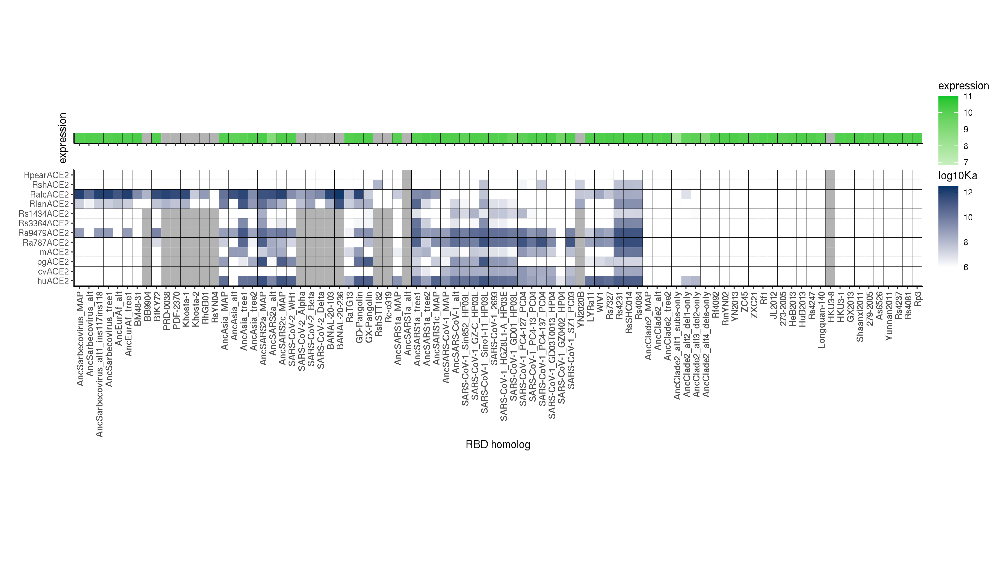

``` r
invisible(dev.print(pdf, paste(config$final_variant_scores_dir,"/lib46_heatmap_wts_all.pdf",sep="")))
```

Showing just extant sarbs.

``` r
#make temp long-form data frame
extant <- c(config$EurAf_extant,config$RsYN04_extant,config$SARS2_extant,config$SARS1_extant,config$Clade2_extant)

temp3 <- temp1[target %in% extant,];temp3$target <- factor(temp3$target,levels=extant)

p1 <- ggplot(temp3,aes(target,ACE2))+geom_tile(aes(fill=log10Ka),color="black",lwd=0.1)+
  scale_fill_gradientn(colours=c("#FFFFFF","#FFFFFF","#003366"),limits=c(4.5,12.5),values=c(0,1.5/8,8/8),na.value="gray70")+
  #scale_fill_gradientn(colours=c("#FFFFFF","#003366"),limits=c(5,12),values=c(0,1),na.value="gray70")+
  #scale_x_continuous(expand=c(0,0),breaks=c(331,seq(335,430,by=5)))+
  labs(x="RBD homolog",y="")+theme_classic(base_size=9)+
  coord_equal()+theme(axis.text.x=element_text(angle=90,hjust=1,vjust=0.6,face="bold"))

p1
```

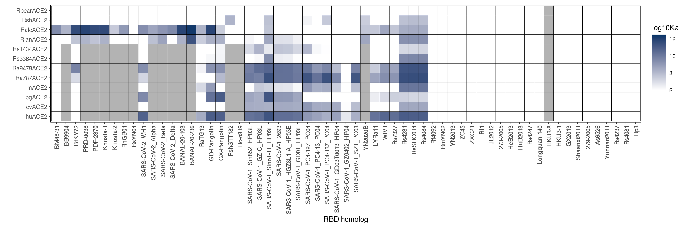

``` r
invisible(dev.print(pdf, paste(config$final_variant_scores_dir,"/lib46_heatmap_wts_extant.pdf",sep="")))
```

And for ancestors.

``` r
#make temp long-form data frame
ancestors <- c(config$ancestors_MAP)

temp4 <- temp1[target %in% ancestors,];temp4$target <- factor(temp4$target,levels=ancestors)

p1 <- ggplot(temp4,aes(target,ACE2))+geom_tile(aes(fill=log10Ka),color="black",lwd=0.1)+
  scale_fill_gradientn(colours=c("#FFFFFF","#FFFFFF","#003366"),limits=c(4.5,12.5),values=c(0,1.5/8,8/8),na.value="gray70")+
  #scale_fill_gradientn(colours=c("#FFFFFF","#003366"),limits=c(5,12),values=c(0,1),na.value="gray70")+
  #scale_x_continuous(expand=c(0,0),breaks=c(331,seq(335,430,by=5)))+
  labs(x="RBD homolog",y="")+theme_classic(base_size=9)+
  coord_equal()+theme(axis.text.x=element_text(angle=90,hjust=1,vjust=0.6,face="bold"))

p1
```

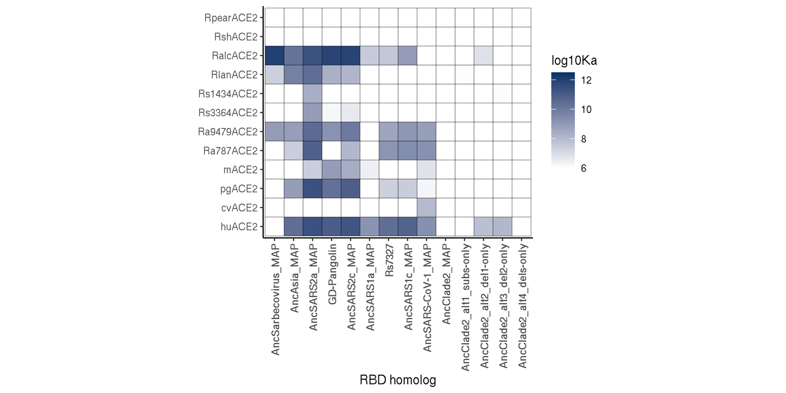

``` r
invisible(dev.print(pdf, paste(config$final_variant_scores_dir,"/lib46_heatmap_wts_MAP-ancestors.pdf",sep="")))
```

``` r
#make temp long-form data frame
ancestors <- c(config$ancestors_MAP_v_alt)

temp5 <- temp1[target %in% ancestors,];temp5$target <- factor(temp5$target,levels=ancestors)

p1 <- ggplot(temp5,aes(target,ACE2))+geom_tile(aes(fill=log10Ka),color="black",lwd=0.1)+
  scale_fill_gradientn(colours=c("#FFFFFF","#FFFFFF","#003366"),limits=c(4.5,12.5),values=c(0,1.5/8,8/8),na.value="gray70")+
  #scale_fill_gradientn(colours=c("#FFFFFF","#003366"),limits=c(5,12),values=c(0,1),na.value="gray70")+
  #scale_x_continuous(expand=c(0,0),breaks=c(331,seq(335,430,by=5)))+
  labs(x="RBD homolog",y="")+theme_classic(base_size=9)+
  coord_equal()+theme(axis.text.x=element_text(angle=90,hjust=1,vjust=0.6,face="bold"))

p1
```

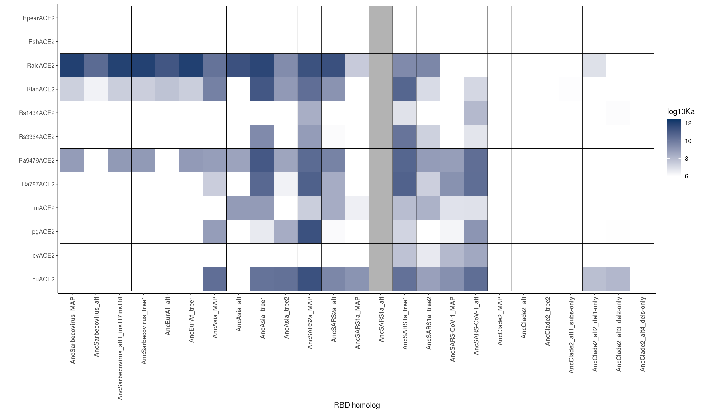

``` r
invisible(dev.print(pdf, paste(config$final_variant_scores_dir,"/lib46_heatmap_wts_MAP-and-alt-ancestors.pdf",sep="")))
```

Next, for the SSM libraries. Many ways of faceting these by mutant,
background, ACE2… also, can be useful as raw Kd, or delta compared to
WT.

``` r
#make temp long-form data frame for absolute log10Ka
temp1 <- data.table::melt(dt_mut[,.(target,position,wildtype,mutant,wildtype_indicator,huACE2,cvACE2,pgACE2,mACE2,Ra787ACE2,Ra9479ACE2,Rs3364ACE2,Rs1434ACE2,RlanACE2,RalcACE2,RshACE2,RpearACE2)],
                          id.vars=c("target","position","wildtype","mutant","wildtype_indicator"),
                          measure.vars=c("huACE2","cvACE2","pgACE2","mACE2","Ra787ACE2","Ra9479ACE2","Rs3364ACE2","Rs1434ACE2","RlanACE2","RalcACE2","RshACE2","RpearACE2"),
                          variable.name="ACE2",value.name="log10Ka")

#make temp long-form data frame for delta log10Ka
temp2 <- data.table::melt(dt_mut[,.(target,position,wildtype,mutant,wildtype_indicator,huACE2_delta,cvACE2_delta,pgACE2_delta,mACE2_delta,Ra787ACE2_delta,Ra9479ACE2_delta,Rs3364ACE2_delta,Rs1434ACE2_delta,RlanACE2_delta,RalcACE2_delta,RshACE2_delta,RpearACE2_delta)],
                          id.vars=c("target","position","wildtype","mutant","wildtype_indicator"),
                          measure.vars=c("huACE2_delta","cvACE2_delta","pgACE2_delta","mACE2_delta","Ra787ACE2_delta","Ra9479ACE2_delta","Rs3364ACE2_delta","Rs1434ACE2_delta","RlanACE2_delta","RalcACE2_delta","RshACE2_delta","RpearACE2_delta"),
                          variable.name="ACE2",value.name="delta_log10Ka")

#for method to duplicate aa labels on right side of plot https://github.com/tidyverse/ggplot2/issues/3171
guide_axis_label_trans <- function(label_trans = identity, ...) {
  axis_guide <- guide_axis(...)
  axis_guide$label_trans <- rlang::as_function(label_trans)
  class(axis_guide) <- c("guide_axis_trans", class(axis_guide))
  axis_guide
}

guide_train.guide_axis_trans <- function(x, ...) {
  trained <- NextMethod()
  trained$key$.label <- x$label_trans(trained$key$.label)
  trained
}
```

Heatmaps faceted by RBD background. First, expression.

``` r
temp_expr <- dt_mut[,.(target,position,mutant,expression,wildtype_indicator)]

p1 <- ggplot(temp_expr,aes(position,mutant))+geom_tile(aes(fill=expression),color="black",lwd=0.1)+
  scale_fill_gradientn(colours=c("#FFFFFF","#06C528"),limits=c(5,11),values=c(0,1),na.value="gray70")+
  labs(x="",y="")+theme_classic(base_size=9)+
  coord_equal()+theme(axis.text.x=element_text(angle=90,hjust=1,vjust=0.6,face="bold",size=10),axis.text.y=element_text(face="bold",size=10))+
  facet_wrap(~target,nrow=1)+
  guides(y.sec=guide_axis_label_trans())+
  geom_text(aes(label=wildtype_indicator),size=2,color="gray10")

p1
```

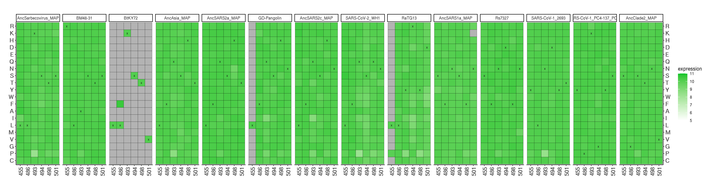

``` r
invisible(dev.print(pdf, paste(config$final_variant_scores_dir,"/lib46_heatmap_SSM_expression-by-target.pdf",sep="")))
```

``` r
temp_expr2 <- dt_mut[,.(target,position,mutant,expression_delta,wildtype_indicator)]

p1.2 <- ggplot(temp_expr2,aes(position,mutant))+geom_tile(aes(fill=expression_delta),color="black",lwd=0.1)+
  scale_fill_gradientn(colours=c("#A94E35","#F48365","#FFFFFF","#7378B9","#383C6C"),limits=c(-2,1),values=c(0,1/3,2/3,2.5/3,3/3),na.value="gray70")+
  labs(x="",y="")+theme_classic(base_size=9)+
  coord_equal()+theme(axis.text.x=element_text(angle=90,hjust=1,vjust=0.6,face="bold",size=10),axis.text.y=element_text(face="bold",size=10))+
  facet_wrap(~target,nrow=1)+
  guides(y.sec=guide_axis_label_trans())+
  geom_text(aes(label=wildtype_indicator),size=2,color="gray10")

p1.2
```

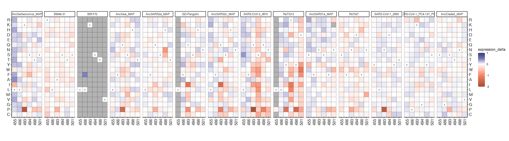

``` r
invisible(dev.print(pdf, paste(config$final_variant_scores_dir,"/lib46_heatmap_SSM_delta-expression-by-target.pdf",sep="")))
```

``` r
p2 <- ggplot(dt_mut,aes(position,mutant))+geom_tile(aes(fill=huACE2),color="black",lwd=0.1)+
  scale_fill_gradientn(colours=c("#FFFFFF","#003366","#003366"),limits=c(6,13),values=c(0,8/8.5,8.5/8.5),na.value="gray70")+ 
  labs(x="",y="")+theme_classic(base_size=9)+
  coord_equal()+theme(axis.text.x=element_text(angle=90,hjust=1,vjust=0.6,face="bold",size=10),axis.text.y=element_text(face="bold",size=10))+
  facet_wrap(~target,nrow=1)+
  guides(y.sec=guide_axis_label_trans())+
  geom_text(aes(label=wildtype_indicator),size=2,color="gray10")

p2
```

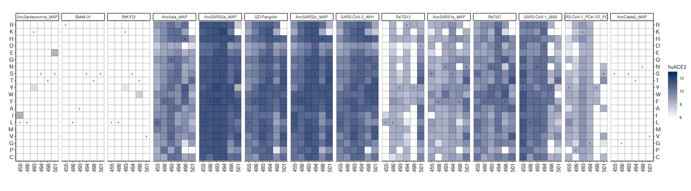

``` r
invisible(dev.print(pdf, paste(config$final_variant_scores_dir,"/lib46_heatmap_SSM_huACE2_log10Ka-by-target.pdf",sep="")))
```

``` r
p3 <- ggplot(dt_mut,aes(position,mutant))+geom_tile(aes(fill=cvACE2),color="black",lwd=0.1)+
  scale_fill_gradientn(colours=c("#FFFFFF","#003366","#003366"),limits=c(6,13),values=c(0,8/8.5,8.5/8.5),na.value="gray70")+ 
  labs(x="",y="")+theme_classic(base_size=9)+
  coord_equal()+theme(axis.text.x=element_text(angle=90,hjust=1,vjust=0.6,face="bold",size=10),axis.text.y=element_text(face="bold",size=10))+
  facet_wrap(~target,nrow=1)+
  guides(y.sec=guide_axis_label_trans())+
  geom_text(aes(label=wildtype_indicator),size=2,color="gray10")

p3
```

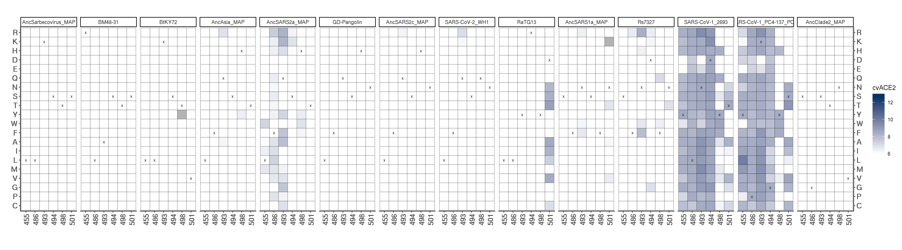

``` r
invisible(dev.print(pdf, paste(config$final_variant_scores_dir,"/lib46_heatmap_SSM_cvACE2_log10Ka-by-target.pdf",sep="")))
```

``` r
p4 <- ggplot(dt_mut,aes(position,mutant))+geom_tile(aes(fill=pgACE2),color="black",lwd=0.1)+
  scale_fill_gradientn(colours=c("#FFFFFF","#003366","#003366"),limits=c(6,13),values=c(0,8/8.5,8.5/8.5),na.value="gray70")+ 
  labs(x="",y="")+theme_classic(base_size=9)+
  coord_equal()+theme(axis.text.x=element_text(angle=90,hjust=1,vjust=0.6,face="bold",size=10),axis.text.y=element_text(face="bold",size=10))+
  facet_wrap(~target,nrow=1)+
  guides(y.sec=guide_axis_label_trans())+
  geom_text(aes(label=wildtype_indicator),size=2,color="gray10")

p4
```

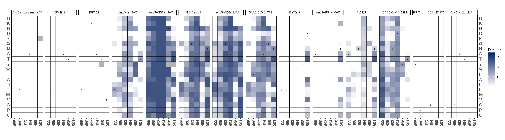

``` r
invisible(dev.print(pdf, paste(config$final_variant_scores_dir,"/lib46_heatmap_SSM_pgACE2_log10Ka-by-target.pdf",sep="")))
```

``` r
p5 <- ggplot(dt_mut,aes(position,mutant))+geom_tile(aes(fill=mACE2),color="black",lwd=0.1)+
  scale_fill_gradientn(colours=c("#FFFFFF","#003366","#003366"),limits=c(6,13),values=c(0,8/8.5,8.5/8.5),na.value="gray70")+ 
  labs(x="",y="")+theme_classic(base_size=9)+
  coord_equal()+theme(axis.text.x=element_text(angle=90,hjust=1,vjust=0.6,face="bold",size=10),axis.text.y=element_text(face="bold",size=10))+
  facet_wrap(~target,nrow=1)+
  guides(y.sec=guide_axis_label_trans())+
  geom_text(aes(label=wildtype_indicator),size=2,color="gray10")

p5
```

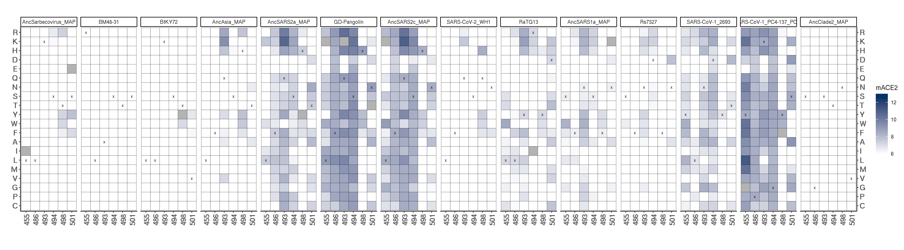

``` r
invisible(dev.print(pdf, paste(config$final_variant_scores_dir,"/lib46_heatmap_SSM_mACE2_log10Ka-by-target.pdf",sep="")))
```

``` r
p6 <- ggplot(dt_mut,aes(position,mutant))+geom_tile(aes(fill=Ra787ACE2),color="black",lwd=0.1)+
  scale_fill_gradientn(colours=c("#FFFFFF","#003366","#003366"),limits=c(6,13),values=c(0,8/8.5,8.5/8.5),na.value="gray70")+
  labs(x="",y="")+theme_classic(base_size=9)+
  coord_equal()+theme(axis.text.x=element_text(angle=90,hjust=1,vjust=0.6,face="bold",size=10),axis.text.y=element_text(face="bold",size=10))+
  facet_wrap(~target,nrow=1)+
  guides(y.sec=guide_axis_label_trans())+
  geom_text(aes(label=wildtype_indicator),size=2,color="gray10")

p6
```

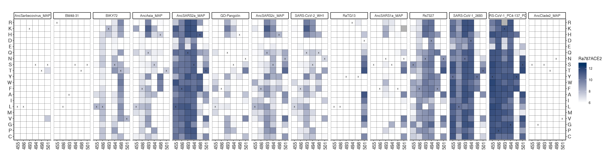

``` r
invisible(dev.print(pdf, paste(config$final_variant_scores_dir,"/lib46_heatmap_SSM_Ra787ACE2_log10Ka-by-target.pdf",sep="")))
```

``` r
p7 <- ggplot(dt_mut,aes(position,mutant))+geom_tile(aes(fill=Ra9479ACE2),color="black",lwd=0.1)+
  scale_fill_gradientn(colours=c("#FFFFFF","#003366","#003366"),limits=c(6,13),values=c(0,8/8.5,8.5/8.5),na.value="gray70")+
  labs(x="",y="")+theme_classic(base_size=9)+
  coord_equal()+theme(axis.text.x=element_text(angle=90,hjust=1,vjust=0.6,face="bold",size=10),axis.text.y=element_text(face="bold",size=10))+
  facet_wrap(~target,nrow=1)+
  guides(y.sec=guide_axis_label_trans())+
  geom_text(aes(label=wildtype_indicator),size=2,color="gray10")

p7
```

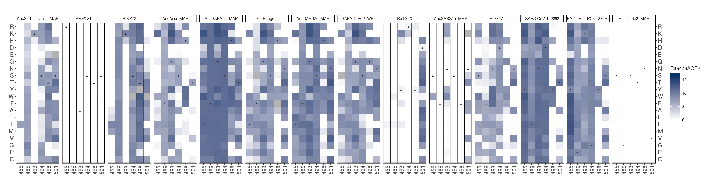

``` r
invisible(dev.print(pdf, paste(config$final_variant_scores_dir,"/lib46_heatmap_SSM_Ra9479ACE2_log10Ka-by-target.pdf",sep="")))
```

``` r
p8 <- ggplot(dt_mut,aes(position,mutant))+geom_tile(aes(fill=Rs3364ACE2),color="black",lwd=0.1)+
  scale_fill_gradientn(colours=c("#FFFFFF","#003366","#003366"),limits=c(6,13),values=c(0,8/8.5,8.5/8.5),na.value="gray70")+
  labs(x="",y="")+theme_classic(base_size=9)+
  coord_equal()+theme(axis.text.x=element_text(angle=90,hjust=1,vjust=0.6,face="bold",size=10),axis.text.y=element_text(face="bold",size=10))+
  facet_wrap(~target,nrow=1)+
  guides(y.sec=guide_axis_label_trans())+
  geom_text(aes(label=wildtype_indicator),size=2,color="gray10")

p8
```

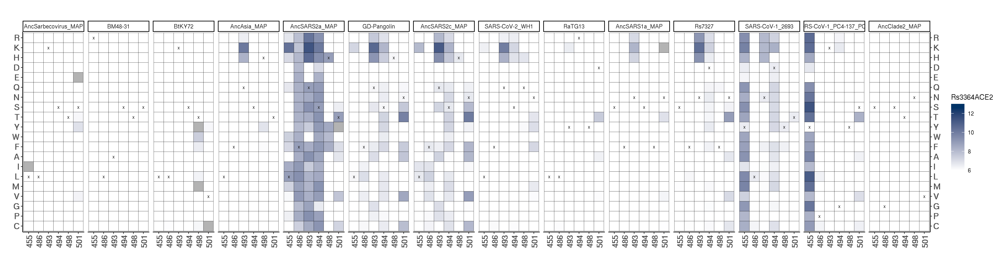

``` r
invisible(dev.print(pdf, paste(config$final_variant_scores_dir,"/lib46_heatmap_SSM_Rs3364ACE2_log10Ka-by-target.pdf",sep="")))
```

``` r
p9 <- ggplot(dt_mut,aes(position,mutant))+geom_tile(aes(fill=Rs1434ACE2),color="black",lwd=0.1)+
  scale_fill_gradientn(colours=c("#FFFFFF","#003366","#003366"),limits=c(6,13),values=c(0,8/8.5,8.5/8.5),na.value="gray70")+
  labs(x="",y="")+theme_classic(base_size=9)+
  coord_equal()+theme(axis.text.x=element_text(angle=90,hjust=1,vjust=0.6,face="bold",size=10),axis.text.y=element_text(face="bold",size=10))+
  facet_wrap(~target,nrow=1)+
  guides(y.sec=guide_axis_label_trans())+
  geom_text(aes(label=wildtype_indicator),size=2,color="gray10")

p9
```

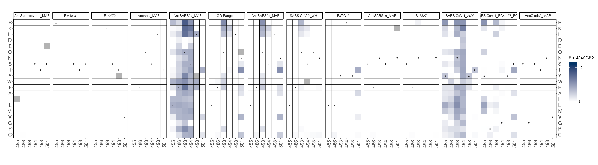

``` r
invisible(dev.print(pdf, paste(config$final_variant_scores_dir,"/lib46_heatmap_SSM_Rs1434ACE2_log10Ka-by-target.pdf",sep="")))
```

``` r
p10 <- ggplot(dt_mut,aes(position,mutant))+geom_tile(aes(fill=RpearoldACE2),color="black",lwd=0.1)+
  scale_fill_gradientn(colours=c("#FFFFFF","#003366","#003366"),limits=c(6,13),values=c(0,8/8.5,8.5/8.5),na.value="gray70")+
  labs(x="",y="")+theme_classic(base_size=9)+
  coord_equal()+theme(axis.text.x=element_text(angle=90,hjust=1,vjust=0.6,face="bold",size=10),axis.text.y=element_text(face="bold",size=10))+
  facet_wrap(~target,nrow=1)+
  guides(y.sec=guide_axis_label_trans())+
  geom_text(aes(label=wildtype_indicator),size=2,color="gray10")

p10
```

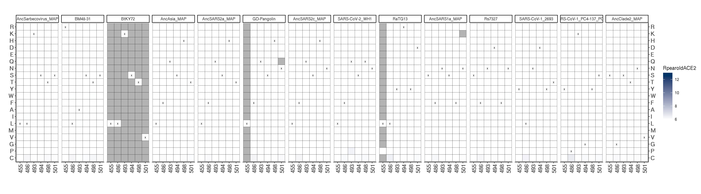

``` r
invisible(dev.print(pdf, paste(config$final_variant_scores_dir,"/lib46_heatmap_SSM_RpearoldACE2_log10Ka-by-target.pdf",sep="")))
```

``` r
p11 <- ggplot(dt_mut,aes(position,mutant))+geom_tile(aes(fill=RlanACE2),color="black",lwd=0.1)+
  scale_fill_gradientn(colours=c("#FFFFFF","#003366","#003366"),limits=c(6,13),values=c(0,8/8.5,8.5/8.5),na.value="gray70")+
  labs(x="",y="")+theme_classic(base_size=9)+
  coord_equal()+theme(axis.text.x=element_text(angle=90,hjust=1,vjust=0.6,face="bold",size=10),axis.text.y=element_text(face="bold",size=10))+
  facet_wrap(~target,nrow=1)+
  guides(y.sec=guide_axis_label_trans())+
  geom_text(aes(label=wildtype_indicator),size=2,color="gray10")

p11
```

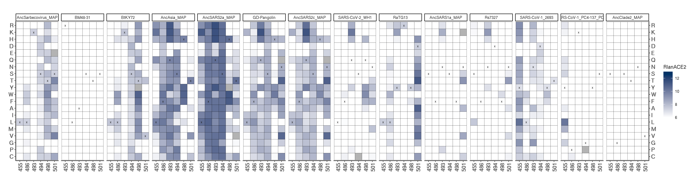

``` r
invisible(dev.print(pdf, paste(config$final_variant_scores_dir,"/lib46_heatmap_SSM_RlanACE2_log10Ka-by-target.pdf",sep="")))
```

``` r
p12 <- ggplot(dt_mut,aes(position,mutant))+geom_tile(aes(fill=RalcACE2),color="black",lwd=0.1)+
  scale_fill_gradientn(colours=c("#FFFFFF","#003366","#003366"),limits=c(6,13),values=c(0,8/8.5,8.5/8.5),na.value="gray70")+
  labs(x="",y="")+theme_classic(base_size=9)+
  coord_equal()+theme(axis.text.x=element_text(angle=90,hjust=1,vjust=0.6,face="bold",size=10),axis.text.y=element_text(face="bold",size=10))+
  facet_wrap(~target,nrow=1)+
  guides(y.sec=guide_axis_label_trans())+
  geom_text(aes(label=wildtype_indicator),size=2,color="gray10")

p12
```

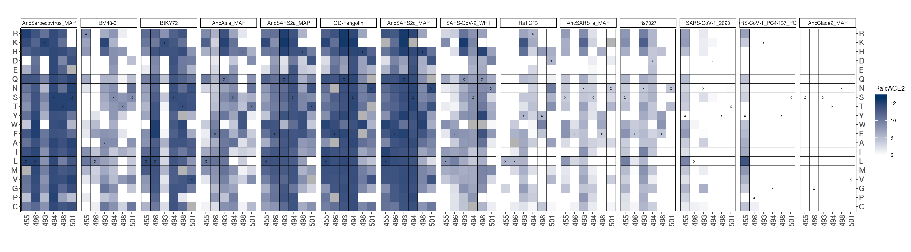

``` r
invisible(dev.print(pdf, paste(config$final_variant_scores_dir,"/lib46_heatmap_SSM_RalcACE2_log10Ka-by-target.pdf",sep="")))
```

``` r
p13 <- ggplot(dt_mut,aes(position,mutant))+geom_tile(aes(fill=RshACE2),color="black",lwd=0.1)+
  scale_fill_gradientn(colours=c("#FFFFFF","#003366","#003366"),limits=c(6,13),values=c(0,8/8.5,8.5/8.5),na.value="gray70")+
  labs(x="",y="")+theme_classic(base_size=9)+
  coord_equal()+theme(axis.text.x=element_text(angle=90,hjust=1,vjust=0.6,face="bold",size=10),axis.text.y=element_text(face="bold",size=10))+
  facet_wrap(~target,nrow=1)+
  guides(y.sec=guide_axis_label_trans())+
  geom_text(aes(label=wildtype_indicator),size=2,color="gray10")

p13
```

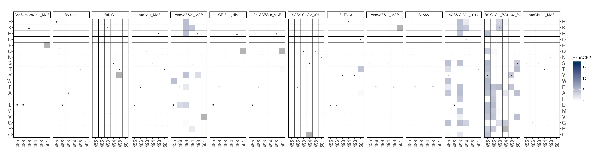

``` r
invisible(dev.print(pdf, paste(config$final_variant_scores_dir,"/lib46_heatmap_SSM_RshACE2_log10Ka-by-target.pdf",sep="")))
```

Rpear (MFI!)

``` r
p14 <- ggplot(dt_mut,aes(position,mutant))+geom_tile(aes(fill=RpearACE2),color="black",lwd=0.1)+
  scale_fill_gradientn(colours=c("#FFFFFF","#FFFFFF","#003366"),limits=c(4.5,9),values=c(0,1/7.5,7.5/7.5),na.value="gray70")+
  labs(x="",y="")+theme_classic(base_size=9)+
  coord_equal()+theme(axis.text.x=element_text(angle=90,hjust=1,vjust=0.6,face="bold",size=10),axis.text.y=element_text(face="bold",size=10))+
  facet_wrap(~target,nrow=1)+
  guides(y.sec=guide_axis_label_trans())+
  geom_text(aes(label=wildtype_indicator),size=2,color="gray10")

p14
```

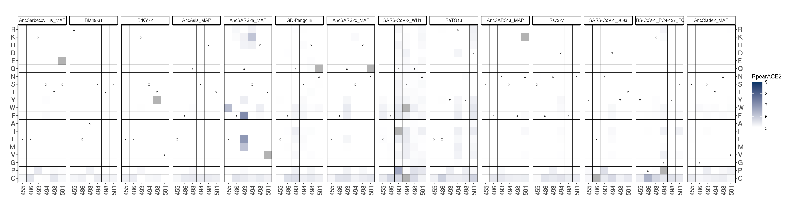

``` r
invisible(dev.print(pdf, paste(config$final_variant_scores_dir,"/lib46_heatmap_SSM_RpearACE2_MFI-by-target.pdf",sep="")))
```

Same faceting but with delta log10Kas

``` r
p2.2 <- ggplot(dt_mut,aes(position,mutant))+geom_tile(aes(fill=huACE2_delta),color="black",lwd=0.1)+
    #scale_fill_gradientn(colours=c("#A94E35","#A94E35","#F48365","#FFFFFF","#7378B9","#7378B9","#383C6C"),limits=c(-7,7),values=c(0,3/14,5/14,7/14,9/14,11/14,14/14),na.value="gray70")+
  scale_fill_gradientn(colours=c("#A94E35","#A94E35","#F48365","#FFFFFF","#7378B9","#383C6C","#383C6C"),limits=c(-6,5),values=c(0,4/11,5/11,6/11,7/11,8/11,11/11),na.value="gray70")+ #effective scale -2 <- 0 -> 2
  labs(x="",y="")+theme_classic(base_size=9)+
  coord_equal()+theme(axis.text.x=element_text(angle=90,hjust=1,vjust=0.6,face="bold",size=10),axis.text.y=element_text(face="bold",size=10))+
  facet_wrap(~target,nrow=1)+
  guides(y.sec=guide_axis_label_trans())+
  geom_text(aes(label=wildtype_indicator),size=2,color="gray10")

p2.2
```

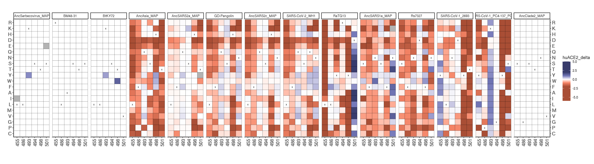

``` r
invisible(dev.print(pdf, paste(config$final_variant_scores_dir,"/lib46_heatmap_SSM_huACE2_delta-log10Ka-by-target.pdf",sep="")))
```

``` r
p3.2 <- ggplot(dt_mut,aes(position,mutant))+geom_tile(aes(fill=cvACE2_delta),color="black",lwd=0.1)+
    #scale_fill_gradientn(colours=c("#A94E35","#A94E35","#F48365","#FFFFFF","#7378B9","#7378B9","#383C6C"),limits=c(-7,7),values=c(0,3/14,5/14,7/14,9/14,11/14,14/14),na.value="gray70")+
  scale_fill_gradientn(colours=c("#A94E35","#A94E35","#F48365","#FFFFFF","#7378B9","#383C6C","#383C6C"),limits=c(-6,5),values=c(0,4/11,5/11,6/11,7/11,8/11,11/11),na.value="gray70")+ #effective scale -2 <- 0 -> 2
  labs(x="",y="")+theme_classic(base_size=9)+
  coord_equal()+theme(axis.text.x=element_text(angle=90,hjust=1,vjust=0.6,face="bold",size=10),axis.text.y=element_text(face="bold",size=10))+
  facet_wrap(~target,nrow=1)+
  guides(y.sec=guide_axis_label_trans())+
  geom_text(aes(label=wildtype_indicator),size=2,color="gray10")

p3.2
```

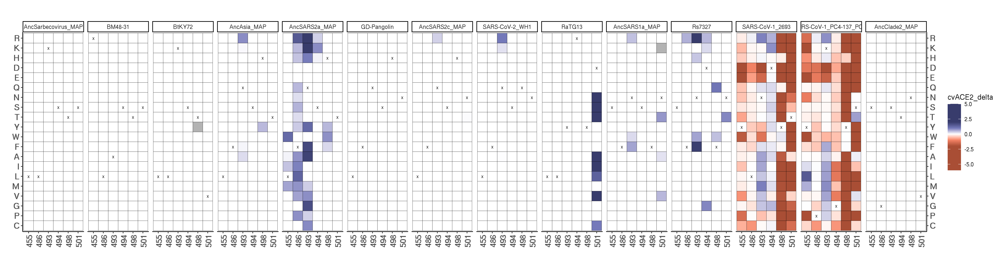

``` r
invisible(dev.print(pdf, paste(config$final_variant_scores_dir,"/lib46_heatmap_SSM_cvACE2_delta-log10Ka-by-target.pdf",sep="")))
```

``` r
p4.2 <- ggplot(dt_mut,aes(position,mutant))+geom_tile(aes(fill=pgACE2_delta),color="black",lwd=0.1)+
    #scale_fill_gradientn(colours=c("#A94E35","#A94E35","#F48365","#FFFFFF","#7378B9","#7378B9","#383C6C"),limits=c(-7,7),values=c(0,3/14,5/14,7/14,9/14,11/14,14/14),na.value="gray70")+
  scale_fill_gradientn(colours=c("#A94E35","#A94E35","#F48365","#FFFFFF","#7378B9","#383C6C","#383C6C"),limits=c(-6,5),values=c(0,4/11,5/11,6/11,7/11,8/11,11/11),na.value="gray70")+ #effective scale -2 <- 0 -> 2
  labs(x="",y="")+theme_classic(base_size=9)+
  coord_equal()+theme(axis.text.x=element_text(angle=90,hjust=1,vjust=0.6,face="bold",size=10),axis.text.y=element_text(face="bold",size=10))+
  facet_wrap(~target,nrow=1)+
  guides(y.sec=guide_axis_label_trans())+
  geom_text(aes(label=wildtype_indicator),size=2,color="gray10")

p4.2
```

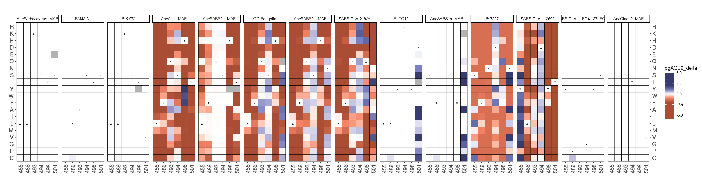

``` r
invisible(dev.print(pdf, paste(config$final_variant_scores_dir,"/lib46_heatmap_SSM_pgACE2_delta-log10Ka-by-target.pdf",sep="")))
```

``` r
p5.2 <- ggplot(dt_mut,aes(position,mutant))+geom_tile(aes(fill=mACE2_delta),color="black",lwd=0.1)+
    #scale_fill_gradientn(colours=c("#A94E35","#A94E35","#F48365","#FFFFFF","#7378B9","#7378B9","#383C6C"),limits=c(-7,7),values=c(0,3/14,5/14,7/14,9/14,11/14,14/14),na.value="gray70")+
  scale_fill_gradientn(colours=c("#A94E35","#A94E35","#F48365","#FFFFFF","#7378B9","#383C6C","#383C6C"),limits=c(-6,5),values=c(0,4/11,5/11,6/11,7/11,8/11,11/11),na.value="gray70")+ #effective scale -2 <- 0 -> 2
  labs(x="",y="")+theme_classic(base_size=9)+
  coord_equal()+theme(axis.text.x=element_text(angle=90,hjust=1,vjust=0.6,face="bold",size=10),axis.text.y=element_text(face="bold",size=10))+
  facet_wrap(~target,nrow=1)+
  guides(y.sec=guide_axis_label_trans())+
  geom_text(aes(label=wildtype_indicator),size=2,color="gray10")

p5.2
```

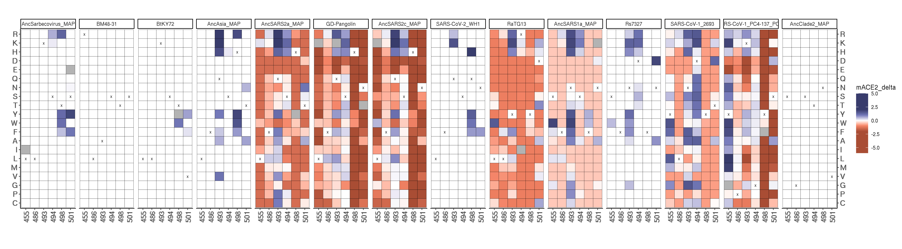

``` r
invisible(dev.print(pdf, paste(config$final_variant_scores_dir,"/lib46_heatmap_SSM_mACE2_delta-log10Ka-by-target.pdf",sep="")))
```

``` r
p6.2 <- ggplot(dt_mut,aes(position,mutant))+geom_tile(aes(fill=Ra787ACE2_delta),color="black",lwd=0.1)+
  #scale_fill_gradientn(colours=c("#A94E35","#A94E35","#F48365","#FFFFFF","#7378B9","#7378B9","#383C6C"),limits=c(-7,7),values=c(0,3/14,5/14,7/14,9/14,11/14,14/14),na.value="gray70")+
  scale_fill_gradientn(colours=c("#A94E35","#A94E35","#F48365","#FFFFFF","#7378B9","#383C6C","#383C6C"),limits=c(-6,5),values=c(0,4/11,5/11,6/11,7/11,8/11,11/11),na.value="gray70")+ #effective scale -2 <- 0 -> 2
  labs(x="",y="")+theme_classic(base_size=9)+
  coord_equal()+theme(axis.text.x=element_text(angle=90,hjust=1,vjust=0.6,face="bold",size=10),axis.text.y=element_text(face="bold",size=10))+
  facet_wrap(~target,nrow=1)+
  guides(y.sec=guide_axis_label_trans())+
  geom_text(aes(label=wildtype_indicator),size=2,color="gray10")

p6.2
```

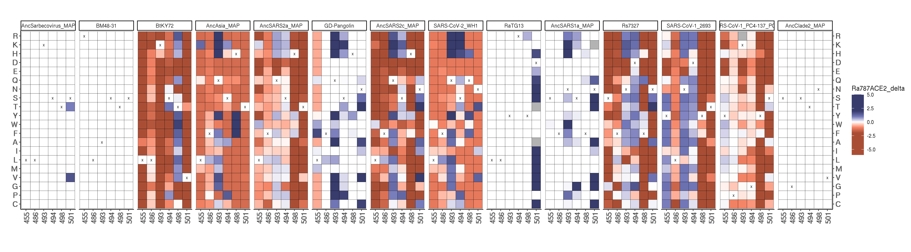

``` r
invisible(dev.print(pdf, paste(config$final_variant_scores_dir,"/lib46_heatmap_SSM_Ra787ACE2_delta-log10Ka-by-target.pdf",sep="")))
```

``` r
p7.2 <- ggplot(dt_mut,aes(position,mutant))+geom_tile(aes(fill=Ra9479ACE2_delta),color="black",lwd=0.1)+
  #scale_fill_gradientn(colours=c("#A94E35","#A94E35","#F48365","#FFFFFF","#7378B9","#7378B9","#383C6C"),limits=c(-7,7),values=c(0,3/14,5/14,7/14,9/14,11/14,14/14),na.value="gray70")+
  scale_fill_gradientn(colours=c("#A94E35","#A94E35","#F48365","#FFFFFF","#7378B9","#383C6C","#383C6C"),limits=c(-6,5),values=c(0,4/11,5/11,6/11,7/11,8/11,11/11),na.value="gray70")+ #effective scale -2 <- 0 -> 2
  labs(x="",y="")+theme_classic(base_size=9)+
  coord_equal()+theme(axis.text.x=element_text(angle=90,hjust=1,vjust=0.6,face="bold",size=10),axis.text.y=element_text(face="bold",size=10))+
  facet_wrap(~target,nrow=1)+
  guides(y.sec=guide_axis_label_trans())+
  geom_text(aes(label=wildtype_indicator),size=2,color="gray10")

p7.2
```

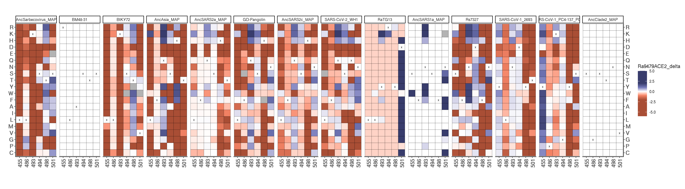

``` r
invisible(dev.print(pdf, paste(config$final_variant_scores_dir,"/lib46_heatmap_SSM_Ra9479ACE2_delta-log10Ka-by-target.pdf",sep="")))
```

``` r
p8.2 <- ggplot(dt_mut,aes(position,mutant))+geom_tile(aes(fill=Rs3364ACE2_delta),color="black",lwd=0.1)+
  #scale_fill_gradientn(colours=c("#A94E35","#A94E35","#F48365","#FFFFFF","#7378B9","#7378B9","#383C6C"),limits=c(-7,7),values=c(0,3/14,5/14,7/14,9/14,11/14,14/14),na.value="gray70")+
  scale_fill_gradientn(colours=c("#A94E35","#A94E35","#F48365","#FFFFFF","#7378B9","#383C6C","#383C6C"),limits=c(-6,5),values=c(0,4/11,5/11,6/11,7/11,8/11,11/11),na.value="gray70")+ #effective scale -2 <- 0 -> 2
  labs(x="",y="")+theme_classic(base_size=9)+
  coord_equal()+theme(axis.text.x=element_text(angle=90,hjust=1,vjust=0.6,face="bold",size=10),axis.text.y=element_text(face="bold",size=10))+
  facet_wrap(~target,nrow=1)+
  guides(y.sec=guide_axis_label_trans())+
  geom_text(aes(label=wildtype_indicator),size=2,color="gray10")

p8.2
```


``` r
invisible(dev.print(pdf, paste(config$final_variant_scores_dir,"/lib46_heatmap_SSM_Rs3364ACE2_delta-log10Ka-by-target.pdf",sep="")))
```

``` r
p9.2 <- ggplot(dt_mut,aes(position,mutant))+geom_tile(aes(fill=Rs1434ACE2_delta),color="black",lwd=0.1)+
  #scale_fill_gradientn(colours=c("#A94E35","#A94E35","#F48365","#FFFFFF","#7378B9","#7378B9","#383C6C"),limits=c(-7,7),values=c(0,3/14,5/14,7/14,9/14,11/14,14/14),na.value="gray70")+
  scale_fill_gradientn(colours=c("#A94E35","#A94E35","#F48365","#FFFFFF","#7378B9","#383C6C","#383C6C"),limits=c(-6,5),values=c(0,4/11,5/11,6/11,7/11,8/11,11/11),na.value="gray70")+ #effective scale -2 <- 0 -> 2
  labs(x="",y="")+theme_classic(base_size=9)+
  coord_equal()+theme(axis.text.x=element_text(angle=90,hjust=1,vjust=0.6,face="bold",size=10),axis.text.y=element_text(face="bold",size=10))+
  facet_wrap(~target,nrow=1)+
  guides(y.sec=guide_axis_label_trans())+
  geom_text(aes(label=wildtype_indicator),size=2,color="gray10")

p9.2
```

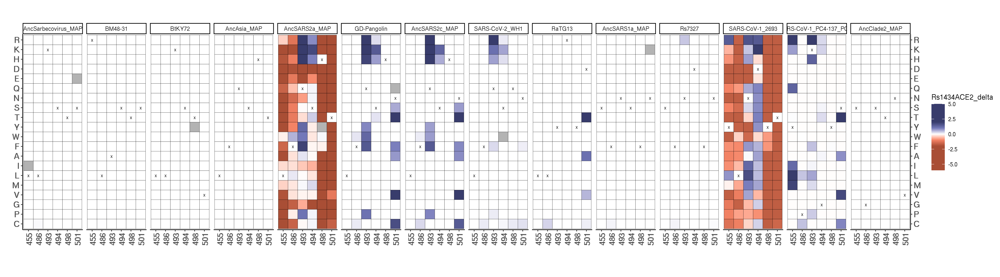

``` r
invisible(dev.print(pdf, paste(config$final_variant_scores_dir,"/lib46_heatmap_SSM_Rs1434ACE2_delta-log10Ka-by-target.pdf",sep="")))
```

``` r
p10.2 <- ggplot(dt_mut,aes(position,mutant))+geom_tile(aes(fill=RpearoldACE2_delta),color="black",lwd=0.1)+
  #scale_fill_gradientn(colours=c("#A94E35","#A94E35","#F48365","#FFFFFF","#7378B9","#7378B9","#383C6C"),limits=c(-7,7),values=c(0,3/14,5/14,7/14,9/14,11/14,14/14),na.value="gray70")+
  scale_fill_gradientn(colours=c("#A94E35","#A94E35","#F48365","#FFFFFF","#7378B9","#383C6C","#383C6C"),limits=c(-6,5),values=c(0,4/11,5/11,6/11,7/11,8/11,11/11),na.value="gray70")+ #effective scale -2 <- 0 -> 2
  labs(x="",y="")+theme_classic(base_size=9)+
  coord_equal()+theme(axis.text.x=element_text(angle=90,hjust=1,vjust=0.6,face="bold",size=10),axis.text.y=element_text(face="bold",size=10))+
  facet_wrap(~target,nrow=1)+
  guides(y.sec=guide_axis_label_trans())+
  geom_text(aes(label=wildtype_indicator),size=2,color="gray10")

p10.2
```

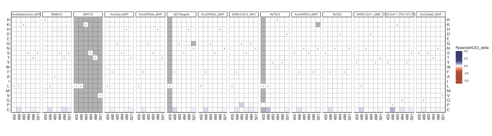

``` r
invisible(dev.print(pdf, paste(config$final_variant_scores_dir,"/lib46_heatmap_SSM_RpearoldACE2_delta-log10Ka-by-target.pdf",sep="")))
```

``` r
p11.2 <- ggplot(dt_mut,aes(position,mutant))+geom_tile(aes(fill=RlanACE2_delta),color="black",lwd=0.1)+
    #scale_fill_gradientn(colours=c("#A94E35","#A94E35","#F48365","#FFFFFF","#7378B9","#7378B9","#383C6C"),limits=c(-7,7),values=c(0,3/14,5/14,7/14,9/14,11/14,14/14),na.value="gray70")+
  scale_fill_gradientn(colours=c("#A94E35","#A94E35","#F48365","#FFFFFF","#7378B9","#383C6C","#383C6C"),limits=c(-6,5),values=c(0,4/11,5/11,6/11,7/11,8/11,11/11),na.value="gray70")+ #effective scale -2 <- 0 -> 2
  labs(x="",y="")+theme_classic(base_size=9)+
  coord_equal()+theme(axis.text.x=element_text(angle=90,hjust=1,vjust=0.6,face="bold",size=10),axis.text.y=element_text(face="bold",size=10))+
  facet_wrap(~target,nrow=1)+
  guides(y.sec=guide_axis_label_trans())+
  geom_text(aes(label=wildtype_indicator),size=2,color="gray10")

p11.2
```

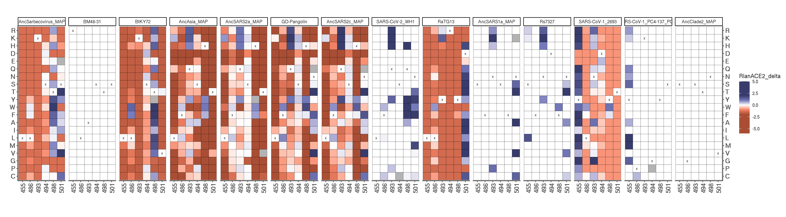

``` r
invisible(dev.print(pdf, paste(config$final_variant_scores_dir,"/lib46_heatmap_SSM_RlanACE2_delta-log10Ka-by-target.pdf",sep="")))
```

``` r
p12.2 <- ggplot(dt_mut,aes(position,mutant))+geom_tile(aes(fill=RalcACE2_delta),color="black",lwd=0.1)+
    #scale_fill_gradientn(colours=c("#A94E35","#A94E35","#F48365","#FFFFFF","#7378B9","#7378B9","#383C6C"),limits=c(-7,7),values=c(0,3/14,5/14,7/14,9/14,11/14,14/14),na.value="gray70")+
  scale_fill_gradientn(colours=c("#A94E35","#A94E35","#F48365","#FFFFFF","#7378B9","#383C6C","#383C6C"),limits=c(-6,5),values=c(0,4/11,5/11,6/11,7/11,8/11,11/11),na.value="gray70")+ #effective scale -2 <- 0 -> 2
  labs(x="",y="")+theme_classic(base_size=9)+
  coord_equal()+theme(axis.text.x=element_text(angle=90,hjust=1,vjust=0.6,face="bold",size=10),axis.text.y=element_text(face="bold",size=10))+
  facet_wrap(~target,nrow=1)+
  guides(y.sec=guide_axis_label_trans())+
  geom_text(aes(label=wildtype_indicator),size=2,color="gray10")

p12.2
```

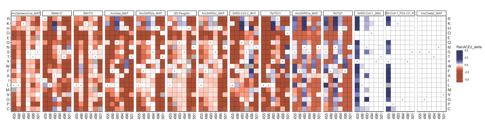

``` r
invisible(dev.print(pdf, paste(config$final_variant_scores_dir,"/lib46_heatmap_SSM_RalcACE2_delta-log10Ka-by-target.pdf",sep="")))
```

``` r
p13.2 <- ggplot(dt_mut,aes(position,mutant))+geom_tile(aes(fill=RshACE2_delta),color="black",lwd=0.1)+
    #scale_fill_gradientn(colours=c("#A94E35","#A94E35","#F48365","#FFFFFF","#7378B9","#7378B9","#383C6C"),limits=c(-7,7),values=c(0,3/14,5/14,7/14,9/14,11/14,14/14),na.value="gray70")+
  scale_fill_gradientn(colours=c("#A94E35","#A94E35","#F48365","#FFFFFF","#7378B9","#383C6C","#383C6C"),limits=c(-6,5),values=c(0,4/11,5/11,6/11,7/11,8/11,11/11),na.value="gray70")+ #effective scale -2 <- 0 -> 2
  labs(x="",y="")+theme_classic(base_size=9)+
  coord_equal()+theme(axis.text.x=element_text(angle=90,hjust=1,vjust=0.6,face="bold",size=10),axis.text.y=element_text(face="bold",size=10))+
  facet_wrap(~target,nrow=1)+
  guides(y.sec=guide_axis_label_trans())+
  geom_text(aes(label=wildtype_indicator),size=2,color="gray10")

p13.2
```

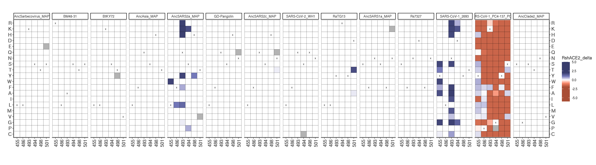

``` r
invisible(dev.print(pdf, paste(config$final_variant_scores_dir,"/lib46_heatmap_SSM_RshACE2_delta-log10Ka-by-target.pdf",sep="")))
```

``` r
p14.2 <- ggplot(dt_mut,aes(position,mutant))+geom_tile(aes(fill=RpearACE2_delta),color="black",lwd=0.1)+
    #scale_fill_gradientn(colours=c("#A94E35","#A94E35","#F48365","#FFFFFF","#7378B9","#7378B9","#383C6C"),limits=c(-7,7),values=c(0,3/14,5/14,7/14,9/14,11/14,14/14),na.value="gray70")+
  scale_fill_gradientn(colours=c("#A94E35","#A94E35","#F48365","#FFFFFF","#7378B9","#383C6C","#383C6C"),limits=c(-6,5),values=c(0,4/11,5/11,6/11,7/11,8/11,11/11),na.value="gray70")+ #effective scale -2 <- 0 -> 2
  labs(x="",y="")+theme_classic(base_size=9)+
  coord_equal()+theme(axis.text.x=element_text(angle=90,hjust=1,vjust=0.6,face="bold",size=10),axis.text.y=element_text(face="bold",size=10))+
  facet_wrap(~target,nrow=1)+
  guides(y.sec=guide_axis_label_trans())+
  geom_text(aes(label=wildtype_indicator),size=2,color="gray10")

p14.2
```

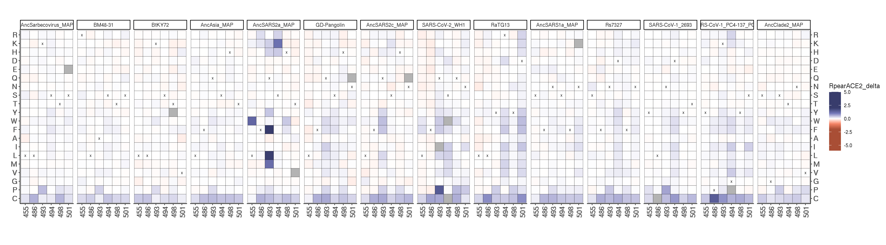

``` r
invisible(dev.print(pdf, paste(config$final_variant_scores_dir,"/lib46_heatmap_SSM_RpearACE2_delta-MFI-by-target.pdf",sep="")))
```

Make composite plots that show the main ACE2s, both as “raw” and
“deltas”, in a single view with all the heatmaps aligned

``` r
ggarrange(p1,p2,p3,p4,p5,p6,p7,p8,p9,p11,p12,p13,nrow=12)
```


``` r
invisible(dev.print(pdf, paste(config$final_variant_scores_dir,"/lib46_heatmap_SSM_all-ACE2s_log10Ka-by-target.pdf",sep="")))
```

``` r
ggarrange(p1.2,p2.2,p3.2,p4.2,p5.2,p6.2,p7.2,p8.2,p9.2,p11.2,p12.2,p13.2,nrow=12)
```


``` r
invisible(dev.print(pdf, paste(config$final_variant_scores_dir,"/lib46_heatmap_SSM_all-ACE2s_delta-log10Ka-by-target.pdf",sep="")))
```

That’s the data! Other analyses in additional notebooks

Save output file.

``` r
dt_mut %>%
  mutate_if(is.numeric, round, digits=5) %>%
  write.csv(file=config$final_variant_scores_lib46_muts_file, row.names=F,quote=F)

dt_wt %>%
  mutate_if(is.numeric, round, digits=5) %>%
  write.csv(file=config$final_variant_scores_lib46_wts_file, row.names=F,quote=F)
```
