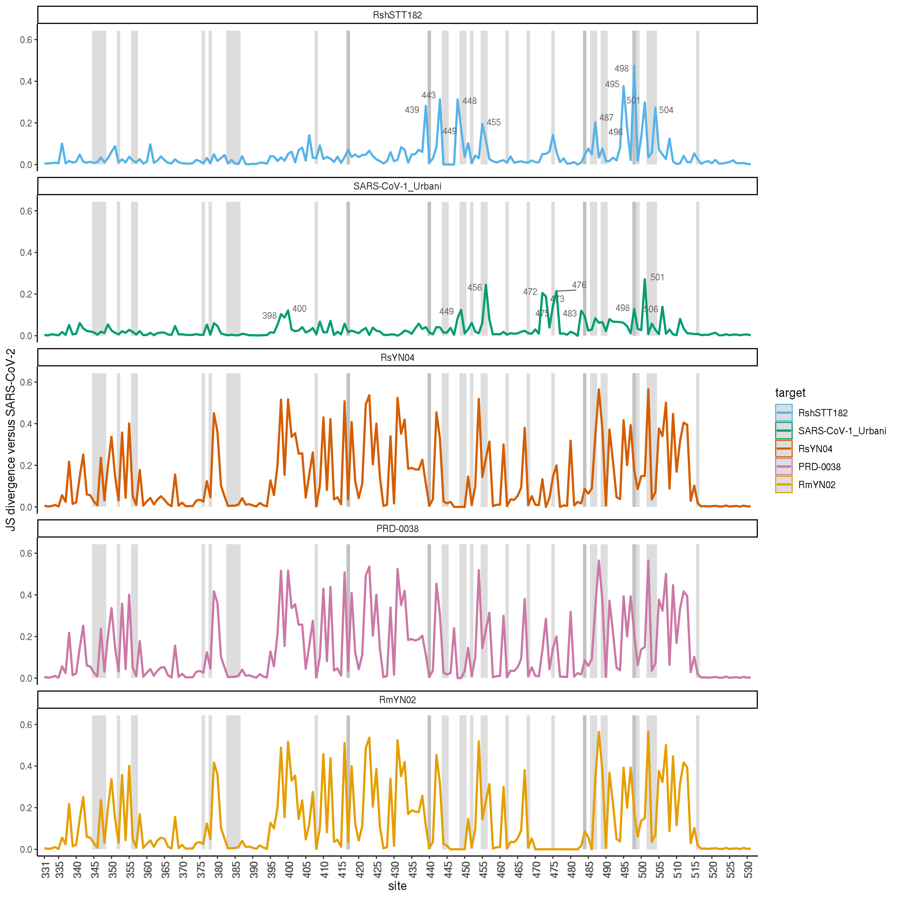
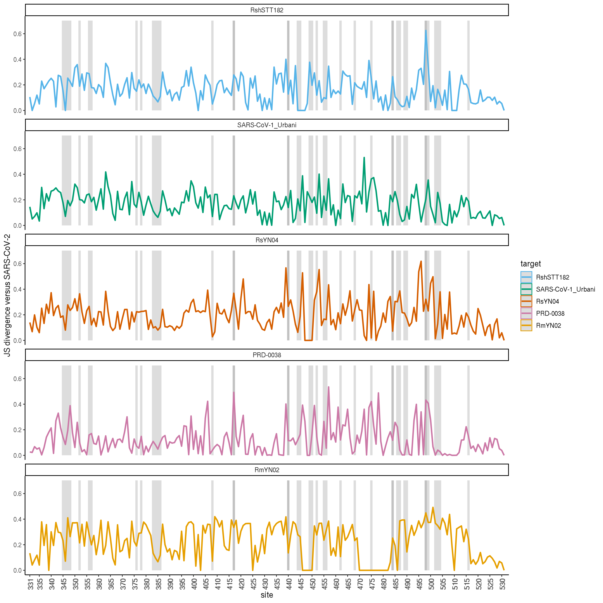
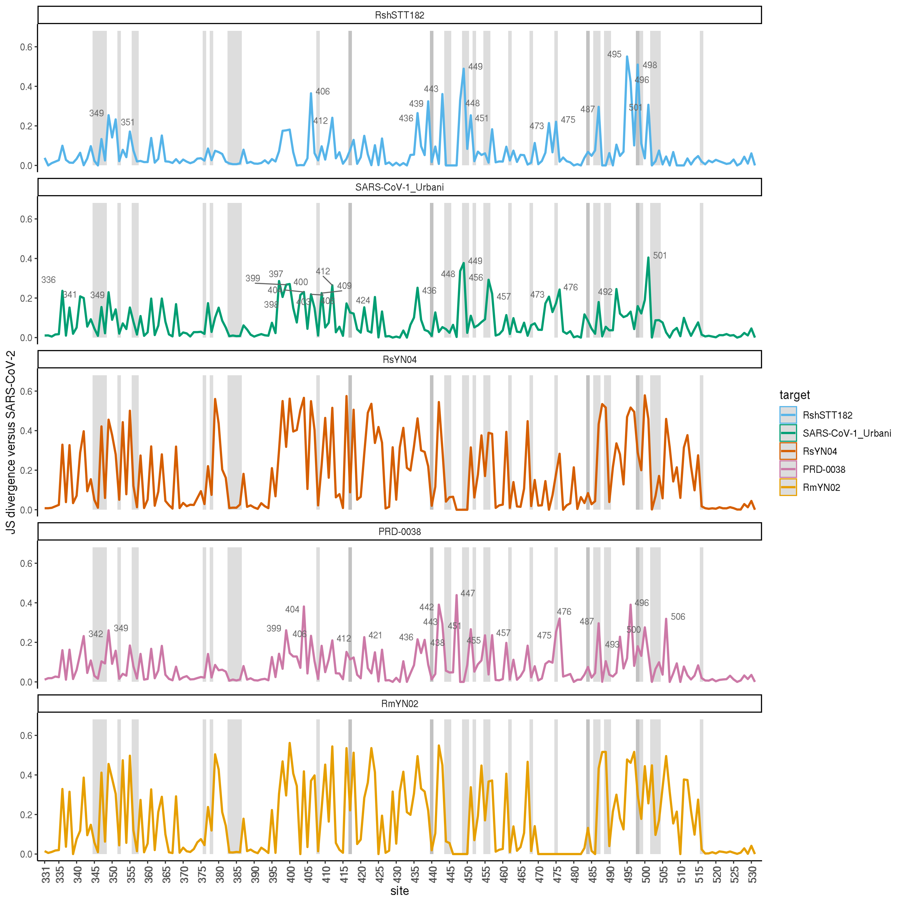
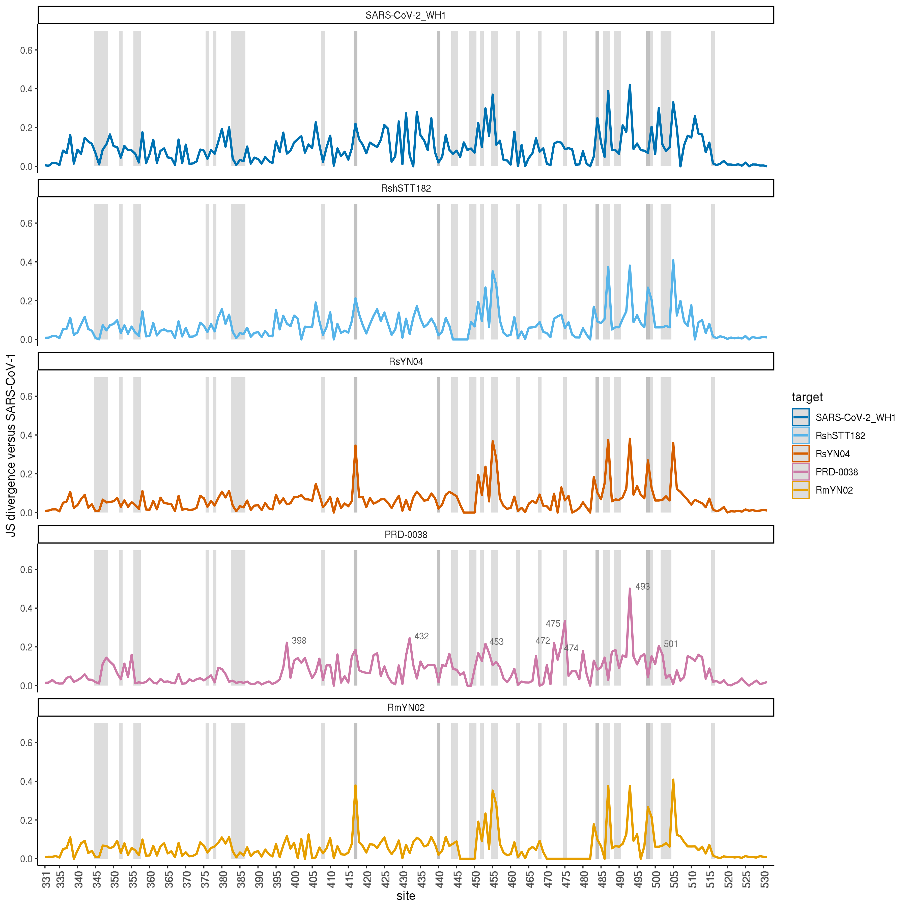
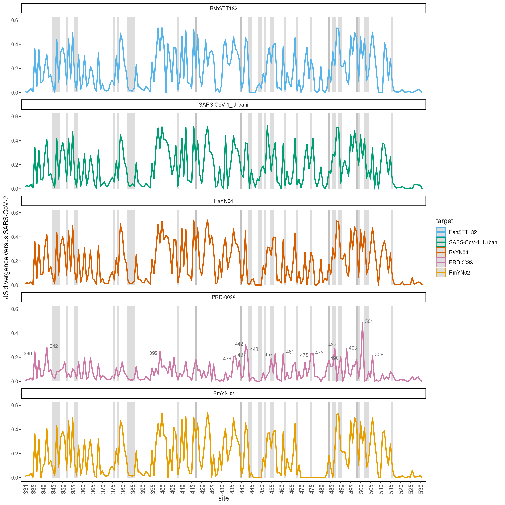
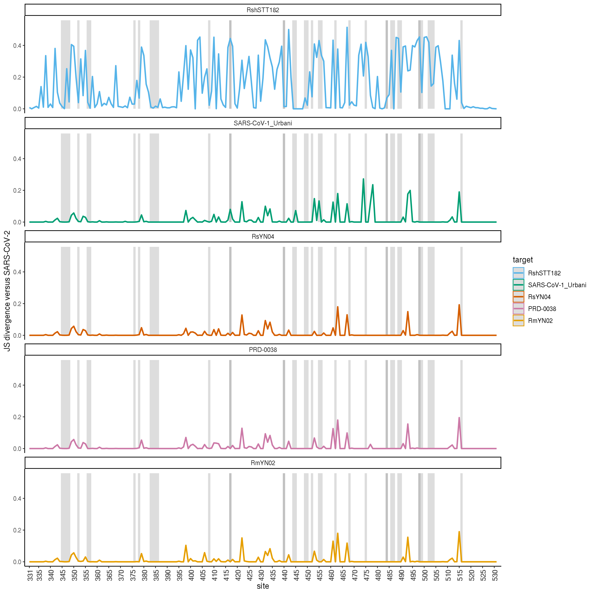
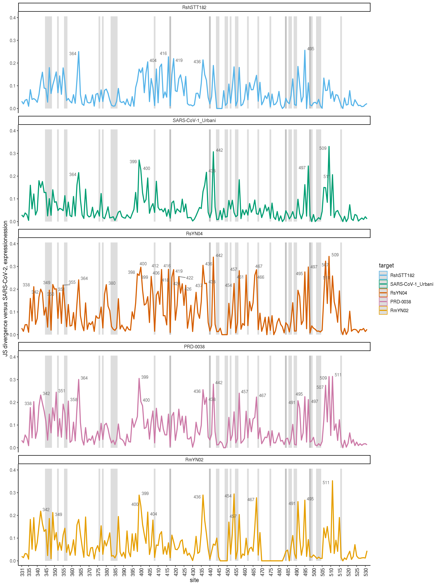
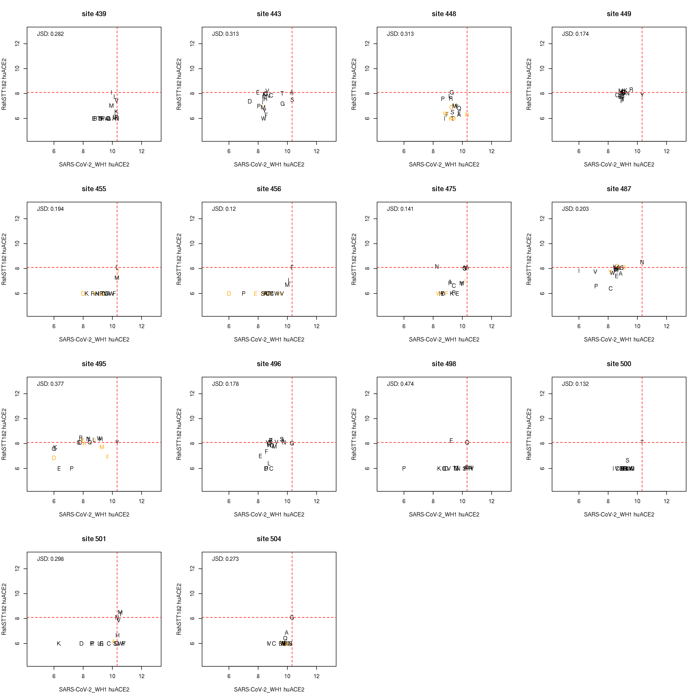
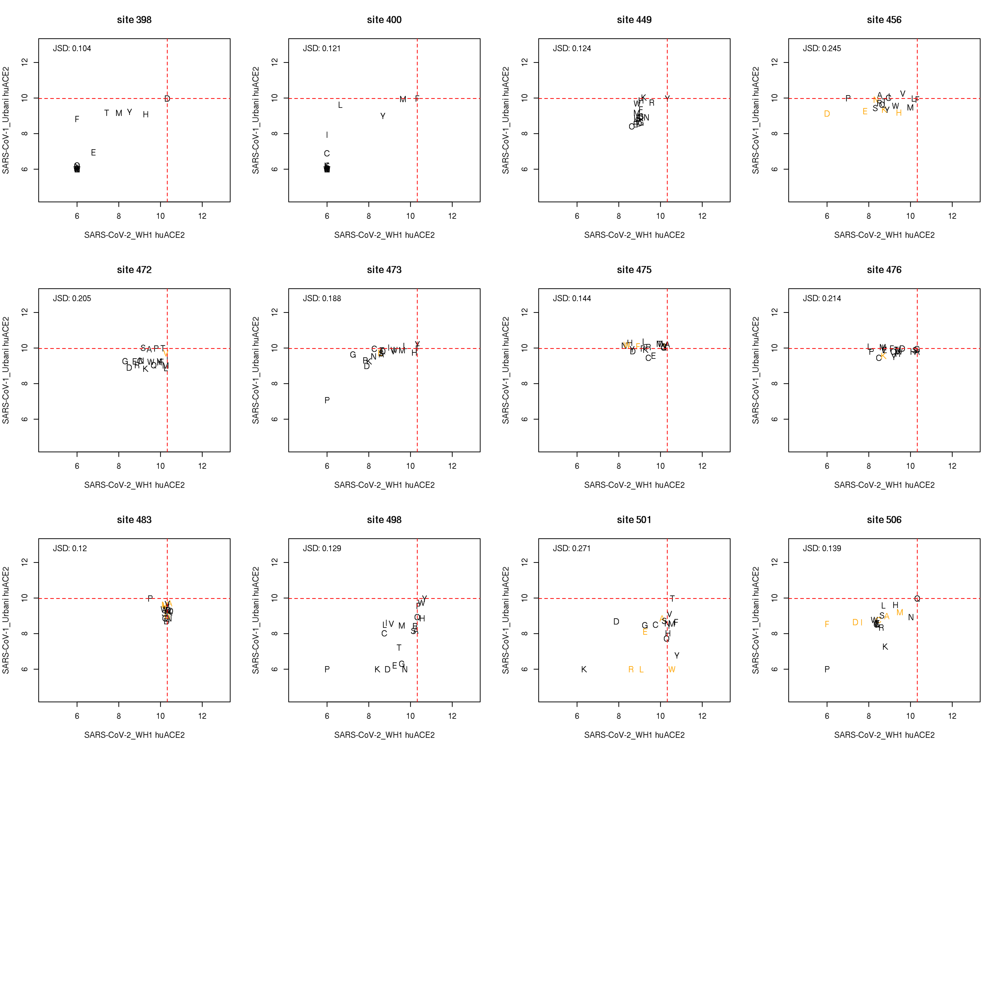

Shifts in mutation effects among sarbecovirus backgrounds
================
Tyler Starr
1/4/2022

-   [Setup](#setup)
-   [Calculate site-wise Jensen-Shannon divergence, a metric of
    divergence in site-specific mutational
    profiles](#calculate-site-wise-jensen-shannon-divergence-a-metric-of-divergence-in-site-specific-mutational-profiles)
-   [Line plots of JS divergence from SARS-CoV-2 across RBD
    sites](#line-plots-of-js-divergence-from-sars-cov-2-across-rbd-sites)
-   [Scatterplots for sites of substantial epistatic shift between
    RBDs](#scatterplots-for-sites-of-substantial-epistatic-shift-between-rbds)
-   [Map divergence to pdb structure](#map-divergence-to-pdb-structure)

This notebook analyzes sites whose mutation effects deviate most
strongly among the variant RBD backgrounds.

``` r
require("knitr")
knitr::opts_chunk$set(echo = T)
knitr::opts_chunk$set(dev.args = list(png = list(type = "cairo")))

#list of packages to install/load
packages = c("yaml","data.table","tidyverse","gridExtra","egg","bio3d","ggridges","ggrepel")
#install any packages not already installed
installed_packages <- packages %in% rownames(installed.packages())
if(any(installed_packages == F)){
  install.packages(packages[!installed_packages])
}
#load packages
invisible(lapply(packages, library, character.only=T))

#read in config file
config <- read_yaml("config.yaml")

#make output directory
if(!file.exists(config$epistatic_shifts_dir)){
  dir.create(file.path(config$epistatic_shifts_dir))
}

#make pdb output directory
if(!file.exists(paste(config$epistatic_shifts_dir,"/pdbs/",sep=""))){
  dir.create(file.path(paste(config$epistatic_shifts_dir,"/pdbs/",sep="")))
}
```

Session info for reproducing environment:

``` r
sessionInfo()
```

    ## R version 3.6.2 (2019-12-12)
    ## Platform: x86_64-pc-linux-gnu (64-bit)
    ## Running under: Ubuntu 18.04.6 LTS
    ## 
    ## Matrix products: default
    ## BLAS/LAPACK: /app/software/OpenBLAS/0.3.7-GCC-8.3.0/lib/libopenblas_haswellp-r0.3.7.so
    ## 
    ## locale:
    ##  [1] LC_CTYPE=en_US.UTF-8       LC_NUMERIC=C              
    ##  [3] LC_TIME=en_US.UTF-8        LC_COLLATE=en_US.UTF-8    
    ##  [5] LC_MONETARY=en_US.UTF-8    LC_MESSAGES=en_US.UTF-8   
    ##  [7] LC_PAPER=en_US.UTF-8       LC_NAME=C                 
    ##  [9] LC_ADDRESS=C               LC_TELEPHONE=C            
    ## [11] LC_MEASUREMENT=en_US.UTF-8 LC_IDENTIFICATION=C       
    ## 
    ## attached base packages:
    ## [1] stats     graphics  grDevices utils     datasets  methods   base     
    ## 
    ## other attached packages:
    ##  [1] ggrepel_0.8.1     ggridges_0.5.1    bio3d_2.4-0       egg_0.4.5        
    ##  [5] gridExtra_2.3     forcats_0.4.0     stringr_1.4.0     dplyr_0.8.3      
    ##  [9] purrr_0.3.3       readr_1.3.1       tidyr_1.0.0       tibble_3.0.2     
    ## [13] ggplot2_3.3.0     tidyverse_1.3.0   data.table_1.12.8 yaml_2.2.0       
    ## [17] knitr_1.26       
    ## 
    ## loaded via a namespace (and not attached):
    ##  [1] tidyselect_1.1.0 xfun_0.11        haven_2.2.0      colorspace_1.4-1
    ##  [5] vctrs_0.3.1      generics_0.0.2   htmltools_0.4.0  rlang_0.4.7     
    ##  [9] pillar_1.4.5     glue_1.3.1       withr_2.1.2      DBI_1.1.0       
    ## [13] dbplyr_1.4.2     modelr_0.1.5     readxl_1.3.1     plyr_1.8.5      
    ## [17] lifecycle_0.2.0  munsell_0.5.0    gtable_0.3.0     cellranger_1.1.0
    ## [21] rvest_0.3.5      evaluate_0.14    parallel_3.6.2   fansi_0.4.0     
    ## [25] broom_0.7.0      Rcpp_1.0.3       scales_1.1.0     backports_1.1.5 
    ## [29] jsonlite_1.6     fs_1.3.1         hms_0.5.2        digest_0.6.23   
    ## [33] stringi_1.4.3    grid_3.6.2       cli_2.0.0        tools_3.6.2     
    ## [37] magrittr_1.5     crayon_1.3.4     pkgconfig_2.0.3  ellipsis_0.3.0  
    ## [41] xml2_1.3.3       reprex_0.3.0     lubridate_1.7.4  assertthat_0.2.1
    ## [45] rmarkdown_2.0    httr_1.4.1       rstudioapi_0.10  R6_2.4.1        
    ## [49] compiler_3.6.2

Define colorblind-friendly palette

``` r
# The palette with grey:
cbPalette <- c("#999999", "#E69F00", "#56B4E9", "#009E73", "#F0E442", 
               "#0072B2", "#D55E00", "#CC79A7")
# The palette with black
cbbPalette <- c("#000000", "#E69F00", "#56B4E9", "#009E73", "#F0E442", 
                "#0072B2", "#D55E00", "#CC79A7")
```

## Setup

Read in tables of mutant measurements.

``` r
dt <- data.table(read.csv(file=config$final_variant_scores_lib40_41_file,stringsAsFactors=F))
```

## Calculate site-wise Jensen-Shannon divergence, a metric of divergence in site-specific mutational profiles

For each pair of backgrounds, at each site I want to compute the
Jensen-Shannon divergence between the profile of mutation effects of all
mutations at the site. (Remove any measurements determined for \<3 or
\<5 bc to avoid measurements with lower precision driving noise in the
global JSD metric.)

``` r
#define a minbc huACE2 measurement that requires three barcodes be averaged for a final determination, otherwise change to NA
dt[,huACE2_min3bc := huACE2]
dt[n_bc_huACE2 < 3, huACE2_min3bc := NA]

dt[,huACE2_min5bc := huACE2]
dt[n_bc_huACE2 < 5, huACE2_min5bc := NA]

#define a minbc Ra787ACE2 measurement that requires three barcodes be averaged for a final determination, otherwise change to NA
dt[,Ra787ACE2_min3bc := Ra787ACE2]
dt[n_bc_Ra787ACE2 < 3, Ra787ACE2_min3bc := NA]

dt[,Ra787ACE2_min5bc := Ra787ACE2]
dt[n_bc_Ra787ACE2 < 5, Ra787ACE2_min5bc := NA]

#define a minbc Ra9479ACE2 measurement that requires three barcodes be averaged for a final determination, otherwise change to NA
dt[,Ra9479ACE2_min3bc := Ra9479ACE2]
dt[n_bc_Ra9479ACE2 < 3, Ra9479ACE2_min3bc := NA]

dt[,Ra9479ACE2_min5bc := Ra9479ACE2]
dt[n_bc_Ra9479ACE2 < 5, Ra9479ACE2_min5bc := NA]

#define a minbc RlanACE2 measurement that requires three barcodes be averaged for a final determination, otherwise change to NA
dt[,RlanACE2_min3bc := RlanACE2]
dt[n_bc_RlanACE2 < 3, RlanACE2_min3bc := NA]

dt[,RlanACE2_min5bc := RlanACE2]
dt[n_bc_RlanACE2 < 5, RlanACE2_min5bc := NA]

#define a minbc RalcACE2 measurement that requires three barcodes be averaged for a final determination, otherwise change to NA
dt[,RalcACE2_min3bc := RalcACE2]
dt[n_bc_RalcACE2 < 3, RalcACE2_min3bc := NA]

dt[,RalcACE2_min5bc := RalcACE2]
dt[n_bc_RalcACE2 < 5, RalcACE2_min5bc := NA]

#define a minbc RshACE2 measurement that requires three barcodes be averaged for a final determination, otherwise change to NA
dt[,RshACE2_min3bc := RshACE2]
dt[n_bc_RshACE2 < 3, RshACE2_min3bc := NA]

dt[,RshACE2_min5bc := RshACE2]
dt[n_bc_RshACE2 < 5, RshACE2_min5bc := NA]

#define a minbc expression measurement that requires three barcodes be averaged for a final determination, otherwise change to NA
dt[,expression_min3bc := expression]
dt[n_bc_expression < 3, expression_min3bc := NA]

dt[,expression_min5bc := expression]
dt[n_bc_expression < 5, expression_min5bc := NA]

#define a function for computing J-S divergence/distance between two affinity vectors (where affinity is given currently as log10-Kd)
JS <- function(vec1,vec2){
  vec1_pair <- vec1[!is.na(vec1) & !is.na(vec2)]
  vec2_pair <- vec2[!is.na(vec1) & !is.na(vec2)]
  pi1 <- 10^(vec1_pair)/sum(10^(vec1_pair))
  pi2 <- 10^(vec2_pair)/sum(10^(vec2_pair))
  n <- 0.5 * (pi1+pi2)
  JS <- 0.5 * (sum(pi1*log(pi1/n)) + sum(pi2*log(pi2/n)))
  #return(sqrt(JS)) #if doing distance
  return(JS) #if doing divergence
}

#first, for huACE2 measurements
#data table for storing difference in correlation in profiles between bg pairs at each site
#generate table with all combinations of bg_1 and bg_2 for each site **using SARS2 numbering alignment**
diffs_huACE2 <- data.table(expand.grid(site=331:531,bg_2=unique(dt$target),bg_1=unique(dt$target)))

#remove duplicates where bg_1 and _2 the same
diffs_huACE2 <- diffs_huACE2[bg_1 != bg_2,]

#loop through and compute JSD for each site for each pair of bgs, for huACE2 metric
diffs_huACE2$JSD <- as.numeric(NA) #jensen-shannon divergence, from raw huACE2 values (lower limit 5)
diffs_huACE2$JSD_min3bc <- as.numeric(NA) #jensen-shannon divergence, require a minimum of 3 bcs averaged
diffs_huACE2$JSD_min5bc <- as.numeric(NA) #jensen-shannon divergence, require a minimum of 5 bcs averaged
for(i in 1:nrow(diffs_huACE2)){
  x_uncens <- dt[target==diffs_huACE2[i,bg_1] & site_SARS2==diffs_huACE2[i,site],huACE2]
  y_uncens <- dt[target==diffs_huACE2[i,bg_2] & site_SARS2==diffs_huACE2[i,site],huACE2]
  x_min3bc <- dt[target==diffs_huACE2[i,bg_1] & site_SARS2==diffs_huACE2[i,site],huACE2_min3bc]
  y_min3bc <- dt[target==diffs_huACE2[i,bg_2] & site_SARS2==diffs_huACE2[i,site],huACE2_min3bc]
  x_min5bc <- dt[target==diffs_huACE2[i,bg_1] & site_SARS2==diffs_huACE2[i,site],huACE2_min5bc]
  y_min5bc <- dt[target==diffs_huACE2[i,bg_2] & site_SARS2==diffs_huACE2[i,site],huACE2_min5bc]
  diffs_huACE2[i,JSD := JS(x_uncens,y_uncens)]
  diffs_huACE2[i,JSD_min3bc := JS(x_min3bc,y_min3bc)]
  diffs_huACE2[i,JSD_min5bc := JS(x_min3bc,y_min5bc)]
}

#repeat for Ra787ACE2 measurements
#data table for storing difference in correlation in profiles between bg pairs at each site
#generate table with all combinations of bg_1 and bg_2 for each site **using SARS2 numbering alignment**
diffs_Ra787ACE2 <- data.table(expand.grid(site=331:531,bg_2=unique(dt$target),bg_1=unique(dt$target)))

#remove duplicates where bg_1 and _2 the same
diffs_Ra787ACE2 <- diffs_Ra787ACE2[bg_1 != bg_2,]

#loop through and compute JSD for each site for each pair of bgs, for Ra787ACE2 metric
diffs_Ra787ACE2$JSD <- as.numeric(NA) #jensen-shannon divergence, from raw Ra787ACE2 values (lower limit 5)
diffs_Ra787ACE2$JSD_min3bc <- as.numeric(NA) #jensen-shannon divergence, require a minimum of 3 bcs averaged
diffs_Ra787ACE2$JSD_min5bc <- as.numeric(NA) #jensen-shannon divergence, require a minimum of 5 bcs averaged
for(i in 1:nrow(diffs_Ra787ACE2)){
  x_uncens <- dt[target==diffs_Ra787ACE2[i,bg_1] & site_SARS2==diffs_Ra787ACE2[i,site],Ra787ACE2]
  y_uncens <- dt[target==diffs_Ra787ACE2[i,bg_2] & site_SARS2==diffs_Ra787ACE2[i,site],Ra787ACE2]
  x_min3bc <- dt[target==diffs_Ra787ACE2[i,bg_1] & site_SARS2==diffs_Ra787ACE2[i,site],Ra787ACE2_min3bc]
  y_min3bc <- dt[target==diffs_Ra787ACE2[i,bg_2] & site_SARS2==diffs_Ra787ACE2[i,site],Ra787ACE2_min3bc]
  x_min5bc <- dt[target==diffs_Ra787ACE2[i,bg_1] & site_SARS2==diffs_Ra787ACE2[i,site],Ra787ACE2_min5bc]
  y_min5bc <- dt[target==diffs_Ra787ACE2[i,bg_2] & site_SARS2==diffs_Ra787ACE2[i,site],Ra787ACE2_min5bc]
  diffs_Ra787ACE2[i,JSD := JS(x_uncens,y_uncens)]
  diffs_Ra787ACE2[i,JSD_min3bc := JS(x_min3bc,y_min3bc)]
  diffs_Ra787ACE2[i,JSD_min5bc := JS(x_min3bc,y_min5bc)]
}

#repeat for Ra9479ACE2 measurements
#data table for storing difference in correlation in profiles between bg pairs at each site
#generate table with all combinations of bg_1 and bg_2 for each site **using SARS2 numbering alignment**
diffs_Ra9479ACE2 <- data.table(expand.grid(site=331:531,bg_2=unique(dt$target),bg_1=unique(dt$target)))

#remove duplicates where bg_1 and _2 the same
diffs_Ra9479ACE2 <- diffs_Ra9479ACE2[bg_1 != bg_2,]

#loop through and compute JSD for each site for each pair of bgs, for Ra9479ACE2 metric
diffs_Ra9479ACE2$JSD <- as.numeric(NA) #jensen-shannon divergence, from raw Ra9479ACE2 values (lower limit 5)
diffs_Ra9479ACE2$JSD_min3bc <- as.numeric(NA) #jensen-shannon divergence, require a minimum of 3 bcs averaged
diffs_Ra9479ACE2$JSD_min5bc <- as.numeric(NA) #jensen-shannon divergence, require a minimum of 5 bcs averaged
for(i in 1:nrow(diffs_Ra9479ACE2)){
  x_uncens <- dt[target==diffs_Ra9479ACE2[i,bg_1] & site_SARS2==diffs_Ra9479ACE2[i,site],Ra9479ACE2]
  y_uncens <- dt[target==diffs_Ra9479ACE2[i,bg_2] & site_SARS2==diffs_Ra9479ACE2[i,site],Ra9479ACE2]
  x_min3bc <- dt[target==diffs_Ra9479ACE2[i,bg_1] & site_SARS2==diffs_Ra9479ACE2[i,site],Ra9479ACE2_min3bc]
  y_min3bc <- dt[target==diffs_Ra9479ACE2[i,bg_2] & site_SARS2==diffs_Ra9479ACE2[i,site],Ra9479ACE2_min3bc]
  x_min5bc <- dt[target==diffs_Ra9479ACE2[i,bg_1] & site_SARS2==diffs_Ra9479ACE2[i,site],Ra9479ACE2_min5bc]
  y_min5bc <- dt[target==diffs_Ra9479ACE2[i,bg_2] & site_SARS2==diffs_Ra9479ACE2[i,site],Ra9479ACE2_min5bc]
  diffs_Ra9479ACE2[i,JSD := JS(x_uncens,y_uncens)]
  diffs_Ra9479ACE2[i,JSD_min3bc := JS(x_min3bc,y_min3bc)]
  diffs_Ra9479ACE2[i,JSD_min5bc := JS(x_min3bc,y_min5bc)]
}

#repeat for RlanACE2 measurements
#data table for storing difference in correlation in profiles between bg pairs at each site
#generate table with all combinations of bg_1 and bg_2 for each site **using SARS2 numbering alignment**
diffs_RlanACE2 <- data.table(expand.grid(site=331:531,bg_2=unique(dt$target),bg_1=unique(dt$target)))

#remove duplicates where bg_1 and _2 the same
diffs_RlanACE2 <- diffs_RlanACE2[bg_1 != bg_2,]

#loop through and compute JSD for each site for each pair of bgs, for RlanACE2 metric
diffs_RlanACE2$JSD <- as.numeric(NA) #jensen-shannon divergence, from raw RlanACE2 values (lower limit 5)
diffs_RlanACE2$JSD_min3bc <- as.numeric(NA) #jensen-shannon divergence, require a minimum of 3 bcs averaged
diffs_RlanACE2$JSD_min5bc <- as.numeric(NA) #jensen-shannon divergence, require a minimum of 5 bcs averaged
for(i in 1:nrow(diffs_RlanACE2)){
  x_uncens <- dt[target==diffs_RlanACE2[i,bg_1] & site_SARS2==diffs_RlanACE2[i,site],RlanACE2]
  y_uncens <- dt[target==diffs_RlanACE2[i,bg_2] & site_SARS2==diffs_RlanACE2[i,site],RlanACE2]
  x_min3bc <- dt[target==diffs_RlanACE2[i,bg_1] & site_SARS2==diffs_RlanACE2[i,site],RlanACE2_min3bc]
  y_min3bc <- dt[target==diffs_RlanACE2[i,bg_2] & site_SARS2==diffs_RlanACE2[i,site],RlanACE2_min3bc]
  x_min5bc <- dt[target==diffs_RlanACE2[i,bg_1] & site_SARS2==diffs_RlanACE2[i,site],RlanACE2_min5bc]
  y_min5bc <- dt[target==diffs_RlanACE2[i,bg_2] & site_SARS2==diffs_RlanACE2[i,site],RlanACE2_min5bc]
  diffs_RlanACE2[i,JSD := JS(x_uncens,y_uncens)]
  diffs_RlanACE2[i,JSD_min3bc := JS(x_min3bc,y_min3bc)]
  diffs_RlanACE2[i,JSD_min5bc := JS(x_min3bc,y_min5bc)]
}

#repeat for RalcACE2 measurements
#data table for storing difference in correlation in profiles between bg pairs at each site
#generate table with all combinations of bg_1 and bg_2 for each site **using SARS2 numbering alignment**
diffs_RalcACE2 <- data.table(expand.grid(site=331:531,bg_2=unique(dt$target),bg_1=unique(dt$target)))

#remove duplicates where bg_1 and _2 the same
diffs_RalcACE2 <- diffs_RalcACE2[bg_1 != bg_2,]

#loop through and compute JSD for each site for each pair of bgs, for RalcACE2 metric
diffs_RalcACE2$JSD <- as.numeric(NA) #jensen-shannon divergence, from raw RalcACE2 values (lower limit 5)
diffs_RalcACE2$JSD_min3bc <- as.numeric(NA) #jensen-shannon divergence, require a minimum of 3 bcs averaged
diffs_RalcACE2$JSD_min5bc <- as.numeric(NA) #jensen-shannon divergence, require a minimum of 5 bcs averaged
for(i in 1:nrow(diffs_RalcACE2)){
  x_uncens <- dt[target==diffs_RalcACE2[i,bg_1] & site_SARS2==diffs_RalcACE2[i,site],RalcACE2]
  y_uncens <- dt[target==diffs_RalcACE2[i,bg_2] & site_SARS2==diffs_RalcACE2[i,site],RalcACE2]
  x_min3bc <- dt[target==diffs_RalcACE2[i,bg_1] & site_SARS2==diffs_RalcACE2[i,site],RalcACE2_min3bc]
  y_min3bc <- dt[target==diffs_RalcACE2[i,bg_2] & site_SARS2==diffs_RalcACE2[i,site],RalcACE2_min3bc]
  x_min5bc <- dt[target==diffs_RalcACE2[i,bg_1] & site_SARS2==diffs_RalcACE2[i,site],RalcACE2_min5bc]
  y_min5bc <- dt[target==diffs_RalcACE2[i,bg_2] & site_SARS2==diffs_RalcACE2[i,site],RalcACE2_min5bc]
  diffs_RalcACE2[i,JSD := JS(x_uncens,y_uncens)]
  diffs_RalcACE2[i,JSD_min3bc := JS(x_min3bc,y_min3bc)]
  diffs_RalcACE2[i,JSD_min5bc := JS(x_min3bc,y_min5bc)]
}

#repeat for RshACE2 measurements
#data table for storing difference in correlation in profiles between bg pairs at each site
#generate table with all combinations of bg_1 and bg_2 for each site **using SARS2 numbering alignment**
diffs_RshACE2 <- data.table(expand.grid(site=331:531,bg_2=unique(dt$target),bg_1=unique(dt$target)))

#remove duplicates where bg_1 and _2 the same
diffs_RshACE2 <- diffs_RshACE2[bg_1 != bg_2,]

#loop through and compute JSD for each site for each pair of bgs, for RshACE2 metric
diffs_RshACE2$JSD <- as.numeric(NA) #jensen-shannon divergence, from raw RshACE2 values (lower limit 5)
diffs_RshACE2$JSD_min3bc <- as.numeric(NA) #jensen-shannon divergence, require a minimum of 3 bcs averaged
diffs_RshACE2$JSD_min5bc <- as.numeric(NA) #jensen-shannon divergence, require a minimum of 5 bcs averaged
for(i in 1:nrow(diffs_RshACE2)){
  x_uncens <- dt[target==diffs_RshACE2[i,bg_1] & site_SARS2==diffs_RshACE2[i,site],RshACE2]
  y_uncens <- dt[target==diffs_RshACE2[i,bg_2] & site_SARS2==diffs_RshACE2[i,site],RshACE2]
  x_min3bc <- dt[target==diffs_RshACE2[i,bg_1] & site_SARS2==diffs_RshACE2[i,site],RshACE2_min3bc]
  y_min3bc <- dt[target==diffs_RshACE2[i,bg_2] & site_SARS2==diffs_RshACE2[i,site],RshACE2_min3bc]
  x_min5bc <- dt[target==diffs_RshACE2[i,bg_1] & site_SARS2==diffs_RshACE2[i,site],RshACE2_min5bc]
  y_min5bc <- dt[target==diffs_RshACE2[i,bg_2] & site_SARS2==diffs_RshACE2[i,site],RshACE2_min5bc]
  diffs_RshACE2[i,JSD := JS(x_uncens,y_uncens)]
  diffs_RshACE2[i,JSD_min3bc := JS(x_min3bc,y_min3bc)]
  diffs_RshACE2[i,JSD_min5bc := JS(x_min3bc,y_min5bc)]
}

#repeat for expression measurements
#data table for storign difference in correlation in profiles between bg pairs at each site
#generate table with all combinations of bg_1 and bg_2 for each site
diffs_expression <- data.table(expand.grid(site=331:531,bg_2=unique(dt$target),bg_1=unique(dt$target)))

#remove duplicates where either bg_1 and _2 the same
diffs_expression <- diffs_expression[bg_1 != bg_2,]

#loop through and compute JSD for each site for each pair of bgs, for expression metric
diffs_expression$JSD <- as.numeric(NA) #jensen-shannon divergence, from raw expression values
diffs_expression$JSD_min3bc <- as.numeric(NA) #jensen-shannon divergence, require a minimum of 3 bcs averaged
diffs_expression$JSD_min5bc <- as.numeric(NA) #jensen-shannon divergence, require a minimum of 5 bcs averaged
for(i in 1:nrow(diffs_expression)){
  x_uncens <- dt[target==diffs_expression[i,bg_1] & site_SARS2==diffs_expression[i,site],expression]
  y_uncens <- dt[target==diffs_expression[i,bg_2] & site_SARS2==diffs_expression[i,site],expression]
  x_min3bc <- dt[target==diffs_expression[i,bg_1] & site_SARS2==diffs_expression[i,site],expression_min3bc]
  y_min3bc <- dt[target==diffs_expression[i,bg_2] & site_SARS2==diffs_expression[i,site],expression_min3bc]
  x_min5bc <- dt[target==diffs_expression[i,bg_1] & site_SARS2==diffs_expression[i,site],expression_min5bc]
  y_min5bc <- dt[target==diffs_expression[i,bg_2] & site_SARS2==diffs_expression[i,site],expression_min5bc]
  diffs_expression[i,JSD := JS(x_uncens,y_uncens)]
  diffs_expression[i,JSD_min3bc := JS(x_min3bc,y_min3bc)]
  diffs_expression[i,JSD_min5bc := JS(x_min3bc,y_min5bc)]
}
```

Output files with the site-pair JS divergences.

``` r
diffs_huACE2[,.(bg_1,bg_2,site,JSD,JSD_min3bc,JSD_min5bc)] %>%
  mutate_if(is.numeric, round, digits=6) %>%
  write.csv(file=config$JSD_huACE2_file, row.names=F,quote=F)
```

``` r
diffs_Ra787ACE2[,.(bg_1,bg_2,site,JSD,JSD_min3bc,JSD_min5bc)] %>%
  mutate_if(is.numeric, round, digits=6) %>%
  write.csv(file=config$JSD_Ra787ACE2_file, row.names=F,quote=F)
```

``` r
diffs_Ra9479ACE2[,.(bg_1,bg_2,site,JSD,JSD_min3bc,JSD_min5bc)] %>%
  mutate_if(is.numeric, round, digits=6) %>%
  write.csv(file=config$JSD_Ra9479ACE2_file, row.names=F,quote=F)
```

``` r
diffs_RlanACE2[,.(bg_1,bg_2,site,JSD,JSD_min3bc,JSD_min5bc)] %>%
  mutate_if(is.numeric, round, digits=6) %>%
  write.csv(file=config$JSD_RlanACE2_file, row.names=F,quote=F)
```

``` r
diffs_RalcACE2[,.(bg_1,bg_2,site,JSD,JSD_min3bc,JSD_min5bc)] %>%
  mutate_if(is.numeric, round, digits=6) %>%
  write.csv(file=config$JSD_RalcACE2_file, row.names=F,quote=F)
```

``` r
diffs_RshACE2[,.(bg_1,bg_2,site,JSD,JSD_min3bc,JSD_min5bc)] %>%
  mutate_if(is.numeric, round, digits=6) %>%
  write.csv(file=config$JSD_RshACE2_file, row.names=F,quote=F)
```

``` r
diffs_expression[,.(bg_1,bg_2,site,JSD,JSD_min3bc,JSD_min5bc)] %>%
  mutate_if(is.numeric, round, digits=6) %>%
  write.csv(file=config$JSD_expr_file, row.names=F,quote=F)
```

Plotting/visualizing:

Utility function: plot scatterplot showing affinity of each of the 20
amino acids in a pair of sites

``` r
plot_scatter <- function(position, bg1, bg2, JSD=F, JSD_min3bc=T, JSD_min5bc=F,n_bc_cutoff=3,phenotype="huACE2"){
  x <- dt[target==bg1 & site_SARS2==position,get(phenotype)]
  x_n_bc <- dt[target==bg1 & site_SARS2==position,get(paste("n_bc_",phenotype,sep=""))]
  x_ref <- dt[target==bg1 & site_SARS2==position & as.character(mutant)==as.character(wildtype),get(phenotype)]
  y <- dt[target==bg2 & site_SARS2==position,get(phenotype)]
  y_n_bc <- dt[target==bg2 & site_SARS2==position,get(paste("n_bc_",phenotype,sep=""))]
  y_ref <- dt[target==bg2 & site_SARS2==position & as.character(mutant)==as.character(wildtype),get(phenotype)]
  x_min3bc <- dt[target==bg1 & site_SARS2==position,get(paste(phenotype,"_min3bc",sep=""))]
  y_min3bc <- dt[target==bg2 & site_SARS2==position,get(paste(phenotype,"_min3bc",sep=""))]
  x_min5bc <- dt[target==bg1 & site_SARS2==position,get(paste(phenotype,"_min5bc",sep=""))]
  y_min5bc <- dt[target==bg2 & site_SARS2==position,get(paste(phenotype,"_min5bc",sep=""))]
  chars <- dt[target==bg1 & site_SARS2==position,mutant]
  cols <- rep("black",20); cols[which(x_n_bc < n_bc_cutoff | y_n_bc < n_bc_cutoff)] <- "orange"
  plot(x,y, xlim=c(4.5,13),ylim=c(4.5,13),pch=chars,xlab=paste(bg1,phenotype),ylab=paste(bg2,phenotype),col=cols,main=paste("site",position))
  abline(v=x_ref,lty=2,col="red")
  abline(h=y_ref,lty=2,col="red")
  if(JSD==T){
    val <- JS(x,y)
    legend("topleft",bty="n",cex=1,legend=paste("JSD:",format(val,digits=3)))
  }else if(JSD_min3bc==T){
    val <- JS(x_min3bc,y_min3bc)
    legend("topleft",bty="n",cex=1,legend=paste("JSD:",format(val,digits=3)))
  }else if(JSD_min5bc==T){
    val <- JS(x_min5bc,y_min5bc)
    legend("topleft",bty="n",cex=1,legend=paste("JSD:",format(val,digits=3)))
  }
}
```

## Line plots of JS divergence from SARS-CoV-2 across RBD sites

Make lineplots showing JS-D across sites for each variant compared to
SARS2-WH1.

Also add gray shading for sites of escape from antibodies from our large
panel of antibodies we’ve profiled w.r.t. WH1 escape, downloaded from:
<https://raw.githubusercontent.com/jbloomlab/SARS2_RBD_Ab_escape_maps/main/processed_data/escape_data.csv>

First, define sites of substantial antibody escape

``` r
dt_mAb <- data.table(read.csv(file=config$WH1_mut_antibody_escape,stringsAsFactors = F))
dt_mAb <- unique(dt_mAb[condition_type=="antibody",.(condition, condition_subtype, site, wildtype, site_total_escape)])

dt_mAb[,site_average_escape:=mean(site_total_escape,na.rm=T),by=c("site")]

site_escape <- unique(dt_mAb[,.(wildtype, site, site_average_escape)])

#define sites for labeling as those with an average of 0.05 normalized site-wise escape across all mAbs
sig_mAb_sites <- site_escape[site_average_escape>0.1, site]


#define some epitope classes for adding highlights
label_df <- data.frame(xmin=sig_mAb_sites-0.5,
                       xmax=sig_mAb_sites+0.5)
```

Plot JSD, require minimum 3 bc for a measurement. Split plot for each bg
since the three non-binders are probably not helpful

``` r
#define focal bg for others to compare to
bg <- "SARS-CoV-2_WH1"
temp <- diffs_huACE2[bg_1==bg,]
temp$target <- as.character(temp$bg_2)

#define colors for each bg
group.colors <- c("SARS-CoV-2_WH1" = cbPalette[6], "RshSTT182" = cbPalette[3], "SARS-CoV-1_Urbani" = cbPalette[4], "RmYN02"=cbPalette[2], "RsYN04"=cbPalette[7], "PRD-0038"=cbPalette[8])

#define order for plotting of bgs
temp$target <- factor(temp$target,levels=c("SARS-CoV-2_WH1","RshSTT182","SARS-CoV-1_Urbani","RsYN04","PRD-0038","RmYN02"))


ggplot(data=temp, aes(x=site, y=JSD_min3bc, color=target))+
  geom_rect(data=label_df, aes(x=NULL, y=NULL, color=NULL,xmin=xmin, xmax=xmax, ymin=0,ymax=1.1*max(temp$JSD,na.rm=T)), alpha=0.2)+
  geom_line(size=1)+
  scale_color_manual(values=group.colors)+
  theme_classic()+
  scale_x_continuous(expand=c(0.01,0.01),breaks=c(331,seq(335,530,by=5)))+
  theme(axis.text.x=element_text(angle=90,hjust=1,vjust=0.6,face="bold",size=10))+
  ylab("JS divergence versus SARS-CoV-2")+
  geom_text_repel(aes(label=ifelse(((JSD_min3bc > 0.15 & target=="RshSTT182")),as.character(site),'')),size=3,color="gray40")+
  geom_text_repel(aes(label=ifelse(((JSD_min3bc > 0.1 & target=="SARS-CoV-1_Urbani")),as.character(site),'')),size=3,color="gray40")+
  facet_wrap(~target,nrow=6)
```



``` r
invisible(dev.print(pdf, paste(config$epistatic_shifts_dir,"/JSD_v_SARS2_min3bc_huACE2.pdf",sep=""),useDingbats=F))
```

Repeat, Ra787ACE2

``` r
#define focal bg for others to compare to
bg <- "SARS-CoV-2_WH1"
temp <- diffs_Ra787ACE2[bg_1==bg,]
temp$target <- as.character(temp$bg_2)

#define colors for each bg
group.colors <- c("SARS-CoV-2_WH1" = cbPalette[6], "RshSTT182" = cbPalette[3], "SARS-CoV-1_Urbani" = cbPalette[4], "RmYN02"=cbPalette[2], "RsYN04"=cbPalette[7], "PRD-0038"=cbPalette[8])

#define order for plotting of bgs
temp$target <- factor(temp$target,levels=c("SARS-CoV-2_WH1","RshSTT182","SARS-CoV-1_Urbani","RsYN04","PRD-0038","RmYN02"))


ggplot(data=temp, aes(x=site, y=JSD_min3bc, color=target))+
  geom_rect(data=label_df, aes(x=NULL, y=NULL, color=NULL,xmin=xmin, xmax=xmax, ymin=0,ymax=1.1*max(temp$JSD,na.rm=T)), alpha=0.2)+
  geom_line(size=1)+
  scale_color_manual(values=group.colors)+
  theme_classic()+
  scale_x_continuous(expand=c(0.01,0.01),breaks=c(331,seq(335,530,by=5)))+
  theme(axis.text.x=element_text(angle=90,hjust=1,vjust=0.6,face="bold",size=10))+
  ylab("JS divergence versus SARS-CoV-2")+
  facet_wrap(~target,nrow=6)
```



``` r
invisible(dev.print(pdf, paste(config$epistatic_shifts_dir,"/JSD_v_SARS2_min3bc_Ra787ACE2.pdf",sep=""),useDingbats=F))
```

Repeat, Ra9479ACE2

``` r
#define focal bg for others to compare to
bg <- "SARS-CoV-2_WH1"
temp <- diffs_Ra9479ACE2[bg_1==bg,]
temp$target <- as.character(temp$bg_2)

#define colors for each bg
group.colors <- c("SARS-CoV-2_WH1" = cbPalette[6], "RshSTT182" = cbPalette[3], "SARS-CoV-1_Urbani" = cbPalette[4], "RmYN02"=cbPalette[2], "RsYN04"=cbPalette[7], "PRD-0038"=cbPalette[8])

#define order for plotting of bgs
temp$target <- factor(temp$target,levels=c("SARS-CoV-2_WH1","RshSTT182","SARS-CoV-1_Urbani","RsYN04","PRD-0038","RmYN02"))


ggplot(data=temp, aes(x=site, y=JSD_min3bc, color=target))+
  geom_rect(data=label_df, aes(x=NULL, y=NULL, color=NULL,xmin=xmin, xmax=xmax, ymin=0,ymax=1.1*max(temp$JSD,na.rm=T)), alpha=0.2)+
  geom_line(size=1)+
  scale_color_manual(values=group.colors)+
  theme_classic()+
  scale_x_continuous(expand=c(0.01,0.01),breaks=c(331,seq(335,530,by=5)))+
  theme(axis.text.x=element_text(angle=90,hjust=1,vjust=0.6,face="bold",size=10))+
  ylab("JS divergence versus SARS-CoV-2")+
  geom_text_repel(aes(label=ifelse(((JSD_min3bc > 0.2 & target %in% c("RshSTT182","SARS-CoV-1_Urbani","PRD-0038"))),as.character(site),'')),size=3,color="gray40")+
  facet_wrap(~target,nrow=6)
```



``` r
invisible(dev.print(pdf, paste(config$epistatic_shifts_dir,"/JSD_v_SARS2_min3bc_Ra9479ACE2.pdf",sep=""),useDingbats=F))
```

Repeat, RlanACE2

``` r
#define focal bg for others to compare to
bg <- "SARS-CoV-1_Urbani"
temp <- diffs_RlanACE2[bg_1==bg,]
temp$target <- as.character(temp$bg_2)

#define colors for each bg
group.colors <- c("SARS-CoV-2_WH1" = cbPalette[6], "RshSTT182" = cbPalette[3], "SARS-CoV-1_Urbani" = cbPalette[4], "RmYN02"=cbPalette[2], "RsYN04"=cbPalette[7], "PRD-0038"=cbPalette[8])

#define order for plotting of bgs
temp$target <- factor(temp$target,levels=c("SARS-CoV-2_WH1","RshSTT182","SARS-CoV-1_Urbani","RsYN04","PRD-0038","RmYN02"))


ggplot(data=temp, aes(x=site, y=JSD_min3bc, color=target))+
  geom_rect(data=label_df, aes(x=NULL, y=NULL, color=NULL,xmin=xmin, xmax=xmax, ymin=0,ymax=1.1*max(temp$JSD,na.rm=T)), alpha=0.2)+
  geom_line(size=1)+
  scale_color_manual(values=group.colors)+
  theme_classic()+
  scale_x_continuous(expand=c(0.01,0.01),breaks=c(331,seq(335,530,by=5)))+
  theme(axis.text.x=element_text(angle=90,hjust=1,vjust=0.6,face="bold",size=10))+
  ylab("JS divergence versus SARS-CoV-1")+
  geom_text_repel(aes(label=ifelse(((JSD_min3bc > 0.2 & target %in% c("PRD-0038"))),as.character(site),'')),size=3,color="gray40")+
  facet_wrap(~target,nrow=6)
```



``` r
invisible(dev.print(pdf, paste(config$epistatic_shifts_dir,"/JSD_v_SARS1_min3bc_RlanACE2.pdf",sep=""),useDingbats=F))
```

Repeat, RalcACE2

``` r
#define focal bg for others to compare to
bg <- "SARS-CoV-2_WH1"
temp <- diffs_RalcACE2[bg_1==bg,]
temp$target <- as.character(temp$bg_2)

#define colors for each bg
group.colors <- c("SARS-CoV-2_WH1" = cbPalette[6], "RshSTT182" = cbPalette[3], "SARS-CoV-1_Urbani" = cbPalette[4], "RmYN02"=cbPalette[2], "RsYN04"=cbPalette[7], "PRD-0038"=cbPalette[8])

#define order for plotting of bgs
temp$target <- factor(temp$target,levels=c("SARS-CoV-2_WH1","RshSTT182","SARS-CoV-1_Urbani","RsYN04","PRD-0038","RmYN02"))


ggplot(data=temp, aes(x=site, y=JSD_min3bc, color=target))+
  geom_rect(data=label_df, aes(x=NULL, y=NULL, color=NULL,xmin=xmin, xmax=xmax, ymin=0,ymax=1.1*max(temp$JSD,na.rm=T)), alpha=0.2)+
  geom_line(size=1)+
  scale_color_manual(values=group.colors)+
  theme_classic()+
  scale_x_continuous(expand=c(0.01,0.01),breaks=c(331,seq(335,530,by=5)))+
  theme(axis.text.x=element_text(angle=90,hjust=1,vjust=0.6,face="bold",size=10))+
  ylab("JS divergence versus SARS-CoV-2")+
  geom_text_repel(aes(label=ifelse(((JSD_min3bc > 0.2 & target %in% c("PRD-0038"))),as.character(site),'')),size=3,color="gray40")+
  facet_wrap(~target,nrow=6)
```



``` r
invisible(dev.print(pdf, paste(config$epistatic_shifts_dir,"/JSD_v_SARS2_min3bc_RalcACE2.pdf",sep=""),useDingbats=F))
```

Repeat, RshACE2

``` r
#define focal bg for others to compare to
bg <- "SARS-CoV-2_WH1"
temp <- diffs_RshACE2[bg_1==bg,]
temp$target <- as.character(temp$bg_2)

#define colors for each bg
group.colors <- c("SARS-CoV-2_WH1" = cbPalette[6], "RshSTT182" = cbPalette[3], "SARS-CoV-1_Urbani" = cbPalette[4], "RmYN02"=cbPalette[2], "RsYN04"=cbPalette[7], "PRD-0038"=cbPalette[8])

#define order for plotting of bgs
temp$target <- factor(temp$target,levels=c("SARS-CoV-2_WH1","RshSTT182","SARS-CoV-1_Urbani","RsYN04","PRD-0038","RmYN02"))


ggplot(data=temp, aes(x=site, y=JSD_min3bc, color=target))+
  geom_rect(data=label_df, aes(x=NULL, y=NULL, color=NULL,xmin=xmin, xmax=xmax, ymin=0,ymax=1.1*max(temp$JSD,na.rm=T)), alpha=0.2)+
  geom_line(size=1)+
  scale_color_manual(values=group.colors)+
  theme_classic()+
  scale_x_continuous(expand=c(0.01,0.01),breaks=c(331,seq(335,530,by=5)))+
  theme(axis.text.x=element_text(angle=90,hjust=1,vjust=0.6,face="bold",size=10))+
  ylab("JS divergence versus SARS-CoV-2")+
  geom_text_repel(aes(label=ifelse(((JSD_min3bc > 0.2 & target %in% c("PRD-0038"))),as.character(site),'')),size=3,color="gray40")+
  facet_wrap(~target,nrow=6)
```



``` r
invisible(dev.print(pdf, paste(config$epistatic_shifts_dir,"/JSD_v_SARS2_min3bc_RshACE2.pdf",sep=""),useDingbats=F))
```

Repeat for expression measurements

``` r
#define focal bg for others to compare to
bg <- "SARS-CoV-2_WH1"
temp <- diffs_expression[bg_1==bg,]
temp$target <- as.character(temp$bg_2)

#define colors for each bg
group.colors <- c("SARS-CoV-2_WH1" = cbPalette[6], "RshSTT182" = cbPalette[3], "SARS-CoV-1_Urbani" = cbPalette[4], "RmYN02"=cbPalette[2], "RsYN04"=cbPalette[7], "PRD-0038"=cbPalette[8])

#define order for plotting of bgs
temp$target <- factor(temp$target,levels=c("SARS-CoV-2_WH1","RshSTT182","SARS-CoV-1_Urbani","RsYN04","PRD-0038","RmYN02"))


ggplot(data=temp, aes(x=site, y=JSD_min3bc, color=target))+
  geom_rect(data=label_df, aes(x=NULL, y=NULL, color=NULL,xmin=xmin, xmax=xmax, ymin=0,ymax=1.1*max(temp$JSD,na.rm=T)), alpha=0.2)+
  geom_line(size=1)+
  scale_color_manual(values=group.colors)+
  theme_classic()+
  scale_x_continuous(expand=c(0.01,0.01),breaks=c(331,seq(335,530,by=5)))+
  theme(axis.text.x=element_text(angle=90,hjust=1,vjust=0.6,face="bold",size=10))+
  ylab("JS divergence versus SARS-CoV-2, expressionession")+
  geom_text_repel(aes(label=ifelse(((JSD_min3bc > 0.2)),as.character(site),'')),size=3,color="gray40")+
  facet_wrap(~target,nrow=6)
```



``` r
invisible(dev.print(pdf, paste(config$epistatic_shifts_dir,"/JSD_v_SARS2_min3bc_expression.pdf",sep=""),useDingbats=F))
```

## Scatterplots for sites of substantial epistatic shift between RBDs

First, RshSTT182

``` r
par(mfrow=c(4,4))
plot_scatter(position=439,"SARS-CoV-2_WH1","RshSTT182")
plot_scatter(position=443,"SARS-CoV-2_WH1","RshSTT182")
plot_scatter(position=448,"SARS-CoV-2_WH1","RshSTT182")
plot_scatter(position=449,"SARS-CoV-2_WH1","RshSTT182")
plot_scatter(position=455,"SARS-CoV-2_WH1","RshSTT182")
plot_scatter(position=456,"SARS-CoV-2_WH1","RshSTT182")
plot_scatter(position=475,"SARS-CoV-2_WH1","RshSTT182")
plot_scatter(position=487,"SARS-CoV-2_WH1","RshSTT182")
plot_scatter(position=495,"SARS-CoV-2_WH1","RshSTT182")
plot_scatter(position=496,"SARS-CoV-2_WH1","RshSTT182")
plot_scatter(position=498,"SARS-CoV-2_WH1","RshSTT182")
plot_scatter(position=500,"SARS-CoV-2_WH1","RshSTT182")
plot_scatter(position=501,"SARS-CoV-2_WH1","RshSTT182")
plot_scatter(position=504,"SARS-CoV-2_WH1","RshSTT182")
invisible(dev.print(pdf, paste(config$epistatic_shifts_dir,"/bg-scatters_RshSTT182-v-SARS2_huACE2.pdf",sep=""),useDingbats=F))
```



SARS1, huACE2

``` r
par(mfrow=c(4,4))
plot_scatter(position=398,"SARS-CoV-2_WH1","SARS-CoV-1_Urbani")
plot_scatter(position=400,"SARS-CoV-2_WH1","SARS-CoV-1_Urbani")
plot_scatter(position=449,"SARS-CoV-2_WH1","SARS-CoV-1_Urbani")
plot_scatter(position=456,"SARS-CoV-2_WH1","SARS-CoV-1_Urbani")
plot_scatter(position=472,"SARS-CoV-2_WH1","SARS-CoV-1_Urbani")
plot_scatter(position=473,"SARS-CoV-2_WH1","SARS-CoV-1_Urbani")
plot_scatter(position=475,"SARS-CoV-2_WH1","SARS-CoV-1_Urbani")
plot_scatter(position=476,"SARS-CoV-2_WH1","SARS-CoV-1_Urbani")
plot_scatter(position=483,"SARS-CoV-2_WH1","SARS-CoV-1_Urbani")
plot_scatter(position=498,"SARS-CoV-2_WH1","SARS-CoV-1_Urbani")
plot_scatter(position=501,"SARS-CoV-2_WH1","SARS-CoV-1_Urbani")
plot_scatter(position=506,"SARS-CoV-2_WH1","SARS-CoV-1_Urbani")
invisible(dev.print(pdf, paste(config$epistatic_shifts_dir,"/bg-scatters_SARS-CoV-1_Urbani-v-SARS2_huACE2.pdf",sep=""),useDingbats=F))
```



## Map divergence to pdb structure

First, huACE2

``` r
pdb_wh1 <- read.pdb(file=config$pdb_6m0j)
```

    ##    PDB has ALT records, taking A only, rm.alt=TRUE

``` r
#iterate through backgrounds, output a pdb comparing its divergence to WH1 (using min3bc)
for(s in c("RshSTT182","SARS-CoV-1_Urbani","RsYN04","PRD-0038","RmYN02")){
  b <- rep(0, length(pdb_wh1$atom$b))
  for(i in 1:nrow(pdb_wh1$atom)){
    if(pdb_wh1$atom$chain[i]=="E"){
      res <- pdb_wh1$atom$resno[i]
      JSD <- diffs_huACE2[bg_1=="SARS-CoV-2_WH1" & bg_2==s & site==res, JSD_min3bc]
      if(length(JSD)>0){
        b[i] <- JSD
      }
    }
  }
  write.pdb(pdb=pdb_wh1, file=paste(config$epistatic_shifts_dir,"/pdbs/",s,"_v_SARS2_JSD-min3bc.pdb",sep=""), b=b)
}
```

repeat for expression measures

``` r
pdb_wh1 <- read.pdb(file=config$pdb_6m0j)
```

    ##    PDB has ALT records, taking A only, rm.alt=TRUE

``` r
#iterate through backgrounds, output a pdb comparing its divergence to WH1 (using min3bc)
for(s in c("RshSTT182","SARS-CoV-1_Urbani","RsYN04","PRD-0038","RmYN02")){
  b <- rep(0, length(pdb_wh1$atom$b))
  for(i in 1:nrow(pdb_wh1$atom)){
    if(pdb_wh1$atom$chain[i]=="E"){
      res <- pdb_wh1$atom$resno[i]
      JSD <- diffs_expression[bg_1=="SARS-CoV-2_WH1" & bg_2==s & site==res, JSD_min3bc]
      if(length(JSD)>0){
        b[i] <- JSD
      }
    }
  }
  write.pdb(pdb=pdb_wh1, file=paste(config$epistatic_shifts_dir,"/pdbs/",s,"_v_SARS2_JSD-min3bc_expression.pdb",sep=""), b=b)
}
```
