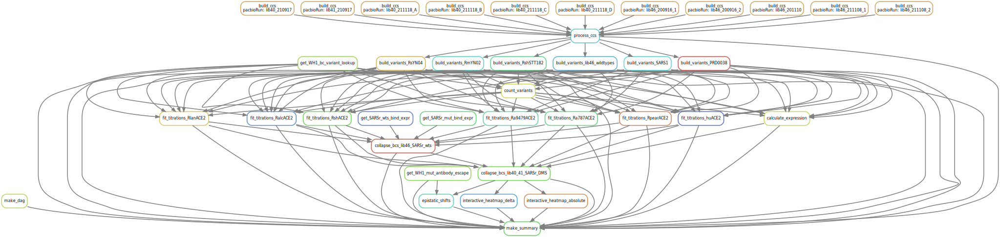

# Summary

Analysis run by [Snakefile](../../Snakefile)
using [this config file](../../config.yaml).
See the [README in the top directory](../../README.md)
for details.

Here is the DAG of the computational workflow:

Here is the Markdown output of each Jupyter notebook in the
workflow:

1. Get prior Wuhan-1 RBD barcode-variant lookup table from the [SARS-CoV-2-RBD_DMS_variants repository](https://github.com/jbloomlab/SARS-CoV-2-RBD_DMS_variants) and antibody escape data from the [escape map aggregator repository](https://github.com/jbloomlab/SARS2_RBD_Ab_escape_maps/blob/main/processed_data/escape_data.csv). 

2. [Process PacBio CCSs](process_ccs.md) for each SARSr background and generate barcode consensus sequences.

3. Build barcode-variant lookup tables for the [RshSTT182](build_variants_RshSTT182.md), [PRD-0038](build_variants_PRD0038.md), [SARS-CoV-1 Urbani](build_variants_SARS1.md), [RsYN04](build_variants_RsYN04.md), and [RmYN02](build_variants_RmYN02.md) backgrounds, as well as the [lib46 pan-sarbecoviruses pool](build_variants_lib46.md). Barcode-variant lookup tables are saved for each background: [RshSTT182](../variants/codon_variant_table_RshSTT182.csv), [PRD-0038](../variants/codon_variant_table_PRD0038.csv), [SARS-CoV-1](../variants/codon_variant_table_SARS1.csv), [RsYN04](../variants/codon_variant_table_RsYN04.csv), and [RmYN02](../variants/codon_variant_table_RmYN02.csv), as well as the [lib46 pan-sarbecovirus pool](../variants/codon_variant_table_lib46.csv).

4. [Count variants by barcode](count_variants.md).
   Creates a [variant counts file](../counts/variant_counts.csv)
   giving counts of each barcoded variant in each condition.

5. Fit titration curves for binding to 
[human ACE2](compute_binding_Kd_huACE2.md), 
[R. shameli ACE2](compute_binding_Kd_RshACE2.md), 
[R. affinis 787 ACE2](compute_binding_Kd_Ra787ACE2.md), 
[R. affinis 9479 ACE2](compute_binding_Kd_Ra9479ACE2.md), 
[R. landeri ACE2](compute_binding_Kd_RlanACE2.md), 
[R. alcyone ACE2](compute_binding_Kd_RalcACE2.md), and 
[R. pearsonii ACE2](compute_binding_Kd_RpearACE2.md) (RpearACE2 is MFI not Kd), to calculate per-barcode KD, recorded in these files for 
[huACE2](../binding_Kd/bc_binding_huACE2.csv), 
[RshACE2](../binding_Kd/bc_binding_RshACE2.csv), 
[Ra787ACE2](../binding_Kd/bc_binding_Ra787ACE2.csv), 
[Ra9479ACE2](../binding_Kd/bc_binding_Ra9479ACE2.csv), 
[RlanACE2](../binding_Kd/bc_binding_RlanACE2.csv), 
[RalcACE2](../binding_Kd/bc_binding_RalcACE2.csv), and
[RpearACE2](../binding_Kd/bc_binding_RpearACE2.csv) (RpearACE2 is MFI not Kd).

6. [Analyze Sort-seq](compute_expression_meanF.md) to calculate per-barcode RBD expression, recorded in [this file](../expression_meanF/bc_expression.csv).

7. Collapse internal replicate barcodes of each variant to final variant phenotypes for the pan-sarbecovirus lib46 pool. Analysis [here](collapse_barcodes_lib46.md) and final output file [here for SSM mutants](../final_variant_scores/final_variant_scores_lib46_muts.csv) and [here for wildtype variants](../final_variant_scores/final_variant_scores_lib46_wts.csv).

8. Collapse internal replicate barcodes of each variant to final variant phenotypes for the sarbecovirus DMS pools. Analysis [here](collapse_barcodes_lib40_41.md) and final output file [here](../final_variant_scores/final_variant_scores_lib40_41.csv).

9. [Analyze patterns of epistasis in the DMS data](epistatic_shifts.md).

10. Make interactive data visualizations, available [here](https://jbloomlab.github.io/SARSr-CoV-RBD_DMS/)